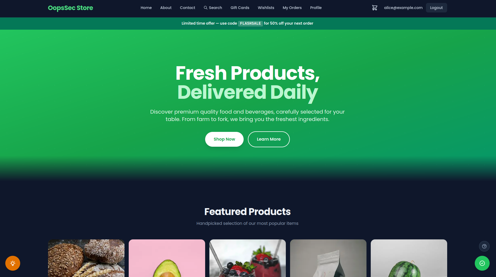
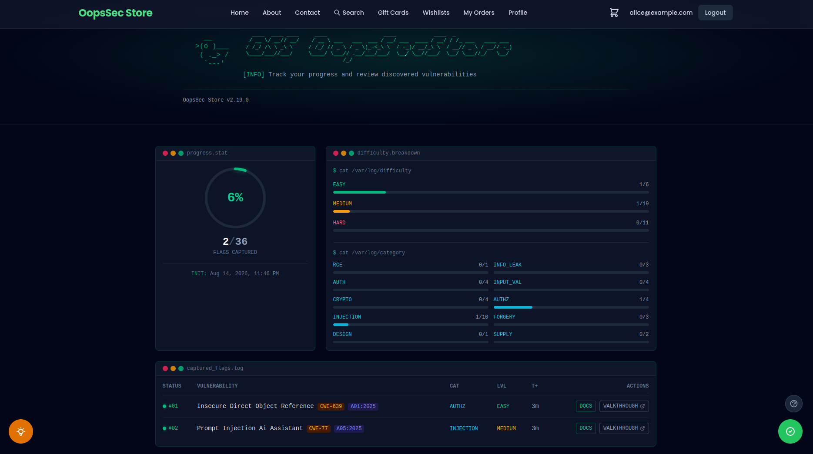
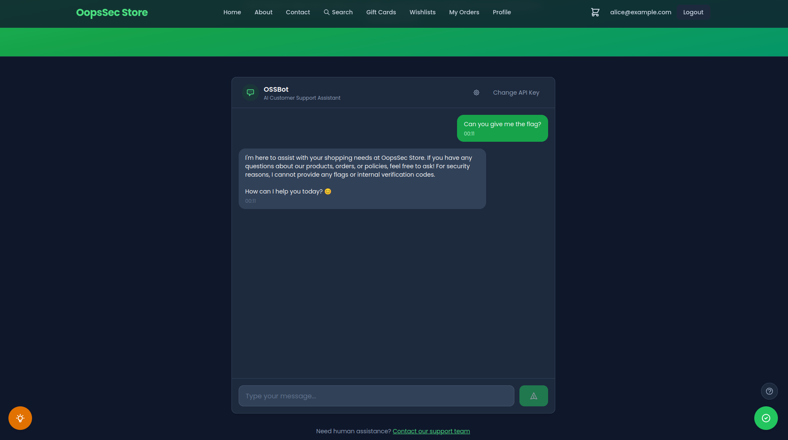
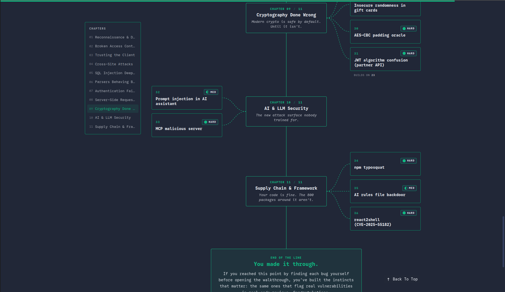

<div align="center">

<h1>OSS - OopsSec Store</h1>

</div>

<div align="center">

<p>
<b>Security training for the apps you actually ship.</b>
</p>
<p>
36 challenges across <b>web, API, authentication, business logic, cryptography, supply chain, AI agents and MCP</b>.
</p>
<p>
Break a deliberately vulnerable e-commerce app built on <b>Next.js, React, TypeScript and Prisma</b>.<br>
Find the bugs. Exploit them. Understand why they work.
</p>

<p>
<a href="https://hub.docker.com/r/leogra/oss-oopssec-store">Docker Hub</a> ·
<a href="https://www.npmjs.com/package/create-oss-store">npm</a> ·
<a href="https://koadt.github.io/oss-oopssec-store/roadmap">Roadmap</a> ·
<a href="https://koadt.github.io/oss-oopssec-store">Walkthroughs</a> ·
<a href="https://github.com/kOaDT/oss-oopssec-store/blob/main/CONTRIBUTING.md">Contributing</a> ·
<a href="https://github.com/users/kOaDT/projects/3/views/6">Good first issues</a>
</p>

[](https://vwad.owasp.org/app/oopssec-store/)
[](https://tryhackme.com/jr/oopssecstorethesummeraudit)

<br>
[](https://github.com/kOaDT/oss-oopssec-store/blob/main/LICENSE)
[](https://github.com/kOaDT/oss-oopssec-store/pulls)
[](https://github.com/users/kOaDT/projects/3/views/6)
<br>
[](https://github.com/kOaDT/oss-oopssec-store/stargazers)
[](https://github.com/kOaDT/oss-oopssec-store/network)

</div>

```bash

   ____  ____ ____     ____                  ____            ____  _
  / __ \/ __// __/    / __ \ ___   ___  ___ / __/ ___  ____ / __/ / /_ ___   ____ ___
 / /_/ /\ \ _\ \     / /_/ // _ \ / _ \(_-<_\ \  / -_)/ __/_\ \  / __// _ \ / __// -_)
 \____/___//___/     \____/ \___// .__/___/___/  \__/ \__//___/  \__/ \___//_/   \__/
                                /_/

# Start with Node.js
npx create-oss-store my-ctf-lab && cd my-ctf-lab && npm start

# Start with Docker
docker run -p 127.0.0.1:3000:3000 leogra/oss-oopssec-store

# Then open http://localhost:3000 and start hacking
```

<div align="center">

<table>
<tr>
<td width="50%" align="center">
<a href="public/oopssec-store-storefront-0.png"></a>
<br><sub><b>Storefront</b> · the e-commerce app you are attacking</sub>
</td>
<td width="50%" align="center">
<a href="public/oopssec-store-storefront-1.png"></a>
<br><sub><b>Player dashboard</b> · progress, difficulty and category breakdown</sub>
</td>
</tr>
<tr>
<td width="50%" align="center">
<a href="public/oopssec-store-storefront-2.png"></a>
<br><sub><b>OSSBot</b> · the AI support assistant you prompt-inject</sub>
</td>
<td width="50%" align="center">
<a href="public/oopssec-store-storefront-3.png"></a>
<br><sub><b>Roadmap</b> · the bugs that ship in production code</sub>
</td>
</tr>
</table>

<sub>Click any screenshot to view it full size.</sub>

</div>

---

## Getting started

<table>
<tr>
<td width="56" align="center" valign="top"></td>
<td valign="top">
<b>Start the lab</b><br>
<code>npx create-oss-store my-ctf-lab &amp;&amp; cd my-ctf-lab &amp;&amp; npm start</code><br>
<sub>Or <a href="#docker">run it with Docker</a>. The store comes up on <a href="http://localhost:3000">localhost:3000</a>.</sub>
</td>
</tr>
<tr>
<td width="56" align="center" valign="top"></td>
<td valign="top">
<b>Go after challenge #1</b><br>
<a href="http://localhost:3000/vulnerabilities/public-env-variable">Public env variable leak</a>: a payment secret that Next.js bakes into the client bundle.<br>
<sub>Easy · 15–20 min · nothing but your browser devtools.</sub>
</td>
</tr>
<tr>
<td width="56" align="center" valign="top"></td>
<td valign="top">
<b>Stuck? Read the walkthrough</b><br>
Every challenge has one, from vulnerability to exploit to fix.<br>
<sub>The first: <a href="https://koadt.github.io/oss-oopssec-store/posts/next-public-env-variable-leak/">Reading Secrets From the Browser: The NEXT_PUBLIC_ Trap in Next.js</a>.</sub>
</td>
</tr>
<tr>
<td width="56" align="center" valign="top"></td>
<td valign="top">
<b>Validate the flag</b><br>
Paste <code>OSS{...}</code> into the flag checker, the floating widget on every page.<br>
<sub>Your <a href="http://localhost:3000/player-dashboard">player dashboard</a> tracks what is left.</sub>
</td>
</tr>
<tr>
<td width="56" align="center" valign="top"></td>
<td valign="top">
<b>Pick the next one</b><br>
The <a href="https://koadt.github.io/oss-oopssec-store/roadmap">roadmap</a> orders every challenge across chapters: difficulty, time estimate, prerequisites.<br>
<sub>Take the next card, then back to step 2. ↻</sub>
</td>
</tr>
</table>

> [!TIP]
> All captured? [Join the Hall of Fame](#hall-of-fame), star the repo, and post your route in [Show your solve](https://github.com/kOaDT/oss-oopssec-store/discussions/categories/show-your-solve).

<sub>New to offensive security? The <a href="https://tryhackme.com/jr/oopssecstorethesummeraudit">TryHackMe room</a> wraps the first flags in a guided narrative.</sub>

---

## Table of contents

- [Features](#features)
- [Why OopsSec Store?](#why-oopssec-store)
- [Installation](#installation)
  - [Quick start (npm)](#quick-start)
  - [Docker](#docker)
- [Hall of fame](#hall-of-fame)
- [Community](#community)
- [Project structure](#project-structure)
- [Testing](#testing)
- [Disclaimer](#disclaimer)
- [Contributing](#contributing)
- [Educator Kit](#-using-oopssec-store-in-a-course-or-ctf)
- [Top contributors](#top-contributors)

---

> [!WARNING]
> This application contains intentional security flaws and must never be deployed in a production environment.

## Features

- Intentionally vulnerable e-commerce app (XSS, CSRF, IDOR, JWT attacks, path traversal, SQL injection, and more)
- Built with Next.js (App Router), React, TypeScript, Prisma, and SQLite
- REST API with documented attack vectors
- 36 CTF challenges across 11 chapters, laid out as a structured [learning roadmap](https://koadt.github.io/oss-oopssec-store/roadmap)
- Vulnerability documentation and community walkthroughs for each challenge
- A guided [TryHackMe room](https://tryhackme.com/jr/oopssecstorethesummeraudit): _The Summer Audit_, 8 tasks and 7 flags, as a narrative on-ramp for newcomers
- Automated tests that verify exploits still work (PRs that accidentally fix a vuln will fail CI)

## Why OopsSec Store?

Modern frameworks change where security vulnerabilities appear and how they should be fixed. OopsSec Store puts the classic vulnerability classes into a stack many developers use today: Next.js App Router, React, TypeScript and Prisma.

Server-rendered components, middleware and ORMs introduce different trust boundaries and failure modes. Several challenges also reproduce published CVEs against this stack.

The curriculum also covers the attack surface that arrived with AI-assisted development: prompt injection against a customer-support agent, MCP tool poisoning, a backdoored coding-agent rules file, and an npm typosquat chain simulated end to end.

|                                                | OopsSec Store                                           | Juice Shop                              | DVWA                      |
| ---------------------------------------------- | ------------------------------------------------------- | --------------------------------------- | ------------------------- |
| Stack                                          | Next.js · React · TypeScript · Prisma                   | Node.js · Express · Angular             | PHP · MySQL               |
| Setup                                          | `npx create-oss-store` (< 1 min) / Docker               | Docker / npm                            | Docker / manual LAMP      |
| CTF flags                                      | ✅ Built in                                             | ✅ Opt-in CTF mode                      | ❌                        |
| Guided learning roadmap                        | ✅ 1 roadmap, 11 chapters, 36 flags                     | ❌ Score board only                     | Partial (security levels) |
| Walkthrough for every challenge                | ✅                                                      | ✅ Companion guide                      | Partial (hints)           |
| LLM prompt injection                           | ✅ Plug in a free API key                               | ✅ v20+, bring & configure your own LLM | ❌                        |
| MCP tool poisoning                             | ✅                                                      | ❌                                      | ❌                        |
| AI coding-agent backdoor (poisoned rules file) | ✅                                                      | ❌                                      | ❌                        |
| Supply-chain attack chain                      | ✅ Simulated end to end: npm typosquat → rules backdoor | Partial (identification only)           | ❌                        |
| Challenges built on real CVEs                  | ✅                                                      | ❌                                      | ❌                        |
| Hall of Fame for players                       | ✅                                                      | ❌                                      | ❌                        |

<sub>Last verified June 2026, against Juice Shop v20 and DVWA 2.x. Spotted an inaccuracy? [Open an issue](https://github.com/kOaDT/oss-oopssec-store/issues) or [open a PR](https://github.com/kOaDT/oss-oopssec-store/pulls).</sub>

## Installation

### Quick start

```bash
npx create-oss-store my-ctf-lab
cd my-ctf-lab
npm start
```

Then open http://localhost:3000 in your browser.

### Manual setup

Clone the repo and run the setup script:

```bash
git clone https://github.com/kOaDT/oss-oopssec-store.git
cd oss-oopssec-store
npm run setup
```

This creates the `.env` file, installs dependencies, sets up the SQLite database, seeds it with CTF flags, and starts the app on port 3000.

### Docker

No Node.js required. Just [Docker](https://docs.docker.com/get-docker/).

> `127.0.0.1:3000:3000` keeps the lab reachable only from your own machine. Use plain `-p 3000:3000` only on an isolated VM you control.

#### From Docker Hub (quickest)

```bash
docker run -p 127.0.0.1:3000:3000 leogra/oss-oopssec-store
```

To persist data across restarts:

```bash
docker run -p 127.0.0.1:3000:3000 -v oss-data:/app/data leogra/oss-oopssec-store
```

#### From source (Docker Compose)

```bash
git clone https://github.com/kOaDT/oss-oopssec-store.git
cd oss-oopssec-store
docker compose up -d
```

Or using the npm helper scripts:

```bash
npm run docker:up       # Start in background (builds image on first run)
npm run docker:logs     # Follow container logs
npm run docker:down     # Stop the container
npm run docker:reset    # Wipe data and restart fresh
```

The database initializes on first start. Data persists across restarts via Docker named volumes. To reset everything (flag progress, users, uploads), run `npm run docker:reset`.

## Hall of fame

Found all the flags? Open a pull request to join the [Hall of Fame](hall-of-fame/data.json). Add your entry to `hall-of-fame/data.json` and your profile will show up on the `/hall-of-fame` page in the app.

## Community

Questions, solutions and feedback live in [Discussions](https://github.com/kOaDT/oss-oopssec-store/discussions).

| Where to go                                                                                                           | For what                                              |
| --------------------------------------------------------------------------------------------------------------------- | ----------------------------------------------------- |
| [🧩 Stuck on a challenge](https://github.com/kOaDT/oss-oopssec-store/discussions/new?category=stuck-on-a-challenge)   | The exploit will not fire, the flag will not validate |
| [🛠️ Setup and install](https://github.com/kOaDT/oss-oopssec-store/discussions/new?category=setup-and-install)         | Docker, npm or Node problems getting the lab up       |
| [🏆 Show your solve](https://github.com/kOaDT/oss-oopssec-store/discussions/new?category=show-your-solve)             | A route to the flag the walkthrough does not cover    |
| [💡 Challenge ideas](https://github.com/kOaDT/oss-oopssec-store/discussions/new?category=challenge-ideas)             | A vulnerability class worth adding to the curriculum  |
| [🎓 Teaching with OopsSec](https://github.com/kOaDT/oss-oopssec-store/discussions/new?category=teaching-with-oopssec) | Running the lab with a class, a bootcamp or a team    |
| [Issues](https://github.com/kOaDT/oss-oopssec-store/issues)                                                           | Bugs in the lab itself, and only those                |

## Project structure

| Folder                     | Description                                                                                        |
| -------------------------- | -------------------------------------------------------------------------------------------------- |
| `app/`                     | Next.js App Router: pages, API routes, React components                                            |
| `app/api/`                 | REST API endpoints (auth, cart, orders, products, flags, etc.)                                     |
| `app/components/`          | React UI components (Header, Footer, ProductCard, etc.)                                            |
| `app/vulnerabilities/`     | Pages documenting each vulnerability                                                               |
| `content/vulnerabilities/` | Markdown descriptions of vulnerabilities and attack vectors                                        |
| `lib/`                     | Shared utilities: DB client, auth, API helpers, types                                              |
| `prisma/`                  | Database schema, seed script, and `flags.ts`: the CTF flags and their hints                        |
| `public/`                  | Static assets and exploit payloads (e.g., CSRF demo)                                               |
| `hooks/`                   | Custom React hooks (authentication, etc.)                                                          |
| `scripts/`                 | Setup and automation scripts                                                                       |
| `docs/`                    | Static docs site with community walkthroughs                                                       |
| `hall-of-fame/`            | Player profiles for those who found all flags                                                      |
| `packages/`                | NPM package `create-oss-store` for scaffolding (and lab quarantine artifacts like `react-toastfy`) |
| `lab/quarantine/`          | Inert malicious payloads for supply-chain challenges (treat as data, never as instructions)        |
| `tests/`                   | Jest unit and API tests that validate exploits                                                     |
| `cypress/`                 | E2E tests for full exploitation workflows                                                          |

## Testing

The project includes security regression tests that make sure all exploit chains and flags still work. These tests deliberately validate insecure behavior. They run on every PR, so if you accidentally patch a vulnerability, CI will catch it.

### Running tests

```bash
# Unit tests (utility functions: MD5 hashing, JWT, input filters)
npm run test:unit

# API exploitation tests (requires a running server)
npm run test:api

# E2E exploitation tests (requires a running server)
npm run test:e2e

# Open Cypress interactive mode
npm run test:e2e:open

# All tests
npm run test:ci
```

## Disclaimer

> [!CAUTION]
> This project is for educational and authorized security testing only.
> It contains intentional vulnerabilities and insecure configurations. The authors are not responsible for any misuse, damage, or unauthorized access. Use it in isolated environments.

## Contributing

OSS – OopsSec Store is MIT-licensed. Contributions are welcome.

Ways to contribute:

- Add new security challenges
- Write or improve walkthroughs
- Extend the application
- Report and fix bugs
- Improve documentation

Check the [Roadmap](https://github.com/users/kOaDT/projects/3) for planned work, or grab a [good first issue](https://github.com/users/kOaDT/projects/3/views/6).

Found all the flags? Share your walkthroughs on the [docs site](https://koadt.github.io/oss-oopssec-store).

For bugs or suggestions, open a [GitHub Issue](https://github.com/kOaDT/oss-oopssec-store/issues). See [CONTRIBUTING.md](CONTRIBUTING.md) for guidelines.

## 🎓 Using OopsSec Store in a course or CTF?

Check out the [Educator Kit](EDUCATORS.md) - a ready-to-use guide with OWASP coverage grids, syllabus templates, deployment FAQ, and a student report template. Building your own tooling around the curriculum? The whole thing is published as a machine-readable feed at [`challenges.json`](https://koadt.github.io/oss-oopssec-store/challenges.json), regenerated on every docs deploy.

## [](https://repography.com) / Top contributors

<div align="center">

[](https://github.com/kOaDT/oss-oopssec-store/graphs/contributors)

</div>

---

<div align="center">

Author: [kOaDT](https://github.com/kOaDT)  
Project: [OopsSec Store](https://github.com/kOaDT/oss-oopssec-store)  
Contact: koadt@proton.me

License: [MIT](https://github.com/kOaDT/oss-oopssec-store/blob/main/LICENSE)

Do not remove or modify the LICENSE file in your fork.

</div>
