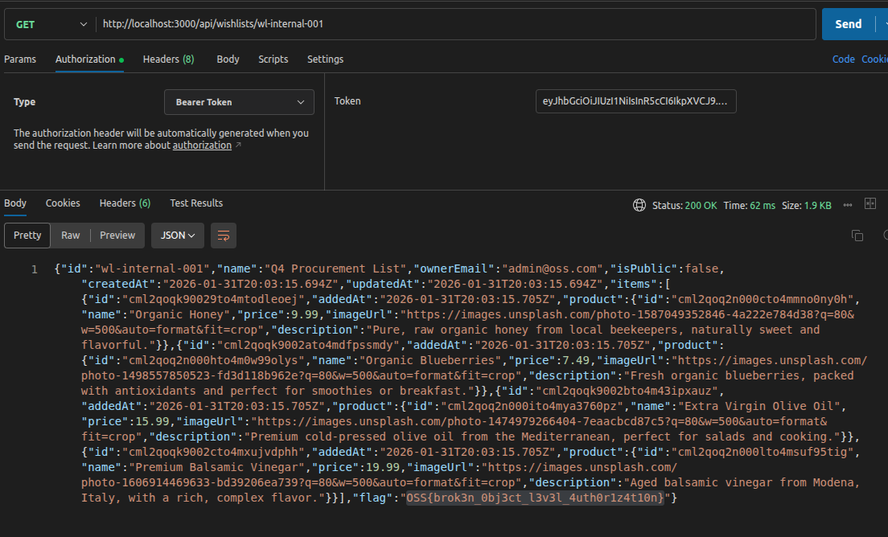

The wishlist API on OopsSec Store authenticates users but never checks whether they actually own the wishlist they're requesting. Any logged-in user can read any wishlist by changing the ID in the URL.

## Table of contents

## Lab setup

The lab requires Node.js. From an empty directory:

```bash
npx create-oss-store oss-store
cd oss-store
npm start
```

The app runs at `http://localhost:3000`.

## Vulnerability overview

OopsSec Store lets users create private wishlists. The frontend only shows you your own, so from the UI everything looks correctly scoped.

`GET /api/wishlists/[id]` on the backend is a different story. It accepts any wishlist ID and returns the full contents. There's a 401 if you're not logged in, but no check that the wishlist is actually yours.

An admin wishlist (`wl-internal-001`) has a note field containing the flag. Since there's no ownership check, any authenticated user can read it.

## Exploitation

### Step 1: Log in

Go to the login page and use the test credentials:

- Email: `alice@example.com`
- Password: `iloveduck`

### Step 2: Use the wishlist feature normally

Go to the Wishlists page from the header. Create a wishlist or look at an existing one. Nothing unusual -- you only see your own wishlists.

### Step 3: Watch the API calls

Open your browser dev tools (Network tab) and click "View Wishlist" on one of your wishlists. You'll see:

```
GET /api/wishlists/wl-alice-001
Cookie: authToken=<your-jwt-token>
```

The response has the full wishlist: name, items, owner email, notes.

### Step 4: Spot the problem

The wishlist ID (`wl-alice-001`) is right there in the URL, and the naming convention is obvious: `wl-{username}-{number}`. Does the API verify you own the wishlist, or does it just hand back whatever you ask for?

### Step 5: Request someone else's wishlist

Try a different wishlist ID. With curl:

```bash
curl -b "authToken=<your-jwt-token>" \
  http://localhost:3000/api/wishlists/wl-internal-001
```

Or from the browser console:

```javascript
const res = await fetch("/api/wishlists/wl-internal-001", {
  credentials: "include",
});
const data = await res.json();
console.log(data);
```

It works. The API hands back the admin's internal wishlist -- items, owner email (`admin@oss.com`), and the note field with the flag.

### Step 6: The flag

```
OSS{brok3n_0bj3ct_l3v3l_4uth0r1z4t10n}
```



## Vulnerable code analysis

The bug is in the `GET` handler of `/api/wishlists/[id]/route.ts`:

```typescript
const user = await getAuthenticatedUser(request);
if (!user) {
  return NextResponse.json({ error: "Unauthorized" }, { status: 401 });
}

const wishlist = await prisma.wishlist.findUnique({
  where: { id },
  include: { items: { include: { product: true } } },
});

// Missing: ownership verification
// wishlist.userId is never compared to user.id
return NextResponse.json(wishlist);
```

The 401 on unauthenticated requests makes the endpoint look secured. But the code never compares `wishlist.userId` to `user.id`, so any logged-in user can fetch any wishlist.

Worth noting: the `DELETE` handler on the same endpoint _does_ check ownership. Someone wrote the authorization logic for deletes and didn't add the same check on reads.

## Remediation

### Check ownership before returning data

Add a comparison after fetching the wishlist:

```typescript
const wishlist = await prisma.wishlist.findUnique({
  where: { id },
});

if (!wishlist) {
  return NextResponse.json({ error: "Wishlist not found" }, { status: 404 });
}

if (wishlist.userId !== user.id) {
  return NextResponse.json({ error: "Forbidden" }, { status: 403 });
}
```

You can also bake the constraint into the query, which has the added benefit of not leaking whether a wishlist ID exists:

```typescript
const wishlist = await prisma.wishlist.findFirst({
  where: {
    id,
    userId: user.id,
  },
});

if (!wishlist) {
  return NextResponse.json({ error: "Wishlist not found" }, { status: 404 });
}
```

If the ID is valid but belongs to someone else, the response is the same 404 as a nonexistent one.

### Apply authorization consistently

The root cause is that someone wrote the ownership check for `DELETE` but not for `GET`. This kind of inconsistency across CRUD operations is where most BOLA bugs live, and automated scanners are generally bad at catching it because they don't reason about which operations should share authorization logic. Centralize the check or make sure every handler on the resource includes it.
