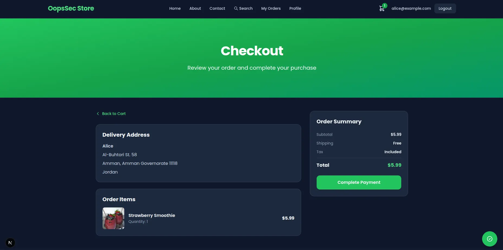
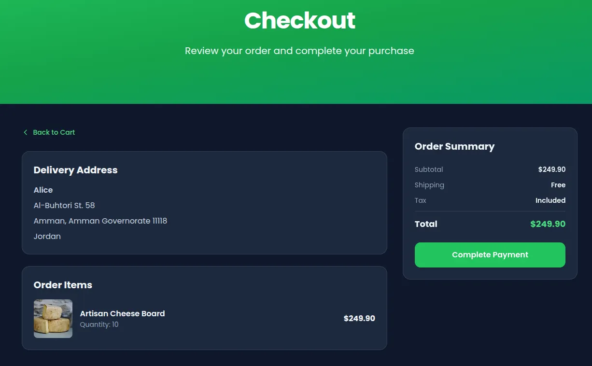
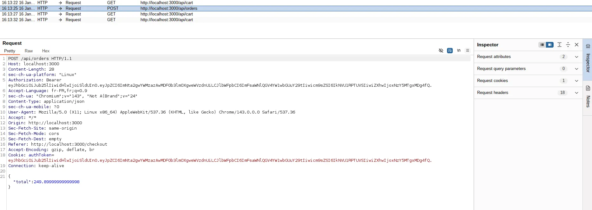
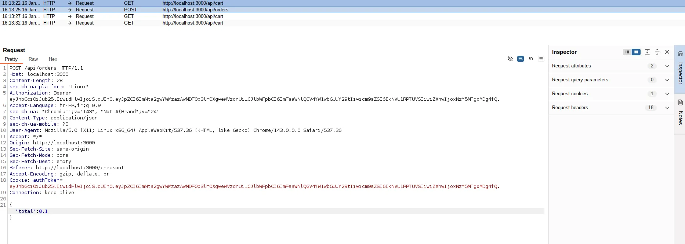
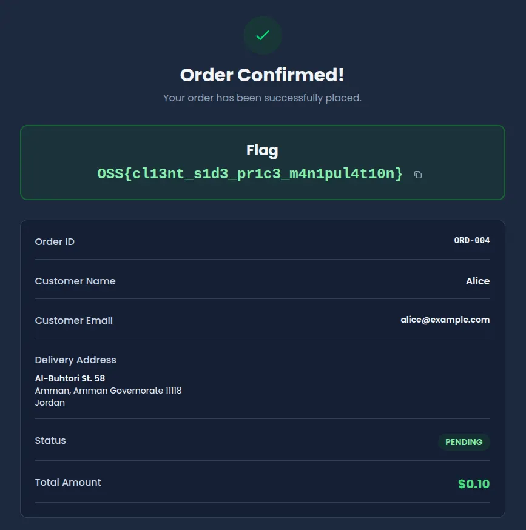

OopsSec Store's checkout sends the order total straight from the browser. The server saves whatever it receives without recalculating from actual product prices. Change it to a penny, the order goes through at a penny.

## Table of contents

## Vulnerability overview

When you buy something on OopsSec Store, the browser sends a POST to `/api/orders` with the cart items and a `total` field. That total is calculated by frontend JavaScript. The server takes it at face value and creates the order.

The product prices are in the database. The server could look them up and do the math itself. It doesn't.

## Locating the attack surface

Add some products to your cart and go through checkout. The payment page shows your order summary with the total.



Click "Complete Payment" and the browser fires off a POST with the order details, including the total the frontend calculated.

## Exploitation

### Configuring the proxy

Set up Burp Suite as an intercepting proxy (browser traffic through `127.0.0.1:8080`). Leave interception off for now.

### Preparing the order

Add products to your cart. Higher-priced items make the result more obvious. Go through checkout until you hit the payment page.



### Intercepting the request

Turn on interception in Burp, then click "Complete Payment". Burp catches the POST to `/api/orders` before it hits the server.


### Looking at the request

The request body is JSON with the order details:



The `total` field is the price the frontend calculated. The server uses this number directly.

### Modifying the price

Change `total` to whatever you want. `0.1` works:



### Completing the attack

Forward the modified request and turn off interception. The server processes the order at your price.

### Capturing the flag

The order confirmation shows the purchase at the modified total. The server notices the mismatch and returns the flag:

```
OSS{cl13nt_s1d3_pr1c3_m4n1pul4t10n}
```



## Vulnerable code analysis

The checkout handler pulls `total` straight out of the request body and saves it:

```typescript
const { total } = await request.json();

const order = await prisma.order.create({
  data: {
    userId: user.id,
    total: total, // Client-provided value used directly
  },
});
```

The frontend does calculate the right number. But the server never checks it. Anyone with a proxy, devtools, or curl can send whatever total they want.

The product prices and cart quantities are right there in the database. The server just doesn't use them.

## Remediation

### Recalculate the total server-side

Pull the cart from the database and compute the total from actual prices:

```typescript
const cart = await prisma.cart.findFirst({
  where: { userId: user.id },
  include: {
    cartItems: {
      include: { product: true },
    },
  },
});

const calculatedTotal = cart.cartItems.reduce(
  (sum, item) => sum + item.product.price * item.quantity,
  0
);

const order = await prisma.order.create({
  data: {
    userId: user.id,
    total: calculatedTotal, // Server-calculated value
  },
});
```

### Detect tampering

If you still want the client total for logging or display, compare it against the server calculation:

```typescript
const clientTotal = requestBody.total;
const serverTotal = calculateTotalFromCart(cart);

if (Math.abs(clientTotal - serverTotal) > 0.01) {
  return NextResponse.json(
    { error: "Price validation failed" },
    { status: 400 }
  );
}
```

The frontend total is fine for UX. The backend should never trust it for the actual charge.
