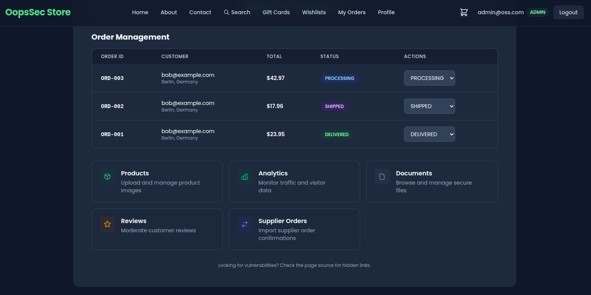
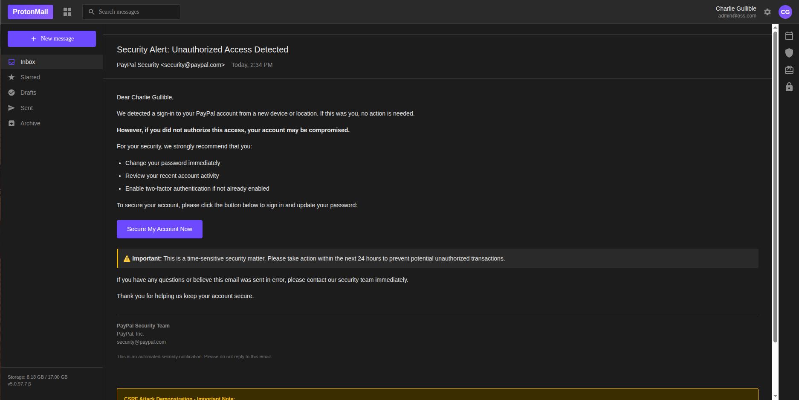
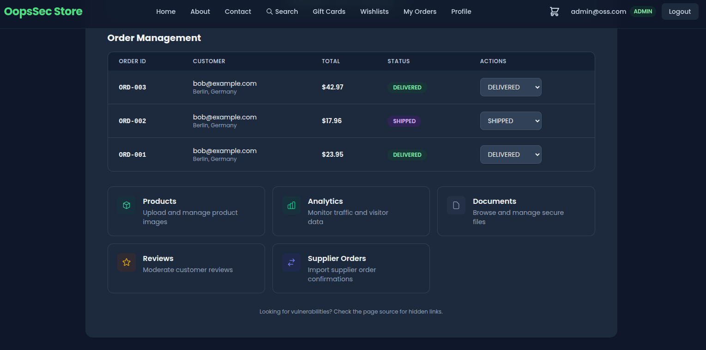

OopsSec Store exposes `PATCH /api/orders/:id` to update an order's status. The handler trusts the `authToken` cookie alone: there is no CSRF token, no `Origin` check, no `Referer` check. The cookie is set with `sameSite: "lax"`, so any page the admin loads in the same browser can issue the request and the server will execute it.

## Table of contents

## Lab setup

From an empty directory:

```bash
npx create-oss-store oss-store
cd oss-store
npm start
```

Or with Docker (no Node.js required):

```bash
docker run -p 3000:3000 leogra/oss-oopssec-store
```

The application runs at `http://localhost:3000`.

## Vulnerability overview

The admin dashboard at `/admin` lists every order in the system and offers a status selector that issues a `PATCH /api/orders/:id` request with a JSON body of the form `{ "status": "DELIVERED" }`.



The handler performs three operations:

1. Reads the `authToken` cookie and resolves the current user.
2. Verifies the user has the `ADMIN` role.
3. Updates the order with the supplied status.

Nothing sits between steps 1 and 3 to prove the request actually came from the admin's UI. The endpoint treats authentication as authorization. With `sameSite: "lax"` on the auth cookie, the browser also attaches it on top-level cross-site navigations and on every same-origin request, which is all an attacker page needs.

## Exploitation

The lab serves the attacker page from the same origin (`/exploits/csrf-attack.html`) so the exploit works without setting up DNS or hosting. The same exploit works from a third-party origin too, either by carrying the request through a top-level navigation or against any deployment that loosens `sameSite`.

### Step 1: Authenticate as an administrator

Sign in with an account that has the `ADMIN` role. If no such account is available, escalate using one of the other vulnerabilities in the lab (mass assignment on registration, JWT weak secret, etc.). After login, the browser holds an HTTP-only `authToken` cookie scoped to the application origin.

### Step 2: Identify a target order

Open `/admin` and pick an order to manipulate. The walkthrough uses `ORD-003` in `PENDING` status as the target. Any order will work; the flag is not tied to a specific identifier.

### Step 3: Locate the exploit page

View the page source of `/admin`. A hidden link points to:

```
/exploits/csrf-attack.html
```

This file ships with the lab and simulates a phishing page that an attacker would normally host on a third-party domain.



### Step 4: Trigger the request

While still authenticated, open `http://localhost:3000/exploits/csrf-attack.html`. The page is styled as a PayPal account-security notification with a single call-to-action button. Clicking it executes the following request:

```javascript
fetch("/api/orders/ORD-003", {
  method: "POST",
  credentials: "include",
  headers: { "Content-Type": "application/json" },
  body: JSON.stringify({ status: "DELIVERED" }),
});
```

The route handler is registered for both `POST` and `PATCH`, so either verb hits the same code path. The `credentials: "include"` flag instructs the browser to attach cookies. Because the request originates from the same origin, `sameSite: "lax"` does not block it. The server receives a fully authenticated admin request and updates the order.

## Flag retrieval

The vulnerable endpoint returns the flag in its JSON response when the status update succeeds:

```json
{
  "success": true,
  "order": { "id": "ORD-003", "status": "DELIVERED" },
  "flag": "OSS{cr0ss_s1t3_r3qu3st_f0rg3ry}"
}
```

Reloading `/admin` confirms the persisted change: the targeted order now shows the new status. The admin never touched the dashboard.



## Vulnerable code analysis

The handler authenticates the user and checks the role, then writes:

```typescript
export async function PATCH(
  request: NextRequest,
  { params }: { params: Promise<{ id: string }> }
) {
  const user = await getAuthenticatedUser(request);
  // No CSRF token validation
  // No Origin or Referer header check
  const { status } = await request.json();
  await prisma.order.update({ where: { id }, data: { status } });
}
```

The cookie configuration makes things worse:

```typescript
response.cookies.set("authToken", token, {
  httpOnly: true,
  secure: process.env.NODE_ENV === "production",
  sameSite: "lax",
  maxAge: 60 * 60 * 24 * 7,
  path: "/",
});
```

`httpOnly: true` blocks JavaScript reads, which helps against token theft via XSS. It does nothing against CSRF, because CSRF does not need to read the cookie — it just needs the browser to send it. The `sameSite` semantics:

| Value    | Cross-site cookie behavior                                                |
| -------- | ------------------------------------------------------------------------- |
| `strict` | Cookie never sent on cross-site requests, including top-level navigation. |
| `lax`    | Cookie sent on top-level navigations (GET) but not on cross-site fetch.   |
| `none`   | Cookie always sent; requires `secure: true`.                              |

In this lab the exploit page is same-origin, so `lax` does not apply at all. Even on a real cross-site deployment, `lax` still permits cookies on top-level GET navigations and on any same-site context, so it is not on its own enough to stop CSRF.

## Remediation

No single one of the controls below is enough; apply them together.

### Tighten the authentication cookie

Set `sameSite: "strict"` on the cookie that authorizes state-changing operations. Strict keeps the cookie out of every cross-site context, top-level navigation included:

```typescript
response.cookies.set("authToken", token, {
  httpOnly: true,
  secure: true,
  sameSite: "strict",
  maxAge: 60 * 60 * 24 * 7,
  path: "/",
});
```

If `strict` breaks legitimate flows like email links landing on an authenticated page, split the session: a long-lived `lax` cookie for navigation and a separate `strict` cookie required for sensitive endpoints.

### Require a CSRF token on state-changing routes

Issue a per-session token at login, hand it to the client via a non-`httpOnly` cookie or a bootstrap endpoint, and require the client to echo it back in a custom header:

```typescript
const tokenFromCookie = request.cookies.get("csrfToken")?.value;
const tokenFromHeader = request.headers.get("X-CSRF-Token");

if (!tokenFromCookie || tokenFromCookie !== tokenFromHeader) {
  return NextResponse.json({ error: "Invalid CSRF token" }, { status: 403 });
}
```

A cross-origin attacker page cannot read cookies for the target origin, and it cannot set custom headers on a cross-origin request without a passing CORS preflight. It can supply at most one half of the pair.

### Validate the Origin header

For non-GET requests, reject anything whose `Origin` (or, failing that, `Referer`) is not on an explicit allowlist:

```typescript
const origin = request.headers.get("origin");
const allowedOrigins = ["https://yourdomain.com"];

if (!origin || !allowedOrigins.includes(origin)) {
  return NextResponse.json({ error: "Invalid origin" }, { status: 403 });
}
```

The check is cheap and runs before any business logic. It catches most cross-origin CSRF attempts even when the token-based defense is misconfigured or partially deployed.

## References

- [OWASP: Cross-Site Request Forgery (CSRF)](https://owasp.org/www-community/attacks/csrf)
- [OWASP CSRF Prevention Cheat Sheet](https://cheatsheetseries.owasp.org/cheatsheets/Cross-Site_Request_Forgery_Prevention_Cheat_Sheet.html)
- [CWE-352: Cross-Site Request Forgery (CSRF)](https://cwe.mitre.org/data/definitions/352.html)
- [MDN: SameSite cookies](https://developer.mozilla.org/en-US/docs/Web/HTTP/Headers/Set-Cookie/SameSite)
