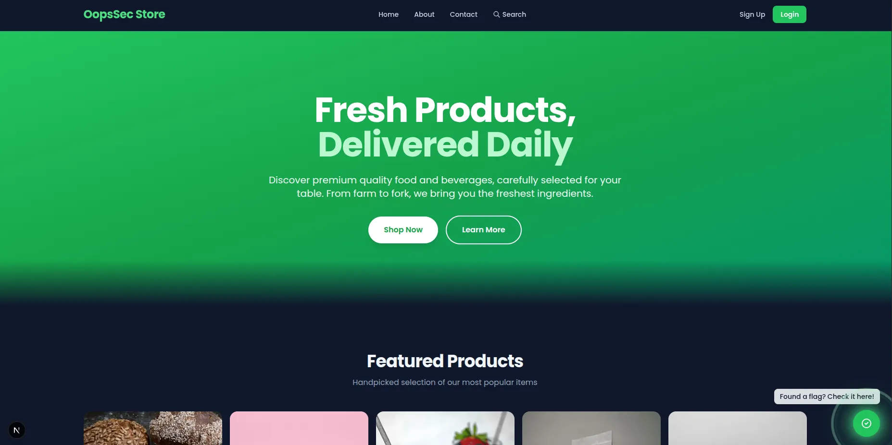
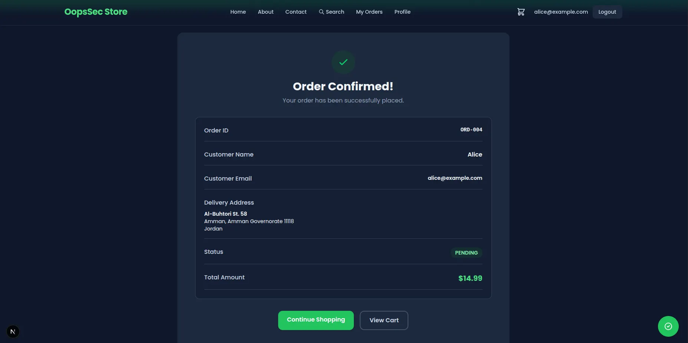
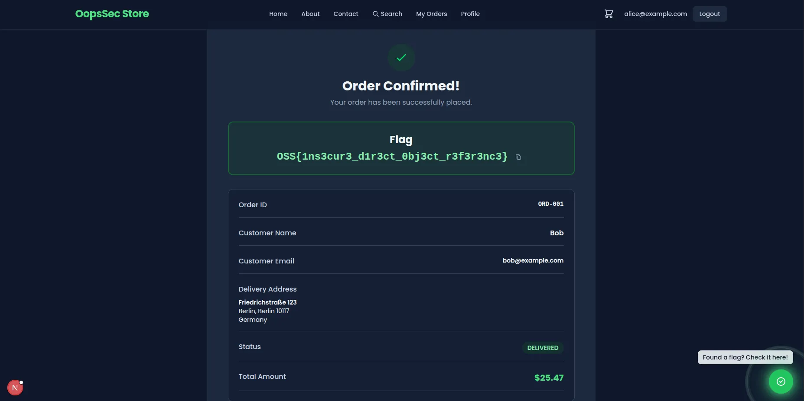

OopsSec Store's order confirmation pages use sequential IDs like `/orders/ORD-004`. The app checks that you're logged in but never checks whether the order is yours. Change `ORD-004` to `ORD-001` and you're looking at someone else's name, email, delivery address, and full order details.

## Table of contents

## Lab setup

The lab requires Node.js. From an empty directory:

```bash
npx create-oss-store oss-store
cd oss-store
npm start
```

The application runs at `http://localhost:3000`.

## Vulnerability overview

After placing an order, you land on a confirmation page at something like `/orders/ORD-004`. The problem is twofold: the backend fetches orders by ID without checking who they belong to, and the IDs are sequential, so guessing valid ones is trivial. Any logged-in user can walk through `ORD-001`, `ORD-002`, `ORD-003`... and read every order in the database.

## Exploitation

### Step 1: Log in

Use the test credentials:

- Email: `alice@example.com`
- Password: `iloveduck`



### Step 2: Place an order

Add something to your cart and check out. You'll land on a confirmation page:

```
http://localhost:3000/orders/ORD-004
```

Your order number will vary depending on what's already in the database, but it's always `ORD-` followed by a sequential number.



### Step 3: Access someone else's order

The IDs are sequential. If yours is `ORD-004`, earlier orders almost certainly exist. Change the URL to:

```
http://localhost:3000/orders/ORD-001
```

It loads. You're now looking at another customer's name, email, delivery address, and what they bought.



### Step 4: Grab the flag

The flag sits at the top of the order confirmation page:

```
OSS{1ns3cur3_d1r3ct_0bj3ct_r3f3r3nc3}
```

## Vulnerable code analysis

Here's what the backend does:

```typescript
const order = await prisma.order.findUnique({
  where: { id },
});

// Missing: ownership verification
// The order is returned to any authenticated user
```

It finds the order by ID and returns it. No check that the logged-in user actually placed it. Authentication confirms you have an account; it says nothing about which orders you should see.

## Remediation

### Check ownership after fetching

Fetch the order, then verify the current user owns it:

```typescript
const order = await prisma.order.findUnique({
  where: { id },
});

if (!order) {
  return NextResponse.json({ error: "Order not found" }, { status: 404 });
}

if (order.userId !== user.id) {
  return NextResponse.json({ error: "Forbidden" }, { status: 403 });
}
```

This has to happen server-side. Hiding the link in the UI doesn't help when someone can just type a URL.

### Use non-sequential IDs

Sequential IDs make enumeration easy. Switching to UUIDs or random tokens doesn't fix the missing authorization check, but it stops people from guessing order IDs by incrementing a number.

### Filter by ownership in the query

You can also bake ownership into the query so the wrong user never sees the record at all:

```typescript
const order = await prisma.order.findFirst({
  where: {
    id,
    userId: user.id,
  },
});

if (!order) {
  return NextResponse.json({ error: "Order not found" }, { status: 404 });
}
```

If the order belongs to someone else, this returns `null`. The user gets a 404 and learns nothing about whether the order exists.
