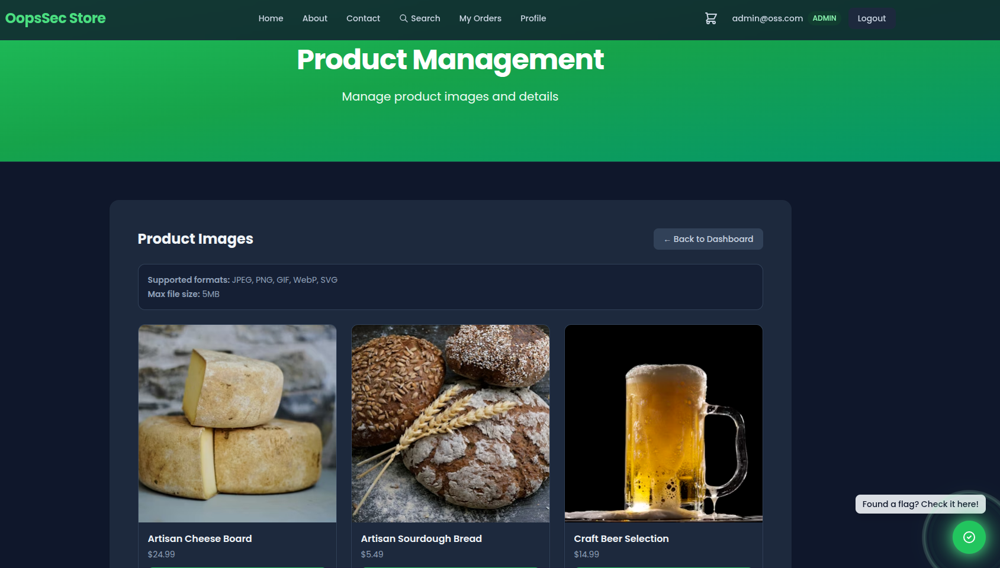
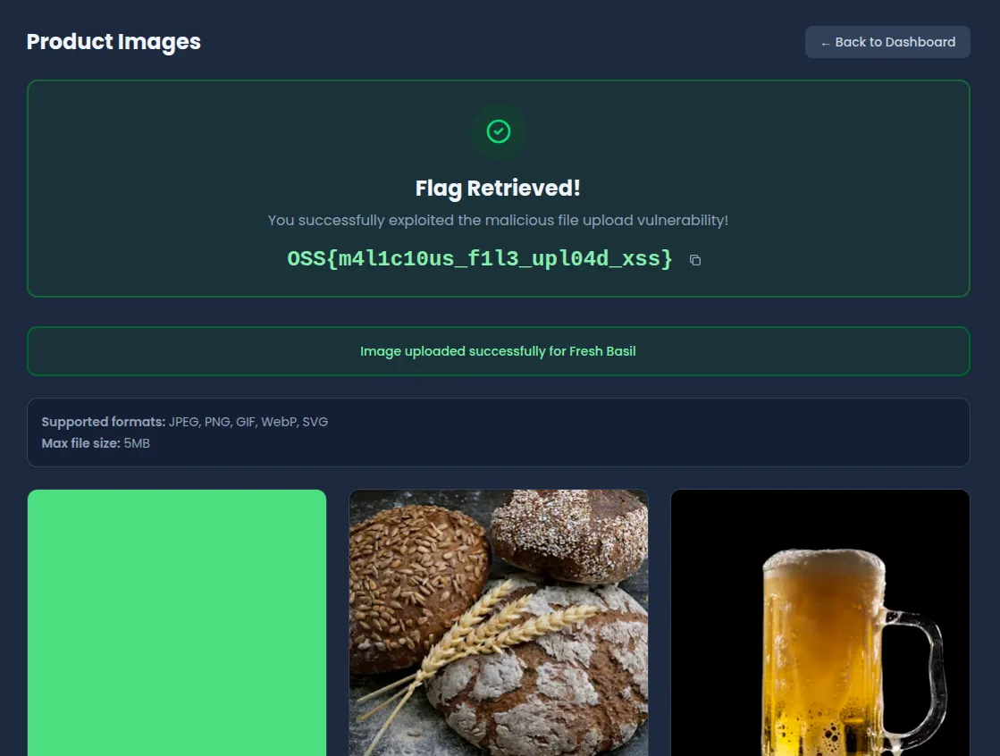
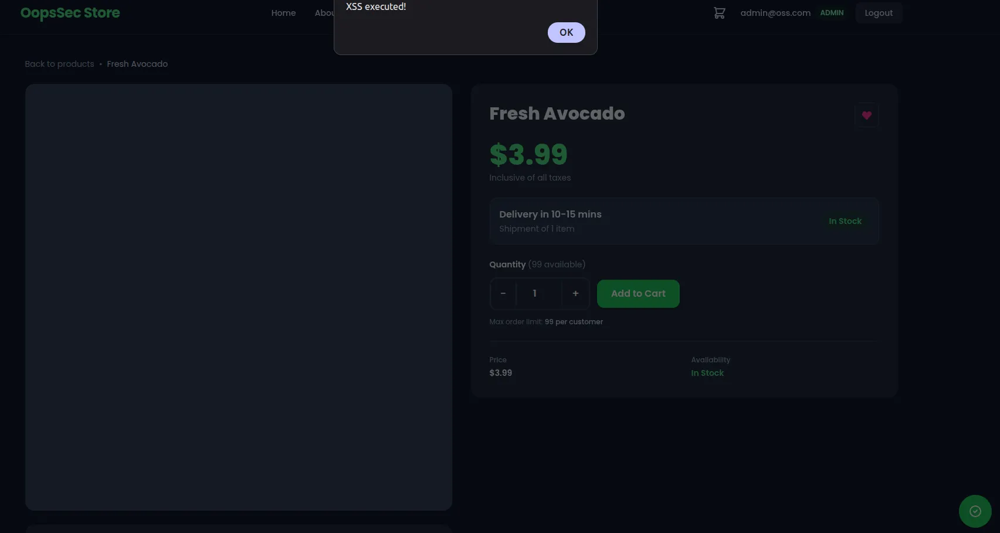

This writeup demonstrates how to exploit a malicious file upload vulnerability in OopsSec Store's admin product image upload feature. By uploading an SVG file containing embedded JavaScript, the payload persists on the server and executes in the browser of every user who views the affected product page.

## Table of contents

## Prerequisites

This vulnerability requires administrator access to the application. The following attack chains can be used to obtain admin credentials:

- [SQL injection to dump the admin password hash](/posts/sql-injection-writeup/)
- [Weak MD5 hashing to crack the admin password](/posts/weak-md5-hashing-admin-compromise/)

Complete those exploits before proceeding with this writeup.

## Lab setup

If a local instance of OopsSec Store is not already running, execute the following commands:

```bash
npx create-oss-store oss-store
cd oss-store
npm run dev
```

Once Next.js has started, the application is accessible at `http://localhost:3000`. Log in using the admin credentials recovered from the prerequisite vulnerabilities.

## Vulnerability overview

The admin panel includes a product management interface where administrators can upload images for products. The application accepts SVG files among the allowed image formats, which creates a significant security risk because SVG is an XML-based format that can contain embedded JavaScript.

The vulnerability stems from two implementation flaws:

1. **Content-Type header validation only**: The server validates uploads based solely on the `Content-Type` header, which is fully controlled by the client and trivially spoofed
2. **Unsafe SVG rendering**: The frontend renders uploaded SVG files using an `<object>` tag, which allows embedded scripts to execute

When a malicious SVG is uploaded and associated with a product, the JavaScript payload executes for every user who views that product, whether on the product detail page or in the admin panel preview.

## Exploitation

### Locating the upload interface

Navigate to the admin product management page at `http://localhost:3000/admin/products`. The interface allows editing existing products and uploading new images.



### Creating the malicious SVG

Create a file named `xss.svg` with the following content:

```xml
<?xml version="1.0" encoding="UTF-8"?>
<svg xmlns="http://www.w3.org/2000/svg" viewBox="0 0 100 100">
  <rect width="100" height="100" fill="#4ade80"/>
  <script type="text/javascript">
    alert('XSS executed!');
  </script>
</svg>
```

This payload is a simple `alert()` in the browser.

### Uploading the payload

In the product management interface:

1. Select a product to edit
2. Click the image upload field
3. Select the `xss.svg` file
4. Save the product

The server accepts the file without inspecting its contents. The application returns the flag immediately upon successful upload to confirm the vulnerability has been exploited.



### Triggering the payload

The malicious script executes in multiple contexts:

- **Product detail page**: Navigate to `http://localhost:3000/products/[product-id]` as any user
- **Admin panel preview**: View the product in the admin interface
- **Direct file access**: Access the uploaded file at `/uploads/[filename].svg`

When the page loads, the browser parses the SVG and executes the embedded JavaScript, displaying the alert dialog.



## Vulnerable code analysis

### Server-side validation bypass

The upload endpoint validates files using only the `Content-Type` header:

```typescript
const ALLOWED_CONTENT_TYPES = [
  "image/jpeg",
  "image/png",
  "image/gif",
  "image/webp",
  "image/svg+xml", // SVG files can contain JavaScript
];

if (!ALLOWED_CONTENT_TYPES.includes(file.type)) {
  return NextResponse.json({ error: "Invalid file type" }, { status: 400 });
}
```

The `file.type` property reflects the `Content-Type` header sent by the client, which can be arbitrarily set. No inspection of the actual file content is performed.

### Unsafe frontend rendering

The product detail page renders SVG images using an `<object>` tag:

```tsx
{
  product.imageUrl.endsWith(".svg") ? (
    <object
      data={product.imageUrl}
      type="image/svg+xml"
      className="h-full w-full object-cover"
    >
      
    </object>
  ) : (
    <Image src={product.imageUrl} alt={product.name} />
  );
}
```

The `<object>` element renders SVG content as a full document, including script execution. This differs from using an `` tag, which would render the SVG but block script execution.

## Remediation

### Content-based file validation

Validate the actual file content rather than trusting client-supplied headers:

```typescript
import { fileTypeFromBuffer } from "file-type";

const buffer = Buffer.from(await file.arrayBuffer());
const detectedType = await fileTypeFromBuffer(buffer);

const SAFE_MIME_TYPES = ["image/jpeg", "image/png", "image/gif", "image/webp"];

if (!detectedType || !SAFE_MIME_TYPES.includes(detectedType.mime)) {
  return NextResponse.json({ error: "Invalid file type" }, { status: 400 });
}
```

This approach uses magic bytes to detect the actual file type, preventing Content-Type spoofing. Excluding SVG from the allowed types eliminates the attack vector entirely.

### SVG sanitization

If SVG support is required, sanitize the content server-side before storage:

```typescript
import DOMPurify from "isomorphic-dompurify";

if (file.type === "image/svg+xml") {
  const svgContent = buffer.toString("utf-8");
  const sanitizedSvg = DOMPurify.sanitize(svgContent, {
    USE_PROFILES: { svg: true, svgFilters: true },
  });
  buffer = Buffer.from(sanitizedSvg);
}
```

DOMPurify removes script tags, event handlers, and other potentially dangerous elements from the SVG content.

### Restrictive response headers

Configure the server to serve uploaded files with security headers that prevent script execution:

```javascript
// next.config.js
headers: [
  {
    source: "/uploads/:path*",
    headers: [
      { key: "Content-Security-Policy", value: "script-src 'none'" },
      { key: "X-Content-Type-Options", value: "nosniff" },
    ],
  },
];
```

The `Content-Security-Policy` header with `script-src 'none'` blocks all script execution, while `X-Content-Type-Options: nosniff` prevents browsers from MIME-sniffing the content type.

Implementing multiple layers of defense provides protection even if one mechanism is bypassed.
