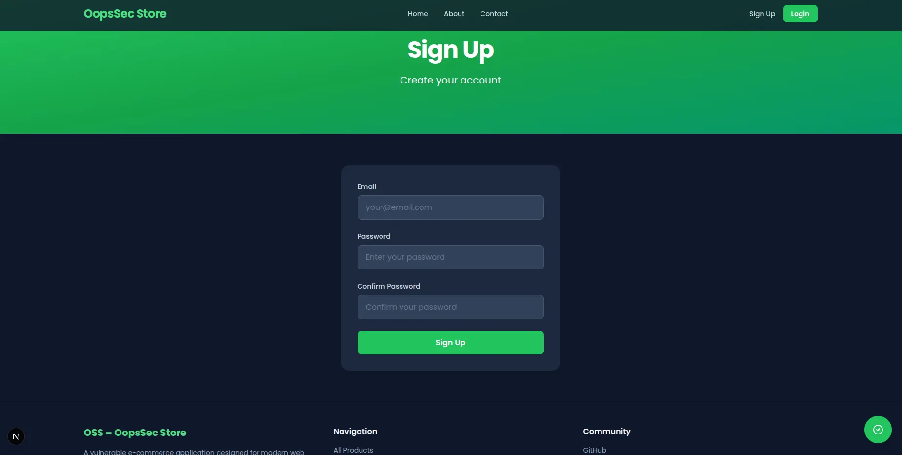
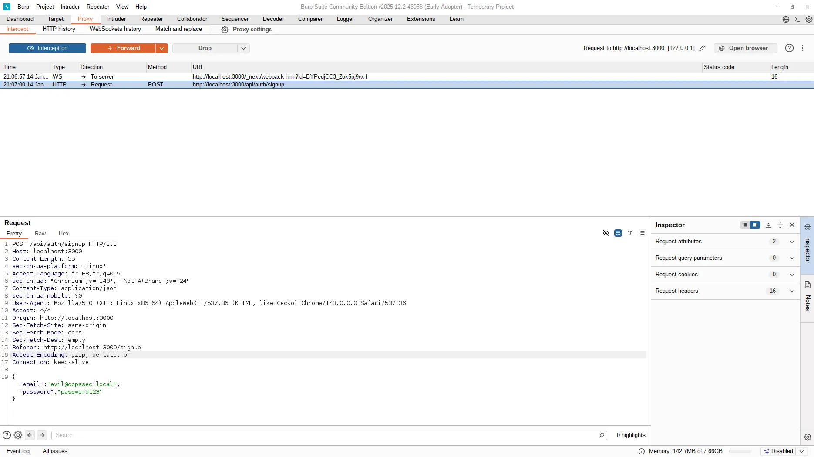
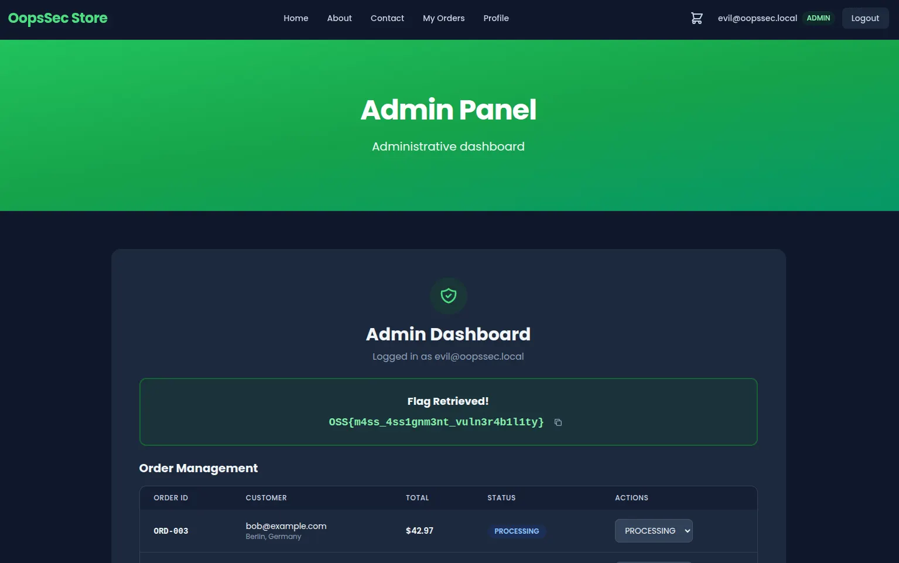

The signup endpoint on OopsSec Store doesn't filter which fields it accepts. You can slip a `role` field into the registration request and create yourself an admin account.

## Table of contents

## Vulnerability overview

The signup form takes an email and password, sends them as JSON to the backend, and the backend creates a user record. But the backend spreads the entire request body into the database query, so whatever you send gets stored, including fields you're not supposed to control.

The attack:

1. Intercept the signup request with a proxy
2. Add `"role": "ADMIN"` to the JSON body
3. Forward the request
4. You now have an admin account

## Locating the attack surface

Head to `/signup`. Standard form, two fields: email and password.



Submitting the form sends a POST to `/api/auth/signup` with a JSON body.

## Exploitation

### Setting up request interception

Set up Burp Suite (or any intercepting proxy) to catch HTTP traffic:

1. Open Burp Suite, go to Proxy > Intercept
2. Turn interception on
3. Point your browser at the proxy (usually `127.0.0.1:8080`)

Every request from the browser now goes through Burp before hitting the server.

### Submitting the registration form

Fill in the form with whatever you want:

- Email: `evil@oopssec.local`
- Password: `password123`

Hit Sign up. Burp catches the request.



### Injecting the role field

The original body:

```json
{
  "email": "evil@oopssec.local",
  "password": "password123"
}
```

Add the `role` field:

```json
{
  "email": "evil@oopssec.local",
  "password": "password123",
  "role": "ADMIN"
}
```

Forward it. The server accepts the payload without complaint.

### Verifying administrator access

After registration, the app redirects straight to `/admin`. The flag is on the dashboard.



## Vulnerable code analysis

Here's why this works:

```typescript
const user = await prisma.user.create({
  data: {
    ...body, // All fields from request body are persisted
    password: hashedPassword,
  },
});
```

The spread operator (`...body`) dumps everything from the request into the database query. The schema has a `role` column, so Prisma stores whatever value you send. No server-side filtering at all.

## Remediation

### Explicit field extraction

Destructure only what you need and hardcode the role:

```typescript
const { email, password } = req.body;

const user = await prisma.user.create({
  data: {
    email,
    password: hash(password),
    role: "CUSTOMER", // Server-controlled value
  },
});
```

Anything extra in the request body gets ignored.

### Input validation with schema enforcement

You can also use Zod to reject unexpected fields outright:

```typescript
import { z } from "zod";

const signupSchema = z.object({
  email: z.string().email(),
  password: z.string().min(8),
});

const validatedData = signupSchema.parse(req.body);
```

If someone sends a `role` field, the request fails before reaching the database. Either approach works. Just don't let request bodies decide who's an admin.
