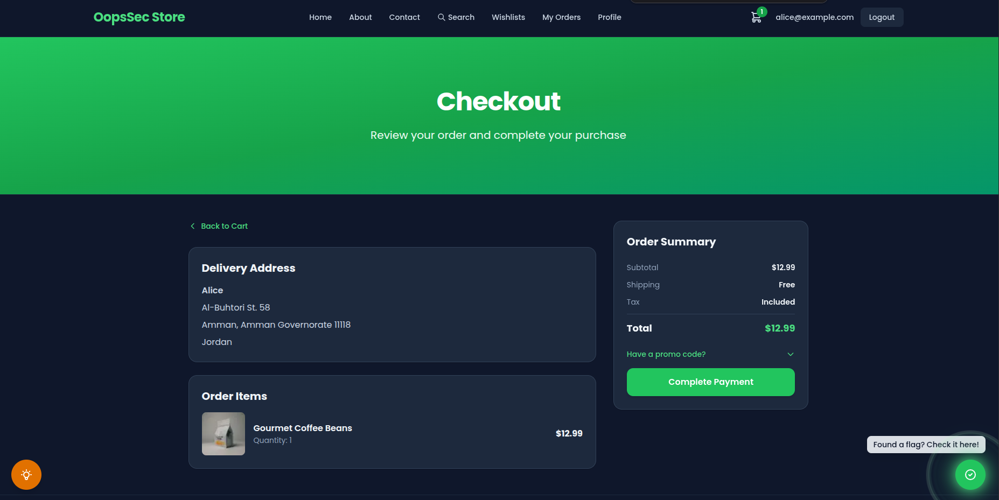
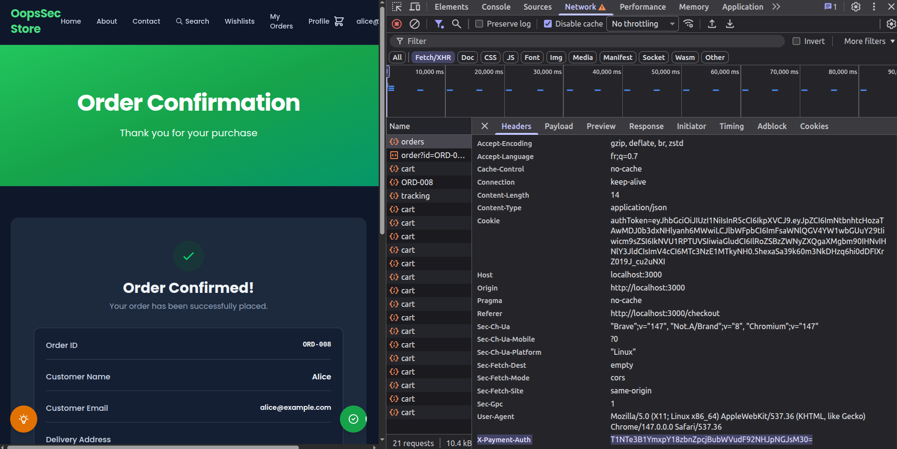
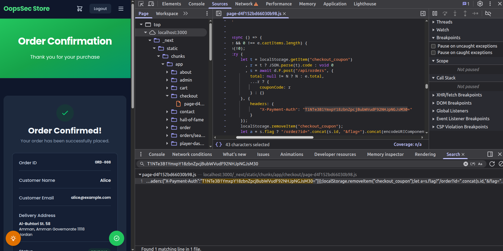

Environment variables prefixed with `NEXT_PUBLIC_` in a Next.js project are substituted into the client JavaScript bundle at build time. The browser receives the literal value, which means any user can read it from the network panel or by searching the static chunks under `/_next/static/chunks/`. The OopsSec Store challenge stores a payment credential under that prefix and forwards it as a custom HTTP header from the checkout page. Recovering the value takes a single request inspection in the browser.

## Table of contents

## Lab setup

From an empty directory:

```bash
npx create-oss-store oss-store
cd oss-store
npm start
```

Or with Docker (no Node.js required):

```bash
docker run -p 3000:3000 leogra/oss-oopssec-store
```

The application runs at `http://localhost:3000`.

## Vulnerability overview

The checkout page reads `process.env.NEXT_PUBLIC_PAYMENT_SECRET` and attaches the value to the order request as the `X-Payment-Auth` header. Because the variable carries the `NEXT_PUBLIC_` prefix, the Next.js compiler replaces the call site with the literal string at build time. Every visitor who loads the checkout page downloads the credential as part of the page's JavaScript, whether or not they ever click "Complete Payment".

The configuration mistake is common in production codebases. The `NEXT_PUBLIC_` prefix is often interpreted as a scoping rule, as if it meant "available to the application code", when its actual effect is to publish the value to every client.

## Locating the attack surface

The vulnerability is reachable from the checkout page at `/checkout`. After adding a product to the cart and proceeding through the flow, the payment summary is displayed.



Submitting the form sends a `POST /api/orders` request. The UI itself shows nothing sensitive, so the leak is not observable from the rendered page.

## Exploitation

### 1. Authenticate and reach the checkout page

Sign in with a seeded account (for example `alice@example.com` / `iloveduck`), add at least one product to the cart, and navigate to `/checkout`.

### 2. Open DevTools and capture the order request

Open the browser developer tools (`F12`, or `Cmd+Option+I` on macOS) and switch to the **Network** tab. Click **Complete Payment** and locate the `POST /api/orders` entry in the request list.

### 3. Inspect the outgoing request headers

In the **Headers** panel, scroll to **Request Headers**. The frontend has attached a custom header that does not belong to a normal browser request:

```
X-Payment-Auth: T1NTe3B1YmxpY18zbnZpcjBubWVudF92NHJpNGJsM30=
```



### 4. Decode the captured value

The value is base64-encoded. Decode it from the **Console** tab:

```javascript
atob("T1NTe3B1YmxpY18zbnZpcjBubWVudF92NHJpNGJsM30=");
```

The decoded output is the flag:

```
OSS{public_3nvir0nment_v4ri4bl3}
```

### 5. Confirm the value is embedded in the static bundle

The same string can be retrieved without sending any request. Open the **Sources** tab, run a global search (`Ctrl+Shift+F`, or `Cmd+Option+F` on macOS) for the literal value, and Chrome will point to a minified file under `/_next/static/chunks/`. The string is inlined directly in the compiled chunk for the checkout client component.



## Vulnerable code analysis

The checkout client component reads the environment variable and attaches it to the order request:

```typescript
const paymentSecret = process.env.NEXT_PUBLIC_PAYMENT_SECRET ?? "";

const order = await api.post(
  "/api/orders",
  {
    total: discountedTotal ?? cartData.total,
  },
  {
    headers: { "X-Payment-Auth": paymentSecret },
  }
);
```

During the production build, the SWC compiler replaces `process.env.NEXT_PUBLIC_PAYMENT_SECRET` with the literal string defined in the environment file. The minifier later mangles local identifier names, but the substituted value is left untouched. As a result, the string `NEXT_PUBLIC_PAYMENT_SECRET` does not appear in the bundle, while the secret value does. Searching for the variable name returns nothing; searching for value-shaped patterns such as long base64 strings, `sk_live_`, `pk_`, or JWT tokens reveals the leak.

The Next.js documentation describes this behavior explicitly, but the prefix is regularly misread. Developers tend to interpret `NEXT_PUBLIC_` as a scoping modifier when it is closer to a publication flag, and any value behind it ends up in the static asset bundle distributed to every client.

## Remediation

### Move the credential to the server

Code that needs access to the payment secret must run on the server. Drop the `NEXT_PUBLIC_` prefix from the environment variable and read it from a route handler, a server action, or a server component:

```typescript
// app/api/orders/route.ts
import { NextResponse } from "next/server";

export async function POST(req: Request) {
  const order = await req.json();
  const paymentSecret = process.env.PAYMENT_SECRET;

  const result = await fetch("https://payments.example.com/charge", {
    method: "POST",
    headers: { Authorization: `Bearer ${paymentSecret}` },
    body: JSON.stringify(order),
  });

  return NextResponse.json(await result.json());
}
```

The browser then calls the application's own endpoint, and the upstream credential never leaves the server:

```typescript
await fetch("/api/orders", {
  method: "POST",
  body: JSON.stringify(order),
});
```

### Detect leaks at build time

A grep over the repository, run in CI, catches the most common variant: a `NEXT_PUBLIC_` variable whose name contains `SECRET`, `KEY`, `TOKEN`, or `PASSWORD`.

```bash
grep -rE "NEXT_PUBLIC_.*(SECRET|KEY|TOKEN|PASSWORD)" .env* src/ app/
```

Dedicated scanners such as TruffleHog and GitHub secret scanning will also flag the value once the bundle is pushed to a public branch.

### Treat exposed values as compromised

Any credential that has been built into a client bundle should be rotated. Static asset URLs are cached by CDNs, archived by services such as the Internet Archive, and indexed by automated crawlers, so the value cannot be assumed to disappear when the next build is deployed.

## References

- [CWE-200: Exposure of Sensitive Information to an Unauthorized Actor](https://cwe.mitre.org/data/definitions/200.html)
- [CWE-798: Use of Hard-coded Credentials](https://cwe.mitre.org/data/definitions/798.html)
- [Next.js documentation: Bundling Environment Variables for the Browser](https://nextjs.org/docs/app/building-your-application/configuring/environment-variables#bundling-environment-variables-for-the-browser)
