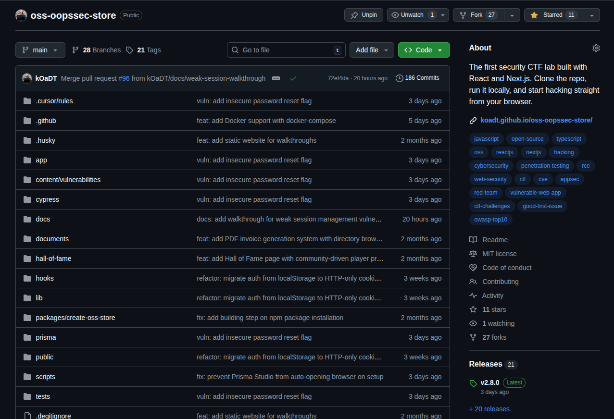
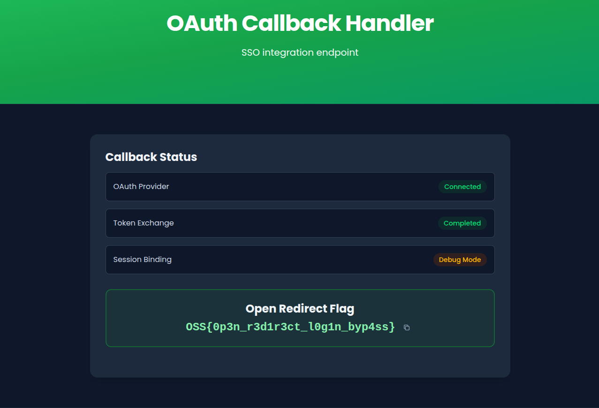

OopsSec Store's login page accepts a `redirect` query parameter that isn't validated after authentication. We'll abuse this to navigate to an internal endpoint that's otherwise inaccessible.

## Table of contents

## Lab setup

The lab requires Node.js. From an empty directory:

```bash
npx create-oss-store oss-store
cd oss-store
npm start
```

The application runs at `http://localhost:3000`.

## Target identification

The app has a login page at `http://localhost:3000/login`. Try visiting `/profile` while logged out and you'll get bounced to:

```
http://localhost:3000/login?redirect=%2Fprofile
```

That `redirect` parameter tells the app where to send you after login.

## Exploitation

### Step 1: Confirming the redirect behavior

First, verify the redirect actually works:

1. Open an incognito window
2. Go to `http://localhost:3000/profile`
3. Notice you land on `/login?redirect=%2Fprofile`
4. Log in with `alice@example.com` / `iloveduck`
5. You end up on `/profile`

So the parameter does control post-login navigation.

### Step 2: Testing for open redirect

Now try an external URL:

1. Go to `http://localhost:3000/login?redirect=https://github.com/kOaDT/oss-oopssec-store`
2. Log in
3. You land on GitHub



No validation at all. The app redirects to an external domain.

### Step 3: Discovering internal endpoints

With the open redirect confirmed, let's look for internal resources worth targeting:

```bash
gobuster dir -u http://localhost:3000/internal -w /usr/share/wordlists/dirb/common.txt
```

This turns up `/internal/oauth/callback`. Visiting it directly while authenticated just kicks you back to the homepage. The page exists, but it won't render through normal navigation.

### Step 4: Exploiting the redirect to access the internal page

Here's the trick: the internal callback page needs a specific cookie that only gets set during login when a redirect parameter is present.

1. Go to `http://localhost:3000/login?redirect=/internal/oauth/callback`
2. Log in with `alice@example.com` / `iloveduck`
3. You land on `/internal/oauth/callback`

### Step 5: Retrieving the flag

This time the page renders. It shows an internal debug interface with OAuth provider status and the flag:

```
OSS{0p3n_r3d1r3ct_l0g1n_byp4ss}
```



## Vulnerable code analysis

In the login form component, the code grabs the `redirect` parameter and navigates to it with zero checks:

```typescript
const redirect = searchParams.get("redirect");

// After successful login:
if (redirect) {
  window.location.href = redirect;
} else if (data.user?.role === "ADMIN") {
  router.push("/admin");
} else {
  router.push("/");
}
```

`window.location.href` will go anywhere. Relative paths, same-origin, external domains. Nothing stops it.

The login API also sets a short-lived `oauth_callback` cookie whenever a redirect parameter is present. The internal callback page checks for this cookie, which is why you can't reach it by just typing the URL in your browser. You have to go through the login flow.

## Remediation

The fix: validate the redirect target before navigating.

### Relative path validation

The simplest approach. Only allow paths starting with a single `/`:

```typescript
function isSafeRedirect(url: string): boolean {
  return url.startsWith("/") && !url.startsWith("//");
}

if (redirect && isSafeRedirect(redirect)) {
  router.push(redirect);
}
```

### URL parsing and origin check

More robust. Parse the URL and compare origins:

```typescript
function isSameOrigin(url: string): boolean {
  try {
    const parsed = new URL(url, window.location.origin);
    return parsed.origin === window.location.origin;
  } catch {
    return false;
  }
}
```

### Allowlist approach

If you only have a handful of valid destinations, just list them:

```typescript
const ALLOWED_REDIRECTS = ["/", "/profile", "/admin", "/orders", "/cart"];

if (redirect && ALLOWED_REDIRECTS.includes(redirect)) {
  router.push(redirect);
}
```

Whichever approach you pick, using `router.push()` instead of `window.location.href` also helps since Next.js router only handles same-origin routes.
