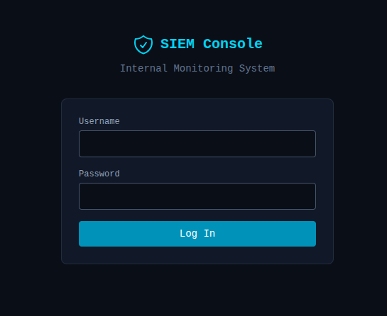
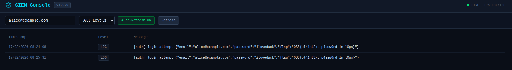

This writeup covers the exploitation of a multi-layer information disclosure vulnerability in OopsSec Store. A forgotten debug statement logs plaintext credentials to a file, and a hidden internal SIEM dashboard with hardcoded credentials exposes those logs.

## Table of contents

## Lab setup

The lab requires Node.js. From an empty directory, run the following commands:

```bash
npx create-oss-store oss-store
cd oss-store
npm start
```

Once Next.js has started, the application is accessible at `http://localhost:3000`.

## Reconnaissance

### Identifying the login mechanism

The application has a standard login form at `/login`. Submitting credentials sends a POST request to `/api/auth/login` with a JSON body:

```json
{
  "email": "alice@example.com",
  "password": "test"
}
```

Nothing unusual is visible in the response, whether the login succeeds or fails.

### Directory enumeration

Using a standard directory enumeration tool against the application reveals a hidden path. For example, with gobuster:

```bash
gobuster dir -u http://localhost:3000 -w /usr/share/seclists/Discovery/Web-Content/common.txt
```

Among the results, `/monitoring` stands out as an unexpected path. Enumerating further:

```bash
gobuster dir -u http://localhost:3000/monitoring -w /usr/share/seclists/Discovery/Web-Content/common.txt
```

This reveals `/monitoring/siem`, a path that is not linked anywhere in the application's navigation or UI.

## Discovering the SIEM interface

Navigating to `http://localhost:3000/monitoring/siem` displays a login form and the title "SIEM Console — Internal Monitoring System."



This is an internal log monitoring dashboard that was never intended to be public-facing.

## Bypassing SIEM authentication

The SIEM login form accepts a username and password. Since this appears to be a hastily deployed internal tool, common default credentials are worth trying:

| Username | Password |
| -------- | -------- |
| admin    | admin    |
| root     | admin    |
| root     | root     |
| admin    | password |

The combination `root` / `admin` grants access to the dashboard.

## Triggering the credential leak

Before reading the logs, we need to generate a login event. Submit any login attempt on the main application at `/login`:

```bash
curl -X POST http://localhost:3000/api/auth/login \
  -H "Content-Type: application/json" \
  -d '{"email":"alice@example.com","password":"iloveduck"}'
```

## Reading the logs

After authenticating on the SIEM dashboard, the log table displays all server-side console output captured since the application started. Searching for `[auth]` or `login attempt` quickly narrows down the relevant entries.

A typical log entry looks like:

```
[auth] login attempt {"email":"alice@example.com","password":"iloveduck","flag":"OSS{pl41nt3xt_p4ssw0rd_1n_l0gs}"}
```

The flag is `OSS{pl41nt3xt_p4ssw0rd_1n_l0gs}`.



## Vulnerability chain

This exploit combines four distinct weaknesses:

1. **CWE-532** — A `console.log` statement in the login route outputs plaintext credentials (email, password, and a flag) on every login attempt.
2. **CWE-312** — The global instrumentation layer (`instrumentation.ts`) captures all `console.*` output and persists it to `logs/app.log` in cleartext.
3. **CWE-200** — The SIEM dashboard at `/monitoring/siem` is hidden but discoverable through standard directory enumeration.
4. **CWE-798** — The SIEM interface is protected by trivially guessable default credentials (`root:admin`).

## Remediation

In a real application:

- **Never log request body fields.** Use structured logging libraries (pino, winston) with automatic redaction of sensitive fields.
- **Treat logs as sensitive data.** Apply access controls, encrypt at rest, enforce retention policies, and audit access.
- **Enforce strong credentials on internal tools.** Never use default or easily guessable passwords. Use a secrets manager and proper identity providers.
- **Apply authentication and authorization to all interfaces**, including internal ones. Use SSO/OIDC and restrict access to private network segments.
- **Audit `console.*` usage before deployment.** Use ESLint rules like `no-console` and pre-commit hooks to catch accidental debug statements.
