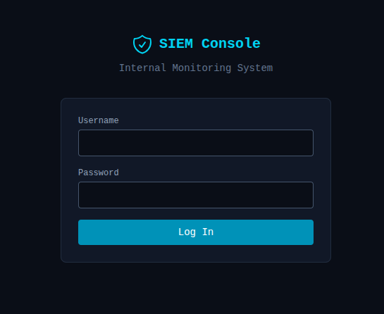
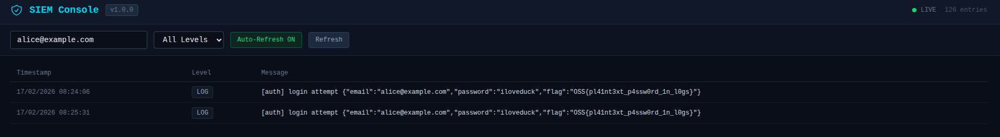

Someone left a debug log in the login route that dumps passwords in plaintext. Those logs end up on a hidden SIEM dashboard protected by default credentials. We'll find it, log in, and read everyone's passwords.

## Table of contents

## Lab setup

From an empty directory:

```bash
npx create-oss-store oss-store
cd oss-store
npm start
```

Or with Docker (no Node.js required):

```bash
docker run -p 3000:3000 leogra/oss-oopssec-store
```

The app runs at `http://localhost:3000`.

## Reconnaissance

### Login mechanism

There's a login form at `/login`. Submitting credentials sends a POST to `/api/auth/login` with a JSON body:

```json
{
  "email": "alice@example.com",
  "password": "test"
}
```

The response doesn't leak anything useful whether login succeeds or fails.

### Directory enumeration

Run gobuster (or any directory brute-forcer) against the app:

```bash
gobuster dir -u http://localhost:3000 -w /usr/share/seclists/Discovery/Web-Content/common.txt
```

`/monitoring` shows up, which is worth poking at. Enumerate one level deeper:

```bash
gobuster dir -u http://localhost:3000/monitoring -w /usr/share/seclists/Discovery/Web-Content/common.txt
```

This turns up `/monitoring/siem` -- not linked anywhere in the app.

## The SIEM dashboard

Hit `http://localhost:3000/monitoring/siem` and you get a login form titled "SIEM Console -- Internal Monitoring System."



An internal log viewer sitting on a public port. Promising.

## Bypassing SIEM authentication

Internal tool, hastily deployed -- default credentials are always worth a shot:

| Username | Password |
| -------- | -------- |
| admin    | admin    |
| root     | admin    |
| root     | root     |
| admin    | password |

`root` / `admin` gets us in.

## Triggering the credential leak

The dashboard is empty until someone actually logs in. Fire off a login attempt on the main app:

```bash
curl -X POST http://localhost:3000/api/auth/login \
  -H "Content-Type: application/json" \
  -d '{"email":"alice@example.com","password":"iloveduck"}'
```

## Reading the logs

Back on the SIEM dashboard, the log table shows all captured log output. Search for `[auth]` or `login attempt` and you'll see something like:

```
[auth] login attempt email=alice@example.com password=iloveduck flag=OSS{pl41nt3xt_p4ssw0rd_1n_l0gs}
```

The flag is `OSS{pl41nt3xt_p4ssw0rd_1n_l0gs}`.



## Vulnerability chain

Four things had to go wrong for this to work:

1. CWE-532 -- A `logger.warn` call in the login route dumps the email, password, and flag in the log message on every attempt.
2. CWE-312 -- The structured logger writes these entries to `logs/app.log` in cleartext.
3. CWE-200 -- The SIEM dashboard at `/monitoring/siem` is unlisted but easy to find with directory enumeration.
4. CWE-798 -- The SIEM login uses default credentials (`root:admin`).

## Remediation

Don't log request bodies or sensitive fields. Even with a structured logging library like Pino, use field redaction so passwords can't end up in output even if someone forgets.

Treat logs as sensitive data. Access controls, encryption at rest, retention policies -- if logs contain anything that could identify a user, they need the same care as a database.

Internal tools need real credentials. Default passwords on an internal dashboard are fine until the dashboard is reachable from the internet. Use a secrets manager or SSO; never ship `root:admin`.

Review log messages for sensitive data during code review. A structured logger doesn't prevent developers from embedding credentials in the message string itself.
