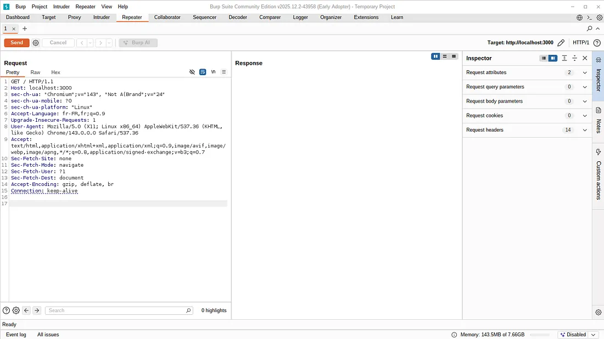
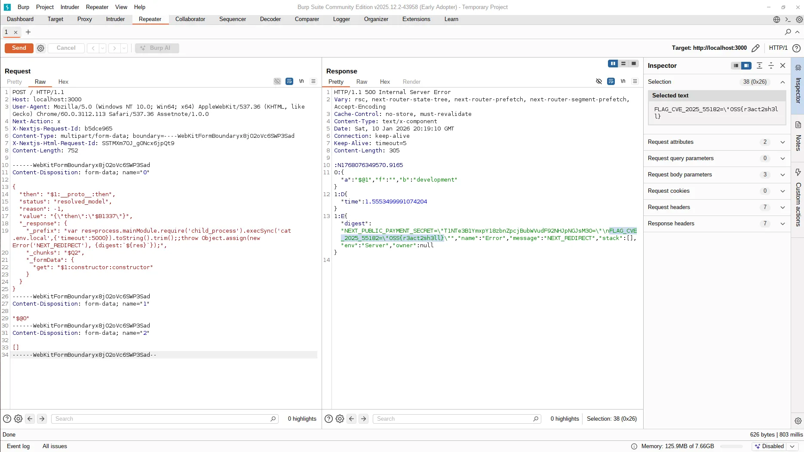
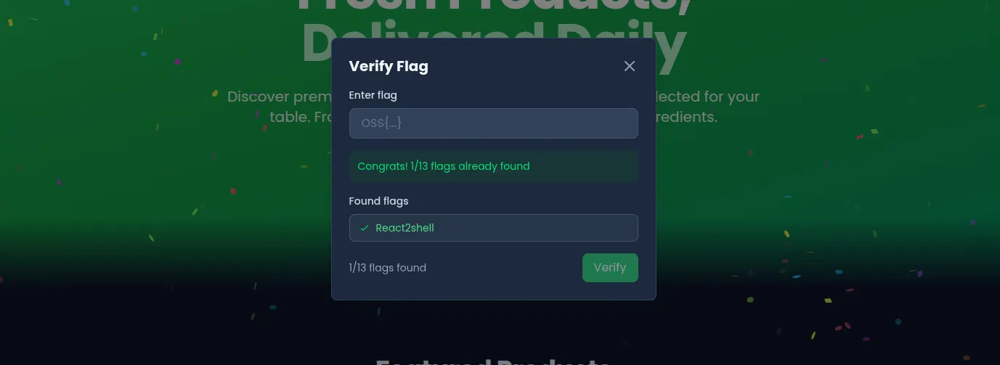

This writeup examines CVE-2025-55182, a critical vulnerability in React Server Components that allows unauthenticated remote code execution through the Flight protocol deserialization mechanism.

## Table of contents

## Lab environment setup

The exploit requires a running instance of OopsSec Store. From an empty directory, execute the following commands:

```bash
npx create-oss-store oss-store
cd oss-store
npm start
```

Once the development server starts, navigate to `http://localhost:3000` to confirm the application is running.

## Vulnerability overview

React Server Components (RSC) communicate with the server through a serialization protocol called Flight. When the browser loads a page or fetches server components, it sends Flight requests to the root endpoint.

The server-side deserializer processes this serialized component data without adequate validation. This lack of input sanitization in the deserialization layer creates the attack surface for CVE-2025-55182, commonly referred to as React2Shell.

## Exploitation methodology

### Intercepting requests with Burp Suite

Configure Burp Suite to intercept HTTP traffic:

1. Open Burp Suite and navigate to Proxy → Intercept
2. Enable interception
3. Configure your browser to use Burp as an HTTP proxy (127.0.0.1:8080), or use Burp's built-in browser
4. Reload `http://localhost:3000`
5. Forward the intercepted request to allow the page to load
6. Right-click any captured request and select "Send to Repeater"
7. Disable interception and switch to the Repeater tab



### Crafting the malicious payload

Replace the entire request in Burp Repeater with the exploit payload from the [CVE-2025-55182 proof of concept repository](https://github.com/kOaDT/poc-cve-2025-55182). The payload manipulates the Flight protocol to inject executable JavaScript that runs on the server.

### Executing the exploit

Send the modified request through Burp Suite. The server attempts to deserialize the payload as a standard Server Components response, but instead executes the injected code.



## Retrieving the flag

The HTTP response contains a React error payload. Embedded within this response are the contents of `.env.local`, including the flag:

```
OSS{r3act2sh3ll}
```

The server executed the injected command (`cat .env.local`) and returned the file contents.



## Vulnerable code analysis

The vulnerability exists in how React Server Components deserialize client-provided data. The deserializer traverses object properties using the following pattern:

```javascript
value = value[path[i]];
```

This implementation has three critical flaws:

1. No allowlist of permitted property names
2. No verification that properties belong to the object itself (own-property check)
3. Full prototype chain traversal is permitted

When an attacker supplies `constructor` as a property name, the deserializer resolves:

```javascript
chunk.constructor.constructor === Function;
```

This provides access to the `Function` constructor, enabling arbitrary code execution:

```javascript
Function("malicious code")();
```

The fundamental issue is trusting client-controlled property names during deserialization without proper sanitization.

## Impact assessment

Remote code execution on the server enables numerous attack vectors:

- Exfiltration of secrets (API keys, database credentials, private tokens)
- Deployment of cryptominers and botnet agents
- Lateral movement into internal networks and cloud metadata services
- Installation of persistent backdoors
- Supply chain compromise

## Remediation

For production applications using Next.js or React Server Components, apply the following fixes:

1. Upgrade React to the latest patched version
2. Upgrade Next.js to the latest patched version
3. Redeploy the application

CVE-2025-55182 was published on December 3, 2025. Working proof-of-concept exploits circulated within hours of disclosure, and active exploitation by threat actors was observed the following day. Given React's widespread adoption, prompt patching is essential.
