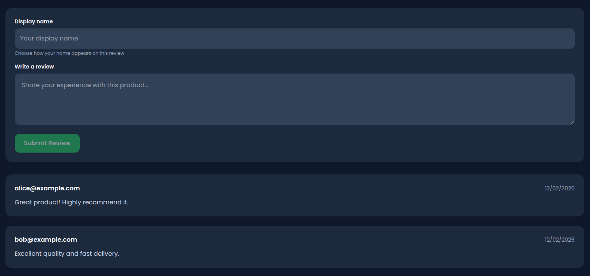
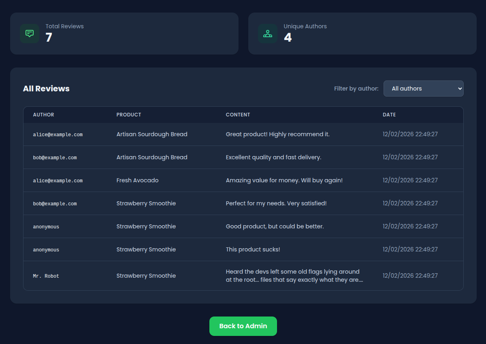
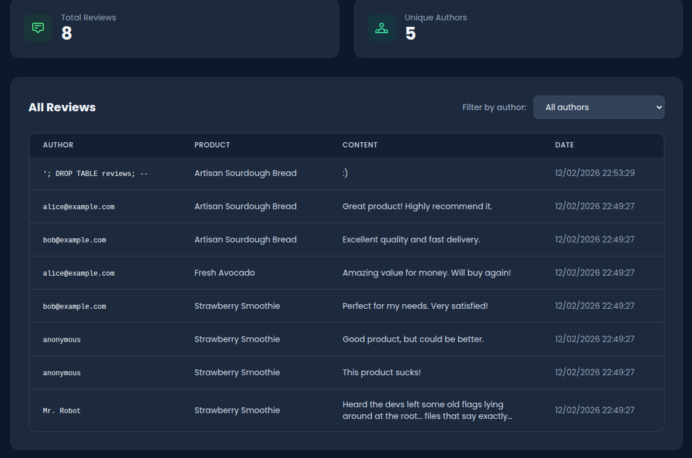
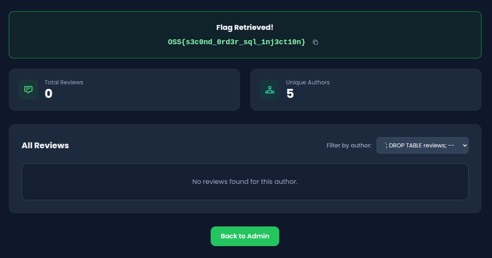

This writeup covers the exploitation of a second-order SQL injection vulnerability in the review moderation feature of OopsSec Store. Unlike traditional SQL injection where the payload executes immediately, this attack demonstrates how safely stored user input can become dangerous when later reused in an unsafe SQL query.

## Table of contents

## Lab setup

The lab requires Node.js. From an empty directory, run the following commands:

```bash
npx create-oss-store oss-store
cd oss-store
npm start
```

Once Next.js has started, the application is accessible at `http://localhost:3000`.

## Target identification

The application allows users to submit product reviews with a customizable "Display name" field. This field lets users choose how their name appears on reviews instead of defaulting to their email address.



The admin panel includes a "Review Moderation" section at `/admin/reviews` where administrators can view and filter all reviews by author. The filter is implemented as a dropdown populated with distinct author names from the database.



## Understanding second-order injection

In a traditional (first-order) SQL injection, the payload is executed at the point of input. In a second-order attack, the malicious input is stored safely first and only executed later when the application reuses it in a different, unsafe context.

The key developer mistake here is assuming that data from the application's own database is trustworthy and doesn't need parameterization.

## Exploitation

### Step 1: Store the payload

Log in to the application with any account (e.g., `alice@example.com` / `iloveduck`). Navigate to any product page and submit a review. In the "Display name" field, enter a destructive SQL payload:

```
'; DROP TABLE reviews; --
```

Write any content in the review body and submit. The review is stored safely via Prisma ORM — no SQL is executed at this point. The payload is just an ordinary string in the database.


### Step 2: Gain admin access

To access the admin panel, you need admin privileges. This can be achieved through existing vulnerabilities (Mass Assignment, JWT forgery, SQL Injections and Weak MD5, etc).

### Step 3: Trigger the injection

Navigate to `/admin/reviews`. The review moderation panel displays all reviews in a table with a "Filter by author" dropdown.



The dropdown is populated with distinct author values from the database, including the malicious payload stored in Step 1. Select the malicious author from the dropdown.

### Step 4: Retrieve the flag

When the filter is applied, the backend constructs a raw SQL query by interpolating the stored author value:

```typescript
const query = `
  SELECT ...
  FROM reviews r
  INNER JOIN products p ON r."productId" = p.id
  WHERE r.author = '${authorFilter}'
  ORDER BY r."createdAt" DESC
`;
```

The stored payload `'; DROP TABLE reviews; --` gets interpolated, producing:

```sql
WHERE r.author = ''; DROP TABLE reviews; --'
```

Since the backend uses `better-sqlite3`'s `exec()` method which supports multi-statement queries, the `DROP TABLE reviews` statement actually executes, destroying the entire reviews table. The backend detects the SQL injection attempt and returns the flag in the response.



## Vulnerable code analysis

The vulnerability lies in the admin reviews API endpoint at `/api/admin/reviews`:

```typescript
// Reviews are stored safely via Prisma ORM (parameterized)
const review = await prisma.review.create({
  data: { productId: id, content, author }, // Safe
});

// But later reused unsafely via raw SQLite driver with multi-statement support
const db = new Database(getDbPath());
const query = `
  SELECT r.id, r.content, r.author, ...
  FROM reviews r
  WHERE r.author = '${authorFilter}'   // VULNERABLE
`;
db.exec(query); // exec() runs ALL statements, including DROP TABLE
```

The developer trusted the author value because it came from the application's own database dropdown, not directly from user input. The use of `exec()` instead of `prepare()` makes it worse — it allows multi-statement execution, enabling destructive operations like `DROP TABLE`.

## Remediation

Replace the raw SQL query with Prisma's parameterized query builder:

```typescript
// SECURE - Use Prisma's built-in parameterization
const reviews = await prisma.review.findMany({
  where: { author: authorFilter },
  include: { product: { select: { name: true } } },
  orderBy: { createdAt: "desc" },
});
```

**General principles:**

- Never assume data from your own database is safe for SQL queries
- Always use parameterized queries regardless of the data source
- Validate and sanitize the `author` field at the input boundary
- Use allowlists for filter values when possible
