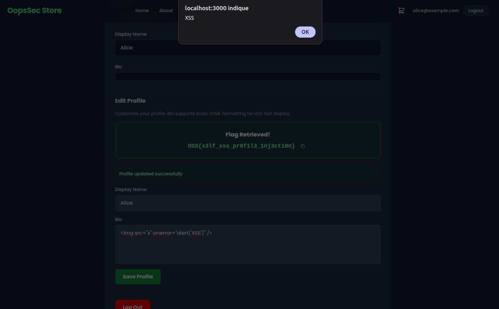
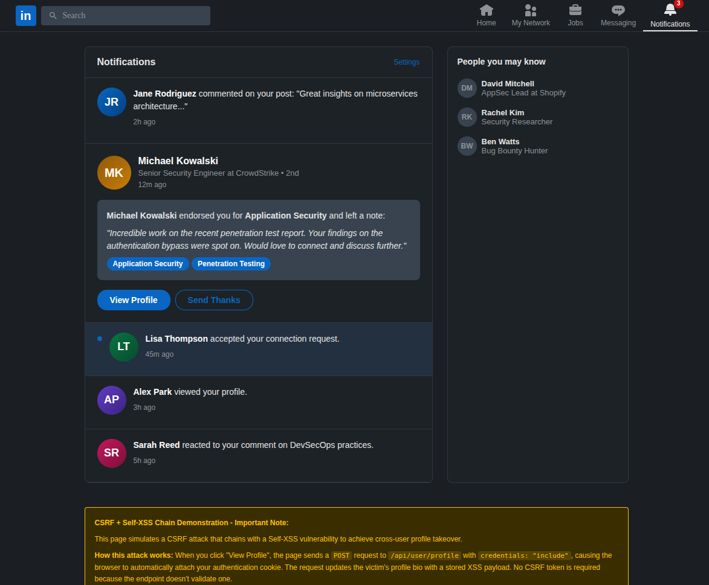

OopsSec Store's profile page renders the user's bio with `dangerouslySetInnerHTML`, no sanitization. On its own the XSS is limited to self-injection, but the profile update endpoint has no CSRF protection either. Chain the two and an attacker can plant a stored XSS payload in any logged-in user's profile just by getting them to visit a page.

## Table of contents

## Vulnerability overview

Two separate issues, neither interesting on its own:

1. **Self-XSS in the bio field.** The profile page renders the bio with React's `dangerouslySetInnerHTML`. Whatever HTML the user saves gets rendered as-is. Since it only affects your own profile, this is typically classified as Self-XSS and deprioritized.

2. **No CSRF protection on profile update.** `POST /api/user/profile` authenticates via an HTTP-only cookie but doesn't require a CSRF token, a same-origin check, or any anti-forgery mechanism. Any cross-origin page can submit a profile update on behalf of a logged-in user.

The Self-XSS only fires in the attacker's own browser. The CSRF can only update text fields. But chained together, an attacker can inject arbitrary JavaScript into a victim's profile that runs every time anyone loads that profile page.

## Lab setup

From an empty directory:

```bash
npx create-oss-store oss-store
cd oss-store
npm start
```

Or with Docker (no Node.js required):

```bash
docker run -p 3000:3000 leogra/oss-oopssec-store
```

The app runs at `http://localhost:3000`.

## Flag 1: Self-XSS in the profile bio (Easy)

### Step 1: Log in

Sign in with the test credentials:

- Email: `alice@example.com`
- Password: `iloveduck`

### Step 2: Navigate to the profile page

Go to `/profile`. There's a form with a bio textarea.

### Step 3: Inject the XSS payload

In the bio field, enter any HTML payload. For example:

```html

```

Click **Save Profile**.



### Step 4: Retrieve the flag

The API detects the HTML tag in the bio and returns the flag.

Once the page re-renders with the saved bio, the `` tag tries to load an invalid `src`, the `onerror` handler fires, and the `alert()` pops up. XSS confirmed.

### Why this payload works

The bio is rendered with `dangerouslySetInnerHTML`, which inserts raw HTML into the DOM. People sometimes assume `<script>` tags will execute here -- they won't. When HTML is inserted via `innerHTML` (which is what `dangerouslySetInnerHTML` uses under the hood), the browser parses the markup but skips `<script>` elements. Event handler attributes like `onerror`, `onload`, and `onmouseover` _do_ fire, because they're bound as the elements are created in the DOM.

`` is a standard XSS vector: the broken image source guarantees the `onerror` handler runs immediately.

## Flag 2: CSRF + Self-XSS chain (Hard)

This flag requires chaining the Self-XSS with the missing CSRF protection. You need admin access first.

### Step 1: Gain admin access

Use one of the other vulnerabilities in the lab to escalate to admin. Mass assignment on the registration endpoint or JWT secret forgery both work. The goal is to get into the admin panel.

### Step 2: Find the hidden exploit link

With admin access, open the admin page and view its source. You'll find a hidden link pointing to:

```
/exploits/csrf-profile-takeover.html
```

This is an example of phishing page that runs the full attack.

### Step 3: Visit the exploit page while logged in

Open `/exploits/csrf-profile-takeover.html` in your browser while still authenticated. The page looks like a LinkedIn notification about a profile endorsement.



### Step 4: Trigger the attack

Put yourself in the victim's shoes: you received this notification and, trusting the familiar LinkedIn interface, you click the "View Profile" button. Behind the scenes, the page sends a `POST` request to `/api/user/profile` with `credentials: "include"`, so the browser attaches your authentication cookie automatically. The request body sets the bio to an XSS payload:

```json
{
  "bio": ""
}
```

### Step 5: Retrieve the flag

The endpoint checks the `Referer` header. Since the request didn't come from `/profile`, the server marks the account as CSRF-exploited. The phishing page then redirects you to `/profile`. The profile page sees the CSRF flag on the account and displays it. You'll also see the stored XSS fire in the bio area.

### Why this works

The profile update endpoint uses cookie-based authentication with `sameSite: "lax"`. There are two ways to exploit this:

1. **Same-origin fetch (used by the exploit page).** Because the exploit page is served from the same origin (`/exploits/csrf-profile-takeover.html`), `fetch` with `credentials: "include"` works. The browser treats it as a same-origin request and attaches the cookie. This scenario is less realistic in practice since it requires the attacker to host a page on the target's own domain.

2. **Cross-origin form submission.** Even from a completely different origin, a classic `<form method="POST">` auto-submit would work. With `sameSite: "lax"`, the browser sends cookies on top-level navigations — and a form submission that redirects the user counts as one. This is possible because the endpoint accepts `application/x-www-form-urlencoded` in addition to JSON.

In both cases, the endpoint has no CSRF token, no `Origin` header check, and no `Referer` validation, so the request goes through.

## Remediation

### Sanitize user-generated HTML

Don't pass untrusted content to `dangerouslySetInnerHTML`. Use a library like [DOMPurify](https://github.com/cure53/DOMPurify) to strip dangerous tags and attributes before rendering:

```typescript
import DOMPurify from "dompurify";

<div dangerouslySetInnerHTML={{ __html: DOMPurify.sanitize(bio) }} />
```

Or skip `dangerouslySetInnerHTML` entirely and render the bio as plain text.

### Add CSRF protection

Add anti-CSRF tokens to all state-changing endpoints. The usual options: synchronizer tokens (one per session, validated server-side), double-submit cookies (random value in both cookie and header, matched on the server), or setting `sameSite: "strict"` on the auth cookie to block cross-site requests entirely.

```typescript
// Example: validate CSRF token in the profile update handler
const csrfToken = request.headers.get("X-CSRF-Token");
const expectedToken = session.csrfToken;

if (!csrfToken || csrfToken !== expectedToken) {
  return NextResponse.json({ error: "Invalid CSRF token" }, { status: 403 });
}
```

### Fix both

Even with CSRF protection, fix the XSS independently. If something else bypasses the CSRF defense later, the unsanitized bio is exploitable again.

## References

- [OWASP: Cross-Site Scripting (XSS)](https://owasp.org/www-community/attacks/xss/)
- [OWASP: Cross-Site Request Forgery (CSRF)](https://owasp.org/www-community/attacks/csrf)
- [PortSwigger: Exploiting Self-XSS via CSRF](https://portswigger.net/web-security/cross-site-scripting/exploiting)
- [React docs: dangerouslySetInnerHTML](https://react.dev/reference/react-dom/components/common#dangerously-setting-the-inner-html)
- [DOMPurify](https://github.com/cure53/DOMPurify)
