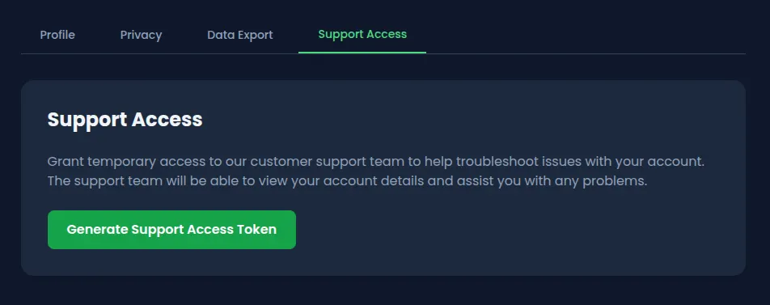
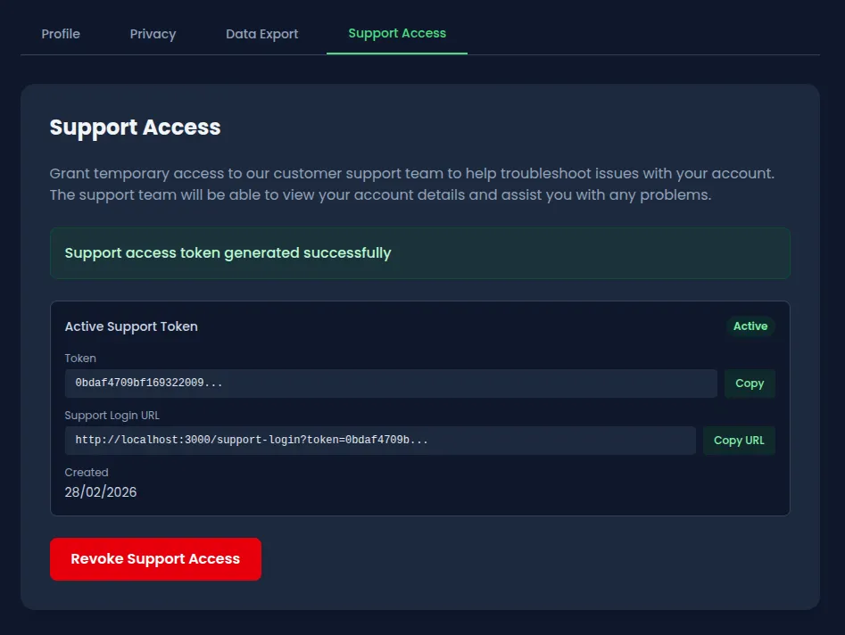
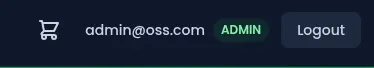
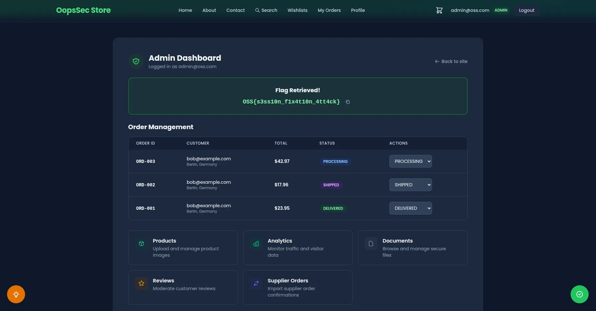

OopsSec Store has a support access feature that lets users generate tokens so customer support can log into their accounts. The token generation endpoint accepts an `email` parameter from the request body without any ownership check, which means any authenticated user can generate a support token for any account, including the administrator.

## Table of contents

## Lab setup

The lab requires Node.js. From an empty directory:

```bash
npx create-oss-store oss-store
cd oss-store
npm start
```

Head to `http://localhost:3000`.

## Target identification

The user profile page has a "Support Access" tab. This feature generates a temporary token URL that a support agent can use to log into the account without a password, a common pattern in SaaS applications.



The endpoint behind it:

```
POST /api/user/support-access
```

Clicking "Generate Support Access Token" creates a JWT-based token tied to the authenticated user's account. A support agent visits the generated URL and gets a full session.



The problem is that the endpoint blindly trusts the request body to determine which account the token is generated for.

## Exploitation

### Step 1: Create a regular account

Sign up on the application with any email and password. The only requirement is an authenticated session.

### Step 2: Locate the support access feature

Go to the profile page and open the Support Access tab. The "Generate Support Access Token" button triggers a POST request to `/api/user/support-access`.

### Step 3: Intercept the token generation request

Open DevTools (Network tab) or set up Burp Suite as a proxy before clicking the button. The default request body is either empty or contains the authenticated user's email.

### Step 4: Replay the request with the admin email

Replay the POST request with a modified body:

```json
{
  "email": "admin@oss.com"
}
```

With curl:

```bash
# Log in as a regular user to grab the session cookie
curl -c cookies.txt -X POST http://localhost:3000/api/auth/login \
  -H "Content-Type: application/json" \
  -d '{"email":"alice@example.com","password":"iloveduck"}'

# Generate a support token for the admin account
curl -b cookies.txt -X POST http://localhost:3000/api/user/support-access \
  -H "Content-Type: application/json" \
  -d '{"email":"admin@oss.com"}'
```

The response contains a support token tied to the admin account instead of the authenticated user's account.

### Step 5: Log in as admin

Open the `supportLoginUrl` from the response in a browser:

```
http://localhost:3000/support-login?token=<the-token-from-step-4>
```

The application validates the token, resolves it to the admin user, and creates a full authenticated session.



### Step 6: Access the admin dashboard

Navigate to `http://localhost:3000/admin`. The flag is on the dashboard.



## Vulnerable code analysis

The root cause is a mass assignment flaw in the token generation endpoint:

```typescript
const targetEmail = body.email || user.email;
```

The server accepts an `email` field from the request body and uses it to determine which account the token is generated for. If no email is provided, it defaults to the authenticated user's email. If one is provided, it generates a token for that account with no ownership check.

The mass assignment is the primary flaw, but the endpoint has other problems that make exploitation worse.

Tokens are valid for 365 days. A support token should expire in hours, not a year. An attacker who generates one token has persistent access to the target account for as long as it lives.

Revocation is cosmetic. The application has a "Revoke" button that marks the token as revoked in the database, but the support login endpoint never checks that flag. A revoked token still works.

There is also no rate limiting on the endpoint. An attacker can generate tokens for every user in the system in a single loop.

## Historical context

Egor Homakov exploited [the same kind of mass assignment flaw on GitHub in 2012](https://homakov.blogspot.com/2012/03/how-to.html), adding himself as an admin on the Rails repository. The mechanism was the same: the server used client-supplied input to determine authorization where it should not have. This class of bug keeps showing up in support access and impersonation features because developers assume the frontend is the only caller.

## Remediation

### Remove the mass assignment

The server already knows who the authenticated user is. Use that:

```typescript
const targetEmail = user.email; // Always use the authenticated user's email
```

### Reduce token lifetime

Twelve hours is generous for a support session. Some applications use one to two hours:

```typescript
const TOKEN_EXPIRY_HOURS = 12;
expiresAt.setHours(expiresAt.getHours() + TOKEN_EXPIRY_HOURS);
```

### Enforce revocation checks

The support login handler must verify the revocation flag before creating a session:

```typescript
if (supportToken.revoked) {
  return NextResponse.json({ error: "Token revoked" }, { status: 401 });
}
```

### Additional hardening

Rate limiting on the token generation endpoint would also help. One token per user per hour is more than enough. On top of that, requiring re-authentication (password confirmation) before generating support tokens would block any attacker who only has session cookies.
