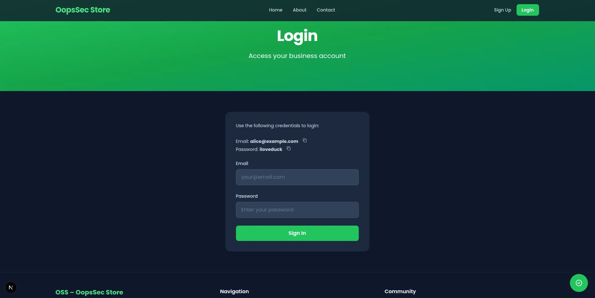
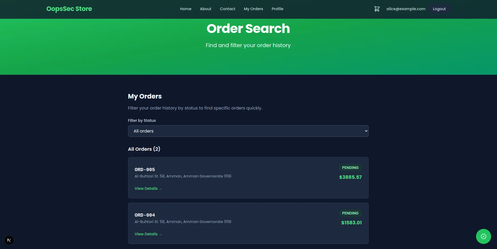
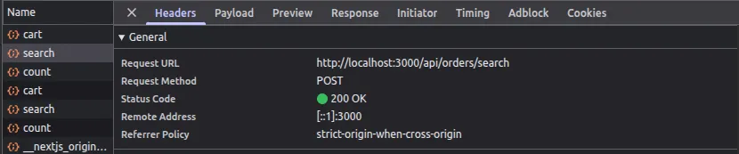
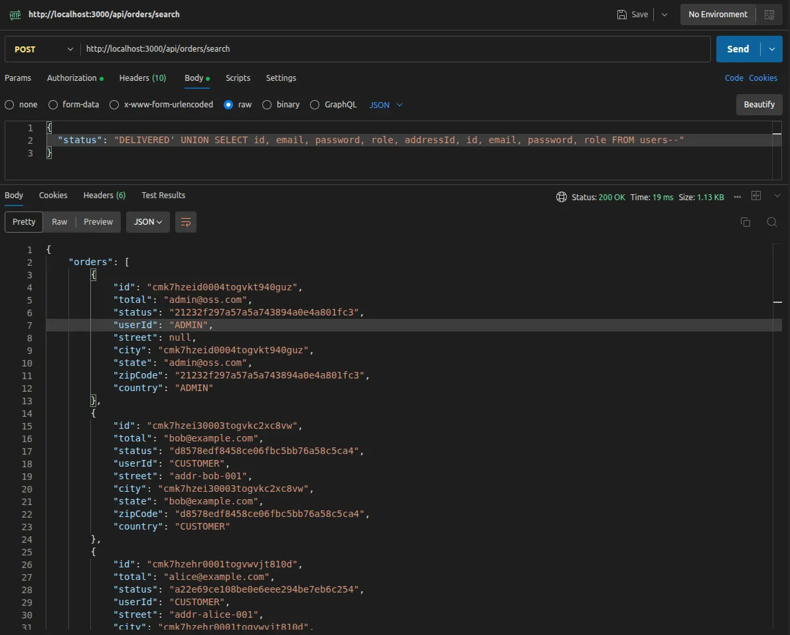
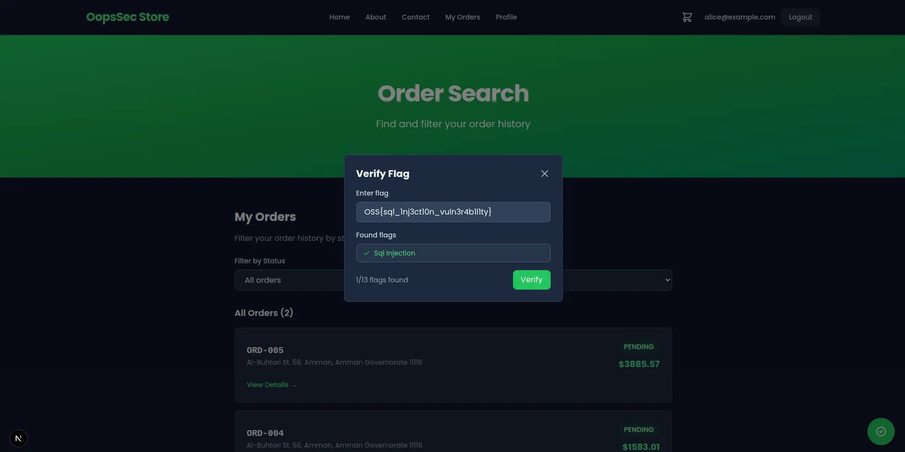

This writeup covers the exploitation of a SQL injection vulnerability in the order filtering feature of OopsSec Store. The vulnerability allows an attacker to extract the entire contents of the users table, including email addresses, passwords, and roles.

## Table of contents

## Lab setup

The lab requires Node.js. From an empty directory, run the following commands:

```bash
npx create-oss-store oss-store
cd oss-store
npm start
```

Once Next.js has started, the application is accessible at `http://localhost:3000`.

## Target identification

The application includes a "My Orders" page where authenticated users can filter their orders by status (`PENDING`, `SHIPPED`, `DELIVERED`, etc.). When a user selects a status from the dropdown, the frontend sends a POST request to `/api/orders/search` with the following JSON body:

```json
{
  "status": "DELIVERED"
}
```

The `status` value is incorporated into a SQL query on the backend without proper sanitization, which creates a SQL injection vulnerability.

## Exploitation

### Step 1: Authentication

The login page displays test credentials for convenience:

- Email: `alice@example.com`
- Password: `iloveduck`



### Step 2: Locating the vulnerable endpoint

After logging in, navigate to `http://localhost:3000/orders/search`. This page displays the user's orders and provides the status filter.



### Step 3: Intercepting the request

Open the browser's DevTools and switch to the Network tab. Reload the page to observe the POST request sent to `/api/orders/search`.



Copy this request to Burp Suite or Postman to modify and replay it.

### Step 4: Crafting the payload

The injection payload uses a UNION-based technique to append data from the `users` table to the query results. Replace the request body with:

```json
{
  "status": "DELIVERED' UNION SELECT id, email, password, role, addressId, id, email, password, role FROM users --"
}
```

The payload works as follows:

1. The single quote (`'`) closes the string literal in the original query
2. The `UNION SELECT` clause appends a second result set from the `users` table
3. The column count and types must match the original query (hence the repeated columns)
4. The double dash (`--`) comments out the remainder of the original query

### Step 5: Retrieving the data

Send the modified request. The server executes the injected SQL without validation.



The response contains the user data mixed with order data. Additionally, the application returns a flag to confirm successful exploitation:

```json
{
  "flag": "OSS{sql_1nj3ct10n_vuln3r4b1l1ty}"
}
```



## Vulnerable code analysis

The vulnerability exists because the backend constructs SQL queries through string concatenation with unsanitized user input:

```ts
const statusFilter =
  status && typeof status === "string" ? `AND o.status = '${status}'` : "";

const query = `
  SELECT ...
  FROM orders o
  WHERE o."userId" = '${user.id}' ${statusFilter}
`;
```

The `status` parameter is inserted directly into the query string. The code assumes the value will be a simple status string like `DELIVERED`, but an attacker can provide arbitrary SQL syntax.

## Remediation

The proper fix is to use parameterized queries or an ORM that handles parameterization automatically. With Prisma, the equivalent query would be:

```ts
const results = await prisma.order.findMany({
  where: {
    userId: user.id,
    status: status,
  },
});
```

Prisma automatically parameterizes the `status` value, preventing any injected SQL from being executed. If raw SQL queries are necessary, use prepared statements with placeholders rather than string interpolation.

Input validation and escaping are not reliable defenses against SQL injection. Parameterized queries are the only robust solution.
