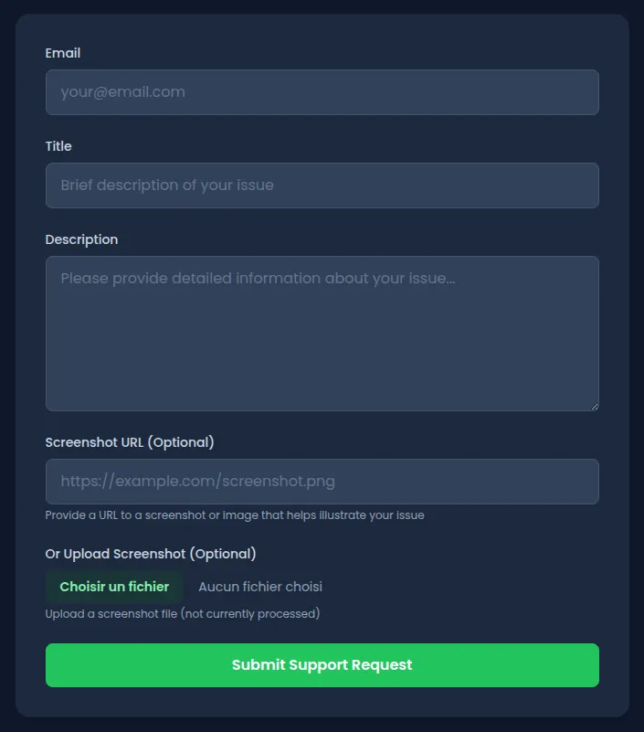
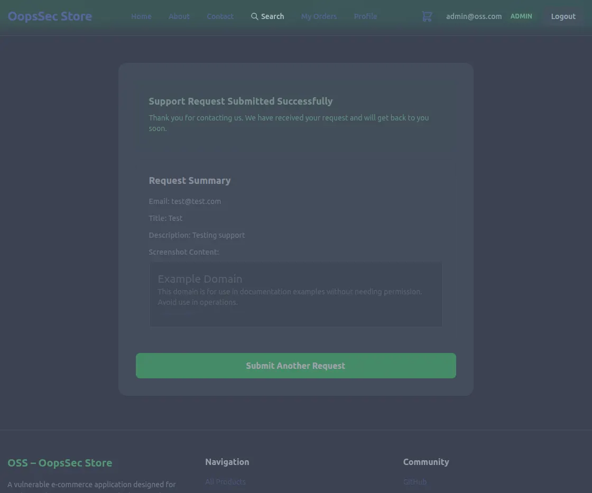
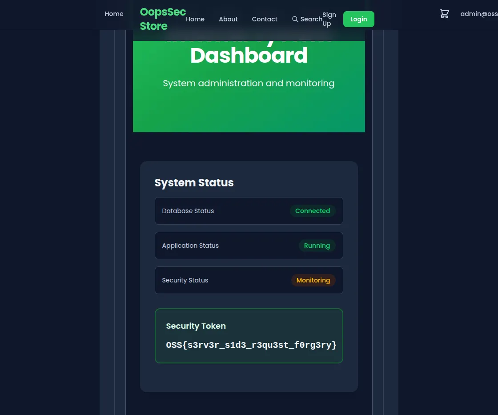

This writeup covers the exploitation of a server-side request forgery (SSRF) vulnerability in OopsSec Store's contact support feature. The vulnerability allows an attacker to make the backend fetch arbitrary URLs and return their content, enabling access to internal pages that are otherwise restricted.

## Table of contents

## Lab setup

The lab requires Node.js. From an empty directory, run the following commands:

```bash
npx create-oss-store oss-store
cd oss-store
npm start
```

Once Next.js has started, the application is accessible at `http://localhost:3000`.

## Target identification

The application includes a Contact Support page at `http://localhost:3000/support`. The form accepts the following fields:

- Email address
- Title
- Description
- Screenshot URL (optional)



The screenshot URL field is designed to allow users to attach visual context to their support requests. When the form is submitted, the application displays a recap of the request, including a rendered preview of the screenshot URL content.

This behavior indicates that the server is fetching the provided URL on behalf of the user and returning the response content directly.

## Exploitation

### Step 1: Confirming server-side fetching

To verify that the server performs the URL fetch rather than the browser, submit a support request with a public URL:

1. Navigate to `http://localhost:3000/support`
2. Fill in the form fields:
   - Email: `test@test.com`
   - Title: `Test`
   - Description: `Testing support`
   - Screenshot URL: `https://example.com`
3. Submit the form

The recap page displays the HTML and CSS content from `example.com`, confirming that the server is making the outbound request.



### Step 2: Identifying internal resources

With SSRF confirmed, the next step is to identify internal resources that may be accessible through the vulnerability. Directory enumeration tools such as `ffuf` or `gobuster` can be used to discover hidden paths. Running a wordlist-based scan against the application reveals an `/internal` endpoint that returns a 302 redirect.

Attempting to access `http://localhost:3000/internal` directly in the browser results in a redirect back to the homepage, indicating that the page exists but is protected from direct access.

This restriction applies to browser-based requests but may not apply to requests originating from the server itself.

### Step 3: Exploiting the SSRF vulnerability

Submit a new support request with the internal page URL:

1. Navigate to `http://localhost:3000/support`
2. Fill in the form fields:
   - Email: `test@test.com`
   - Title: `Internal access test`
   - Description: `Testing SSRF`
   - Screenshot URL: `http://localhost:3000/internal`
3. Submit the form

### Step 4: Retrieving the flag

The recap page renders the HTML content of the internal page instead of returning an error. The server-side request bypasses the access restriction because it originates from the same host.



The internal page contains the flag:

```
OSS{s3rv3r_s1d3_r3qu3st_f0rg3ry}
```

## Vulnerable code analysis

The vulnerability exists because the backend trusts user-provided URLs without validation. When processing the support form submission, the API performs the following operations:

1. Extracts the `screenshotUrl` from user input
2. Calls `fetch()` on the provided URL
3. Returns the response content directly to the client

There is no validation to ensure the URL points to a safe, external resource. The server assumes that user-provided URLs are benign, which allows an attacker to specify internal addresses such as `localhost`, `127.0.0.1`, or private IP ranges.

## Remediation

Preventing SSRF requires multiple layers of validation and architectural safeguards.

### URL validation

Reject URLs that do not use allowed protocols (HTTP/HTTPS) and parse URLs to detect malformed input:

```typescript
const url = new URL(screenshotUrl);
if (!["http:", "https:"].includes(url.protocol)) {
  throw new Error("Invalid protocol");
}
```

### Internal address blocking

Deny requests to localhost, loopback addresses, and private IP ranges:

```typescript
const BLOCKED_HOSTS = ["localhost", "127.0.0.1", "0.0.0.0"];
const PRIVATE_RANGES = [
  /^10\./,
  /^172\.(1[6-9]|2[0-9]|3[01])\./,
  /^192\.168\./,
];

if (
  BLOCKED_HOSTS.includes(url.hostname) ||
  PRIVATE_RANGES.some(range => range.test(url.hostname))
) {
  throw new Error("Internal addresses are not allowed");
}
```

### Domain allowlisting

Restrict fetching to known, trusted domains such as a dedicated CDN or image hosting service:

```typescript
const ALLOWED_DOMAINS = ["cdn.example.com", "images.example.com"];
if (!ALLOWED_DOMAINS.includes(url.hostname)) {
  throw new Error("Domain not allowed");
}
```

### Response handling

Avoid returning raw fetched content to users. Instead, store relevant metadata or process the response through a sanitization layer before display.

Implementing these controls in combination provides defense in depth against SSRF attacks.
