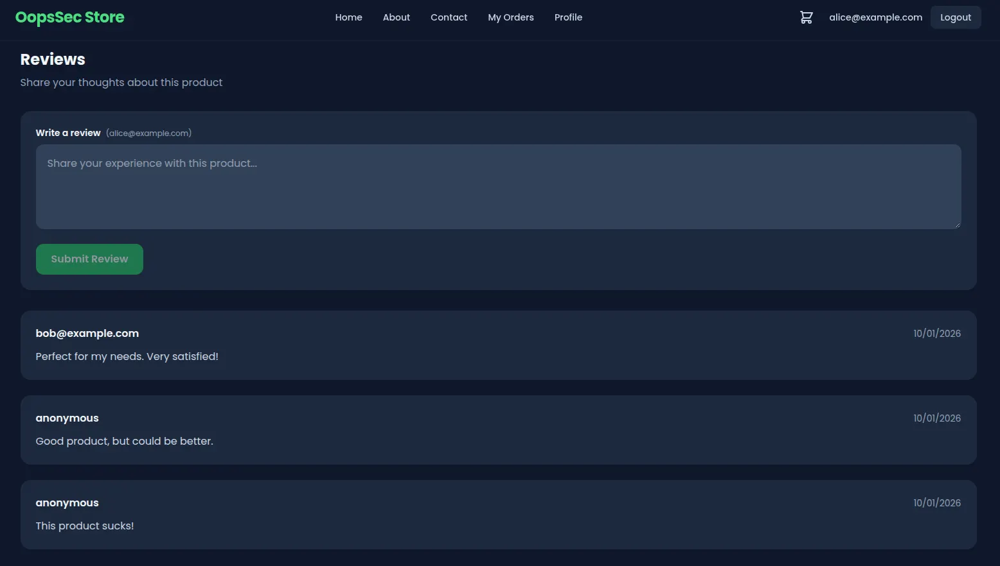
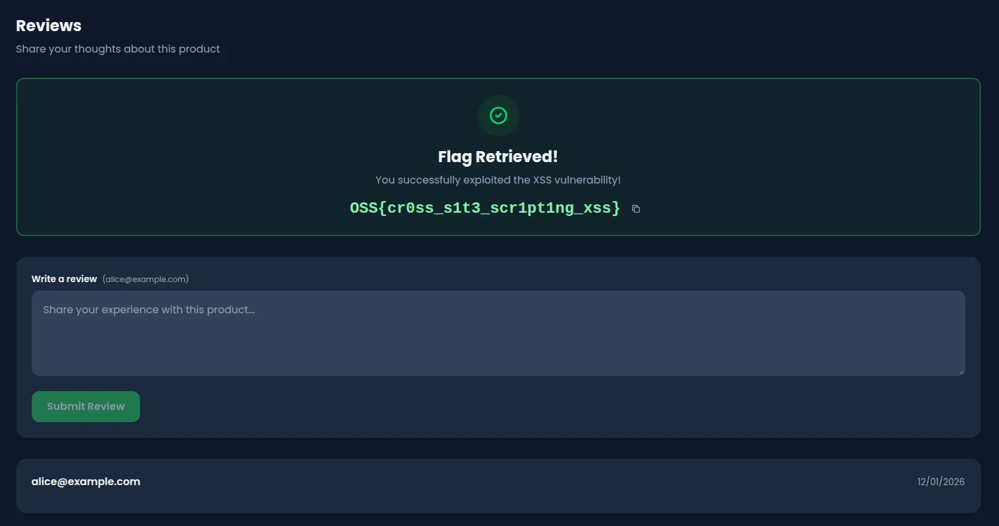

This writeup demonstrates how to exploit a stored cross-site scripting (XSS) vulnerability in OopsSec Store's product reviews feature. By injecting JavaScript into a review, the payload is persisted in the database and executes every time a user loads the product page.

## Table of contents

## Vulnerability overview

OopsSec Store allows users to submit reviews for products. When a review is submitted, it is stored in the database and rendered on the product page. The application fails to sanitize user input on the server side and renders review content as raw HTML on the client side, creating a stored XSS vulnerability.

The attack flow is as follows:

1. An attacker submits a review containing malicious JavaScript
2. The backend stores the payload without sanitization
3. When any user visits the product page, the review is fetched and injected into the DOM
4. The browser parses and executes the embedded script in the context of the victim's session

## Locating the attack surface

Navigate to any product page and scroll to the Reviews section. The interface displays existing reviews and provides a form for submitting new ones.



When a review is submitted, the browser sends a POST request to `/api/products/[id]/reviews`. The backend stores the content directly in the database, and the frontend renders it without escaping.

## Exploitation

### Crafting the payload

A simple payload to demonstrate arbitrary JavaScript execution:

```html
<script>
  alert("XSS");
</script>
```

This basic payload proves that user-controlled input is being executed as code in the browser.

### Executing the attack

1. Open any product page in OopsSec Store
2. Scroll to the Reviews section
3. Paste the payload into the review textarea
4. Click Submit

The API stores the payload as a regular review without any validation or sanitization.

### Triggering the vulnerability

Refresh the product page. The malicious review is loaded from the database and injected into the DOM. The browser parses the `<script>` tag and executes the JavaScript.

An alert dialog appears with the message "XSS", confirming code execution. The application also detects the XSS payload and displays the flag:

```
OSS{cr0ss_s1t3_scr1pt1ng_xss}
```



Every subsequent visitor to this product page will trigger the same payload execution.

## Vulnerable code analysis

The vulnerability exists due to two implementation flaws.

### Server-side: no input sanitization

The API endpoint stores user-provided content directly in the database:

```typescript
const review = await prisma.review.create({
  data: {
    productId: id,
    content: content.trim(), // No sanitization performed
    author,
  },
});
```

The `trim()` method only removes whitespace; it does not filter or escape HTML or JavaScript.

### Client-side: raw HTML injection

The frontend renders review content using a ref that allows raw HTML injection:

```tsx
<div
  ref={el => {
    reviewRefs.current[review.id] = el; // Raw HTML injection
  }}
  className="text-slate-700 dark:text-slate-300"
/>
```

This bypasses React's default XSS protections, which normally escape content rendered via JSX expressions.

## Remediation

### Server-side sanitization

Sanitize user input before storing it in the database using a library such as DOMPurify:

```typescript
import DOMPurify from "isomorphic-dompurify";

const review = await prisma.review.create({
  data: {
    productId: id,
    content: DOMPurify.sanitize(content.trim()),
    author,
  },
});
```

This removes script tags and other potentially dangerous HTML elements before they reach the database.

### Client-side safe rendering

Allow React to handle HTML escaping by rendering content as text rather than HTML:

```tsx
<div className="text-slate-700 dark:text-slate-300">{review.content}</div>
```

When content is passed as a JSX expression, React automatically escapes HTML entities, preventing script execution.

Implementing both server-side sanitization and client-side safe rendering provides defense in depth against XSS attacks.
