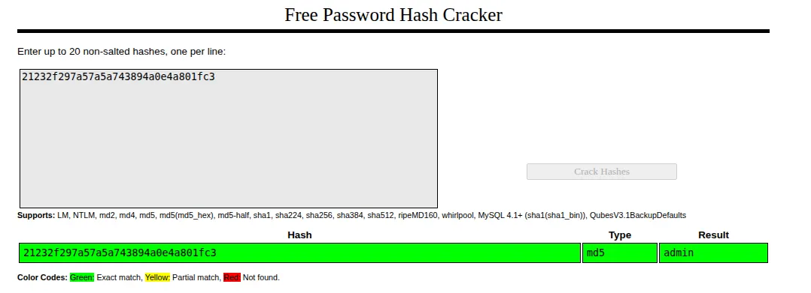
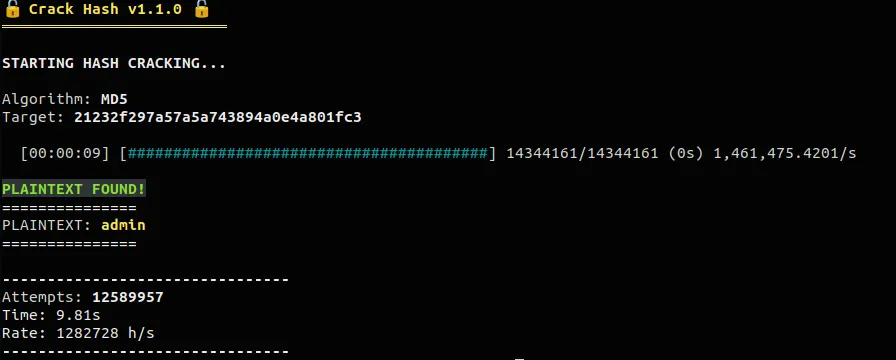
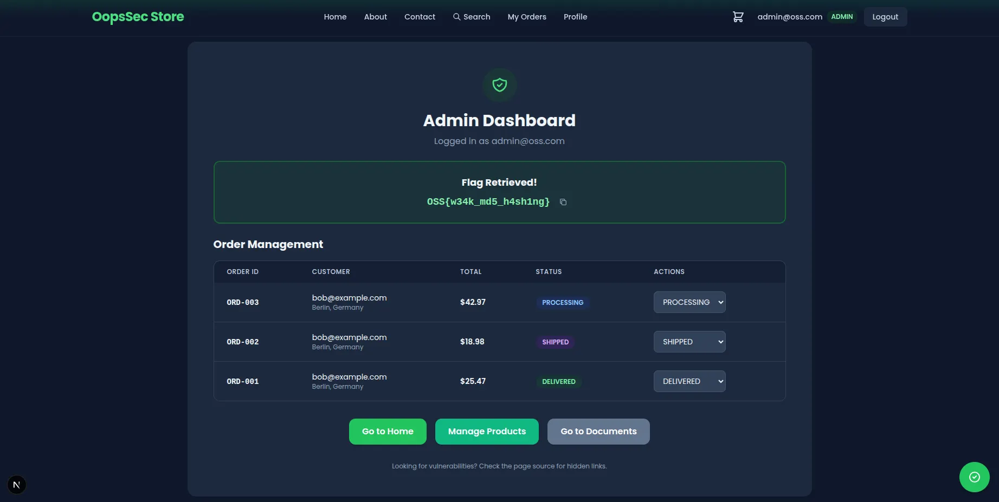

This writeup demonstrates how a SQL injection vulnerability can be chained with weak password hashing to achieve full administrative access. The attack leverages a [previously documented database dump](https://koadt.github.io/oss-oopssec-store/posts/sql-injection-writeup/) to extract password hashes, then exploits the use of unsalted MD5 to recover the admin credentials.

## Table of contents

## Lab setup

The lab requires Node.js. From an empty directory, run the following commands:

```bash
npx create-oss-store oss-store
cd oss-store
npm run dev
```

Once Next.js has started, the application is accessible at `http://localhost:3000`.

## Target identification

This attack chains two distinct vulnerabilities:

1. **SQL injection** in the order search endpoint, which allows extraction of the entire users table
2. **Weak password hashing** using unsalted MD5, which allows rapid recovery of plaintext passwords

The admin panel at `/admin` is protected by authentication. Obtaining valid admin credentials provides unrestricted access to administrative functionality.

## Exploitation

### Step 1: Extracting the users table

The first phase requires exploiting the SQL injection vulnerability documented in the [SQL Injection writeup](https://koadt.github.io/oss-oopssec-store/posts/sql-injection-writeup/). After successful exploitation, the response contains the complete users table, including email addresses, roles, and password hashes.

### Step 2: Identifying the admin account

Examining the extracted data reveals a user with the `ADMIN` role:

| Field         | Value                              |
| ------------- | ---------------------------------- |
| Email         | `admin@oss.com`                    |
| Role          | `ADMIN`                            |
| Password hash | `21232f297a57a5a743894a0e4a801fc3` |

The hash format is immediately recognizable: 32 hexadecimal characters with no additional encoding or salt prefix. This is characteristic of raw MD5.

### Step 3: Cracking the MD5 hash

MD5 is a cryptographically broken hash function that should never be used for password storage. The hash `21232f297a57a5a743894a0e4a801fc3` is one of the most commonly indexed hashes in rainbow tables.

**Option A: Online lookup**

Submitting the hash to a rainbow table service such as CrackStation (`https://crackstation.net/`) returns the plaintext immediately: `admin`.



**Option B: Local dictionary attack**

Using a hash cracking tool with a common password wordlist produces the same result. The weak password combined with the fast MD5 algorithm means cracking completes in milliseconds.

For example: https://github.com/kOaDT/crack-hash



### Step 4: Authenticating as admin

Navigate to `/login` and enter the recovered credentials:

- Email: `admin@oss.com`
- Password: `admin`


Upon successful authentication, the application redirects to the admin panel.

### Step 5: Retrieving the flag

The admin panel at `/admin` displays the flag at the top of the page:

```
OSS{w34k_md5_h4sh1ng}
```



## Vulnerable code analysis

The vulnerability exists because the application stores passwords using raw MD5 hashes without salting:

```ts
const hashedPassword = crypto.createHash("md5").update(password).digest("hex");
```

This implementation has multiple security deficiencies:

1. **No salting**: Identical passwords produce identical hashes, enabling rainbow table attacks
2. **Fast algorithm**: MD5 is designed for speed, allowing billions of hash computations per second
3. **Cryptographically broken**: MD5 has known collision vulnerabilities and is considered obsolete for security purposes

When combined with the SQL injection vulnerability, an attacker can extract hashes and recover passwords in seconds.

## Remediation

Password storage should use a slow, salted hashing algorithm specifically designed for this purpose. The bcrypt algorithm is a well-established choice:

```ts
import bcrypt from "bcryptjs";

const hashPassword = async (password: string): Promise<string> => {
  return bcrypt.hash(password, 12);
};

const verifyPassword = async (
  password: string,
  hash: string
): Promise<boolean> => {
  return bcrypt.compare(password, hash);
};
```

Key properties of this implementation:

- **Automatic salting**: bcrypt generates and stores a unique salt for each password
- **Configurable work factor**: The cost parameter (12 in this example) controls computational expense
- **Resistance to GPU attacks**: bcrypt's memory-hard properties limit parallel cracking efficiency

Additionally, the SQL injection vulnerability must be eliminated using parameterized queries. Attack chains succeed because multiple defensive layers fail simultaneously.
